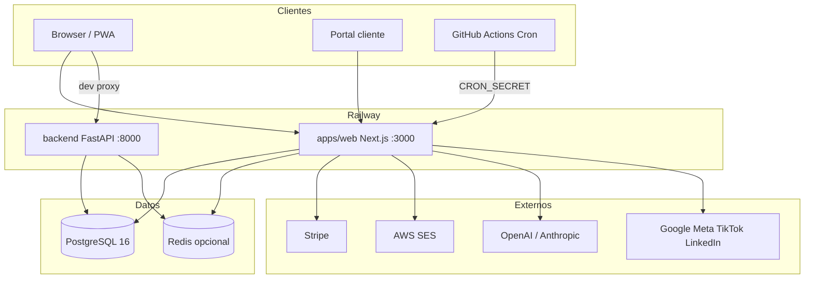

# ARCHITECTURE — Arquitectura real NELVYON

> Actualizado: 2026-07-09. Refleja código en repo. **Prod Web:** `815e4c0f` en `nelvyon.com`.

---

## Vista general



---

## Capas lógicas

### 1. Presentación
- **Next.js App Router** — `apps/web/src/app/`
- **SaasShellLayout** — todas las páginas `/saas/*`
- **Features** — `apps/web/src/features/`
- **Legacy Vite** — `frontend/` (no prod)

### 2. API / BFF
- **Route handlers** — `apps/web/src/app/api/`
- **Auth SaaS** — `requireSaasContext` middleware
- **Auth Platform** — `requirePlatformClaims` OS/portal
- **Crons** — `apps/web/src/app/api/cron/*` + `CRON_SECRET`

### 3. Dominio (TypeScript)
- **Servicios** — `backend/saas/*.ts` (clases puras)
- **DbClient** — pool Postgres singleton
- **Email** — `backend/email/sesClient.ts`
- **Integraciones** — `backend/integrations/`
- **OS agents** — `backend/os-agents/` (sectores, packs)
- **Private AI** — `backend/private-ai/`

### 4. Dominio (Python)
- **FastAPI** — `backend/main.py` — routers legacy CRM/campaigns
- **Pack voice / agents** — servicios Python
- **Alembic** — esquemas runtime complementarios

### 5. Datos
- **Migraciones SQL** — fuente de verdad schema
- **RLS** — Supabase políticas cliente

---

## Flujos principales

### Auth SaaS
```
POST /api/auth/* → JWT cookie → requireSaasContext → tenant_id scoped queries
```

### Campaña email
```
UI /saas/campanias → API → SaasCampaniasService → SES → tracking pixel
```

### Growth pack OS
```
Kickoff /api/os/packs/[id]/kickoff → runGrowthPack → agents → QA ≥85 → auto-approve → portal
```

### Billing
```
Stripe checkout → webhook → UPDATE saas_tenants.plan → UI badge
```

### CEO brief cron
```
GitHub cron 07:00 UTC → POST /api/cron/saas-ceo-brief → SaasCeoBriefService → SES + saas_ceo_brief_runs
```

### Private AI (preparado)
```
/api/saas/private-ai/* → SaasPrivateAiService → PrivateAiRouter → Provider (unconfigured default)
```

---

## Módulos SaaS (selección)

| Módulo | Servicio principal | UI |
|--------|-------------------|-----|
| CRM | `SaasCrmService` | `/saas/crm` |
| Campañas | `SaasCampaniasService` | `/saas/campanias` |
| Workflows | `SaasWorkflowService` | `/saas/workflows` |
| Billing | `SaasBillingService` | `/saas/billing` |
| Inbox | `SaasInboxService` | `/saas/inbox` |
| Integraciones | `SaasIntegrationsHubService` | `/saas/integraciones` |

---

## Comunicación entre capas

| De | A | Mecanismo |
|----|---|-----------|
| Next.js pages | TS services | import `@nelvyon/saas` / path relativo |
| Next.js API | DbClient | `backend/db/DbClient.ts` |
| Vite dev | FastAPI | proxy `/api` → :8000 |
| Python | Postgres | SQLAlchemy async + settings.database_url |
| Crons externos | Next.js | HTTP + Bearer secret |

---

## Restricciones arquitectónicas

Ver `CLAUDE.md` — no UI sin API, no mock silencioso prod, force-dynamic en APIs con DB.

---

## Diagrama Private AI

Ver `docs/PRIVATE_AI_ARCHITECTURE.md` sección layer diagram.

---

## Referencias código

| Concepto | Archivo |
|----------|---------|
| Pack orchestrator | `apps/web/src/lib/packs/packOrchestrator.ts` |
| Service catalog | `apps/web/src/lib/saas/servicePacksCatalog.ts` |
| Integrations | `backend/saas/integrationsCatalog.ts` |
| Agent registry | `backend/private-ai/nelvyonAgentRegistry.ts` |
| Migrate runner | `backend/db/migrate.ts` |
