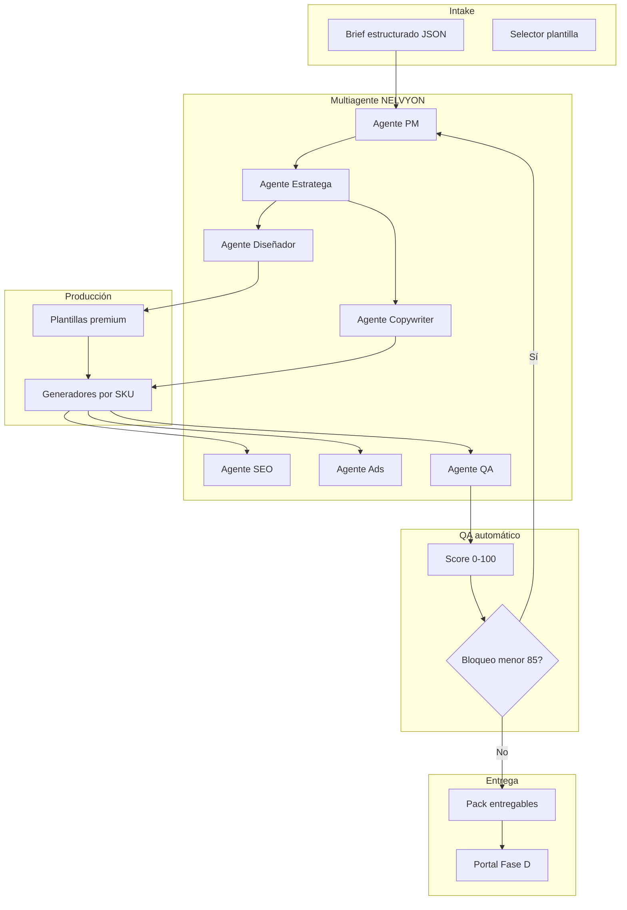

# NELVYON — Autonomous Services Mode

**Versión:** 1.0  
**Fecha:** 2026-06-07  
**Estado:** Plan técnico-operativo — **sin implementación**  
**Modelo:** Producción de servicios **sin freelancers como base** — IA + plantillas premium + SOPs + QA automático + revisión multiagente.

---

## 0. Principios y límites del plan

### 0.1 Qué cambia respecto al modelo anterior

| Antes (híbrido freelancer) | Ahora (autonomous mode) |
|----------------------------|-------------------------|
| Freelancer ejecuta SOP | **Pipeline multiagente** ejecuta SOP |
| QA humano G3 obligatorio | **QA automático score ≥ 85** + excepción humana opcional |
| Creatividad desde cero | **Plantilla premium + parametrización IA** |
| Escala = más personas | Escala = más cómputo + librería plantillas |

**Humano residual (no base del modelo):** aprobación cliente, accesos OAuth cuentas ads, excepciones legales sector regulado, override QA < 85 con justificación firmada.

### 0.2 Fuera de alcance de implementación (este plan)

| Área | Regla |
|------|-------|
| SaaS | No modificar |
| OS core | No modificar shell, RLS, deals, documentos core |
| Portal cliente | No modificar en Fases A–C; solo entrega en Fase D vía capa delgada |
| Backend crítico | No tocar auth, billing, migrate core |

### 0.3 Activos existentes reutilizables (solo lectura / orquestación futura)

| Activo | Ubicación | Rol en autonomous mode |
|--------|-----------|------------------------|
| Web Builder | `os_web_builder_service` | Generación web |
| Landing Builder | `landing_builder_service` | Generación landing |
| Store Builder | `os_store_builder_service` | Ecommerce básico |
| Chatbot | `chatbot_service.py` | Despliegue bot |
| Ads APIs | `google_ads_service`, `meta_ads_service` | Campañas (con tokens cliente) |
| Agents LLM | `backend/os-agents/agents/*PremiumAgent.ts` | Borradores → evolucionar a agentes autónomos |
| QA engine | `qa_engine.py` | Base scoring automático |
| Runbooks + SOPs | `docs/services/*_SOP.md` | Fuente de verdad alcance |
| Plantillas zip | `templates/*.zip` | Base premium (Aceternity) |

### 0.4 Arquitectura objetivo (conceptual)



---

## 1. Servicios producidos casi en autonomía (catálogo)

NELVYON puede producir en **modo autónomo** estos 11 SKUs. El grado de autonomía varía por servicio (ver §8).

| # | Servicio | SKU | Tier autónomo recomendado | Autonomía objetivo |
|---|----------|-----|---------------------------|-------------------|
| 1 | Landing pages | NELVYON-LANDING | Starter / Pro | 90–95% |
| 2 | Webs corporativas | NELVYON-WEB | Starter / Pro | 82–88% |
| 3 | Logos | NELVYON-LOGO | Starter / Pro | 75–85% |
| 4 | Branding básico | NELVYON-BRAND | Starter / Pro | 78–88% |
| 5 | Chatbots IA | NELVYON-CHATBOT | Starter / Pro | 85–92% |
| 6 | Automatizaciones | NELVYON-AUTO | Starter / Pro | 70–80% |
| 7 | SEO básico | NELVYON-SEO | Starter / Pro | 80–88% |
| 8 | Campañas Google Ads | NELVYON-GADS | Starter / Pro | 75–85% |
| 9 | Campañas Meta Ads | NELVYON-META | Starter / Pro | 75–85% |
| 10 | Ecommerce básico | NELVYON-ECOM | Starter / Pro | 70–80% |
| 11 | TikTok Ads básico | NELVYON-TIKTOK | Starter | 65–75% |

**Premium tier:** autonomía reducida (60–75%) — más iteraciones, personalización y revisión humana opcional en excepciones.

---

## 2. Ficha por servicio

Formato estándar por SKU: inputs · plantillas · agentes · pasos automáticos · QA · entregables · límites.

---

### 2.1 Landing pages

| Dimensión | Detalle |
|-----------|---------|
| **Inputs cliente** | Nombre empresa, sector, propuesta valor (1 párrafo), CTA objetivo, paleta opcional, logo PNG/SVG, testimonios (texto), dominio/subdominio, pixel Meta o Google ID, 3 referencias webs que gustan |
| **Plantillas** | 6 layouts CRO (`landing-cro-v1`…`v6`) basados en Aceternity/Proactiv; variantes hero, formulario, pricing, FAQ |
| **Agentes** | PM → Estratega (ángulo conversión) → Copywriter (headline, bullets, CTA) → Diseñador (tokens + imágenes) → SEO (meta, schema) → QA |
| **Pasos automáticos** | 1) Validar brief · 2) Elegir plantilla por sector · 3) Generar copy ES/EN · 4) Aplicar design tokens · 5) Build `landing_builder_service` · 6) Inyectar pixels · 7) PageSpeed pass · 8) Pack ZIP + URL staging |
| **QA automático** | Checklist `LANDING_SOP.md` G2: mobile 375px, CTA visible above fold, form funcional, SSL, meta title/desc, contraste WCAG AA, LCP < 2.5s staging, 1 CTA principal |
| **Entregables** | URL staging/live, fuentes editables (JSON copy map), 3 PNG preview, informe QA PDF, guía cambio CTA 1 pág |
| **Límites reales** | Sin video custom; máx. 1 landing/variante A/B en Starter; copy legal sector salud/finanzas requiere disclaimer cliente; no integración CRM custom sin AUTO |

**Score QA pesos:** CRO 30% · técnico 25% · copy 25% · SEO on-page 20%

---

### 2.2 Webs corporativas

| Dimensión | Detalle |
|-----------|---------|
| **Inputs cliente** | Brief 11 servicios WEB_SOP, sitemap deseado (5–7 páginas), textos por página o bullet points, imágenes equipo/producto, logo, colores, dominio, email formulario, política privacidad (o generar borrador) |
| **Plantillas** | 4 shells corporativos: `corp-saas`, `corp-services`, `corp-local`, `corp-professional` (Proactiv, Foxtrot, Productized Agency, Simplistic SaaS adaptados) |
| **Agentes** | PM → Estratega (arquitectura info) → Copywriter (todas páginas) → Diseñador (sistema visual) → SEO (sitemap, schema Organization) → QA |
| **Pasos automáticos** | 1) Mapear páginas a rutas plantilla · 2) Generar copy por sección · 3) Optimizar imágenes WebP · 4) Build `os_web_builder_service` · 5) Cookies banner RGPD básico · 6) Formulario → email/webhook · 7) Sitemap.xml + robots.txt |
| **QA automático** | Navegación 100% links, 404 cero, responsive 3 breakpoints, form test, política privacidad presente, H1 único por página, alt en imágenes, PageSpeed mobile ≥ 80 |
| **Entregables** | Web live/staging, ZIP código, mapa contenido JSON, checklist SEO on-page, vídeo Loom autogenerado walkthrough 2 min |
| **Límites reales** | Starter máx. 5 páginas; blog > 2 posts = scope Pro+; fotos stock si cliente no envía; sin multi-idioma > 2 idiomas en autónomo; integraciones ERP no incluidas |

---

### 2.3 Logos

| Dimensión | Detalle |
|-----------|---------|
| **Inputs cliente** | Nombre marca, sector, 5 adjetivos marca, referencias amor/odio (URLs), restricciones color, competidores a evitar, nombre legal entidad |
| **Plantillas** | Kit generativo: 12 prompts sectoriales + 8 layouts geométricos + pipeline SVG template (monograma, wordmark, combination) |
| **Agentes** | Estratega (posicionamiento semiótico) → Diseñador (conceptos IA + vectorización asistida) → QA (legibilidad, escala) |
| **Pasos automáticos** | 1) Research competencia (web scrape público) · 2) Generar 6 conceptos (2D raster) · 3) Selección automática top 3 por score estética · 4) Vectorizar mejor concepto (SVG) · 5) Variantes H/V/mono · 6) Export kit PNG/ICO/SVG |
| **QA automático** | Legible 32px favicon, contraste mono, máx. 3 colores, sin gradiente obligatorio, archivos nombrados convención, similitud < 30% con logos competencia top-5 (visión IA) |
| **Entregables** | SVG master, PNG @1x/@2x/@4x, favicon.ico, mini brand sheet 1 pág PDF |
| **Límites reales** | **No sustituye registro marca**; sin garantía trademark; Premium (4 conceptos + refinamiento) necesita override humano; caligrafía compleja falla a menudo; no packaging 3D |

---

### 2.4 Branding básico

| Dimensión | Detalle |
|-----------|---------|
| **Inputs cliente** | Todo logo §2.3 + personalidad marca, audiencia, competidores, touchpoints (web, social, email), tono deseado |
| **Plantillas** | Brand book HTML→PDF 18 pp, paleta 5 colores, 2 tipografías Google Fonts, 9 plantillas social (Canva JSON/Figma community base) |
| **Agentes** | Estratega → Copywriter (voz, tagline, messaging) → Diseñador (sistema visual) → QA |
| **Pasos automáticos** | 1) Arquetipo + posicionamiento · 2) Paleta generativa con WCAG · 3) Tipografía pair · 4) Logo si no existe · 5) Brand book compile · 6) Mockups web/social/tarjeta |
| **QA automático** | Contraste AA todas combinaciones, coherencia logo+paleta+tipo, 5 ejemplos do/don't voz, licencias fonts documentadas |
| **Entregables** | Brand book PDF, tokens JSON (`--color-primary`, fonts), kit social PNG, plantilla presentación Google Slides autogenerada |
| **Límites reales** | Sin naming legal avanzado; sin manual impresión CMYK profundo; submarcas = Premium; rebrands con activos legacy complejos requieren intake extendido |

---

### 2.5 Chatbots IA

| Dimensión | Detalle |
|-----------|---------|
| **Inputs cliente** | URL web, 20–50 FAQs (o PDF catálogo), tono, idiomas, horario humano, email handoff, leads: qué campos capturar, sector compliance |
| **Plantillas** | 5 flows base: `faq-general`, `lead-capture`, `appointment`, `ecommerce-support`, `b2b-qualify` |
| **Agentes** | Estratega (intenciones) → Copywriter (respuestas) → PM (integración) → QA (alucinaciones, RGPD) |
| **Pasos automáticos** | 1) Ingest FAQs/web scrape permitido · 2) Clasificar intenciones · 3) Generar system prompt · 4) Desplegar `chatbot_service` widget · 5) Test 50 preguntas gold set · 6) Dashboard métricas |
| **QA automático** | Tasa respuesta útil ≥ 80% gold set, sin datos inventados precios, disclaimer presente, RGPD banner, handoff email funciona, latencia < 3s p95 |
| **Entregables** | Widget JS snippet, panel admin, export conversaciones CSV, doc actualización FAQs |
| **Límites reales** | No consejo médico/legal vinculante; sin WhatsApp Business API en Starter autónomo; 50+ intenciones = Pro; fine-tuning custom Premium |

---

### 2.6 Automatizaciones IA

| Dimensión | Detalle |
|-----------|---------|
| **Inputs cliente** | Diagrama proceso actual (texto), herramientas (CRM, email, Sheets), triggers deseados, volumen/mes, datos sensibles |
| **Plantillas** | 8 playbooks: `lead-to-crm`, `form-to-slack`, `abandoned-cart-email`, `welcome-sequence`, `invoice-reminder`, `review-request`, `ads-lead-routing`, `chatbot-to-crm` |
| **Agentes** | Estratega (TO-BE) → PM (workflow) → QA (seguridad datos) |
| **Pasos automáticos** | 1) Mapear AS-IS → TO-BE · 2) Elegir playbook · 3) Generar Make/Zapier/n8n JSON · 4) Documentar · 5) Test con datos sandbox |
| **QA automático** | Flujo ejecuta 3 veces sin error, PII no en logs, idempotencia, timeout handling, rollback doc |
| **Entregables** | Diagrama Mermaid, export workflow, manual operación, credenciales checklist |
| **Límites reales** | Sin acceso a sistemas on-premise; APIs propietarias sin doc = no autónomo; ERP complejos = consultoría; no garantía SLA terceros |

---

### 2.7 SEO básico

| Dimensión | Detalle |
|-----------|---------|
| **Inputs cliente** | URL web, mercado objetivo, 10 keywords semilla, acceso GSC (OAuth), competidores, idioma |
| **Plantillas** | Informe SEO 25 pp HTML→PDF, checklist on-page 40 ítems, plantilla brief artículo |
| **Agentes** | SEO (auditoría) → Copywriter (meta, H1) → Estratega (priorización) → QA |
| **Pasos automáticos** | 1) Crawl sitemap (límite 50 URLs) · 2) Lighthouse batch · 3) GSC import si token · 4) Análisis keywords · 5) Recomendaciones on-page · 6) Aplicar fixes auto (meta, alt, schema) donde posible |
| **QA automático** | Informe completo 10 secciones, 0 URLs críticas 5xx, titles únicos, meta desc presentes, schema válido JSON-LD |
| **Entregables** | PDF informe, CSV issues priorizados, parches meta JSON para CMS, plan 90 días |
| **Límites reales** | Sin link building outreach; sin garantía posiciones; crawl > 200 URLs = Pro; Semrush/Ahrefs opcional con API key cliente |

---

### 2.8 Campañas Google Ads

| Dimensión | Detalle |
|-----------|---------|
| **Inputs cliente** | URL landing, presupuesto diario, geo, keywords semilla, conversión (form/llamada), acceso Google Ads OAuth, histórico si existe |
| **Plantillas** | Estructura cuenta template: 1 campaña Search Starter, 2 campañas Pro (Search+PMax), RSA templates por sector (8) |
| **Agentes** | Estratega (funnel) → Ads (estructura, pujas) → Copywriter (RSA) → QA |
| **Pasos automáticos** | 1) Validar tracking · 2) Keyword research IA + negativas · 3) Crear campaña vía API · 4) RSA 15 headlines / 4 descriptions · 5) Extensiones · 6) Informe setup |
| **QA automático** | Conversion tracking verde, ≥ 1 RSA strength Good, políticas Google pass (automated policy check), geo correcto, presupuesto cap |
| **Entregables** | Export campaña PDF, screenshot Ads Manager, lista keywords CSV, manual optimización 14d |
| **Límites reales** | Cuenta suspendida = no autónomo; presupuesto media cliente; sin garantía CPL; políticas sector restringido (salud, legal) = revisión humana |

---

### 2.9 Campañas Meta Ads

| Dimensión | Detalle |
|-----------|---------|
| **Inputs cliente** | URL, pixel ID, BM access, presupuesto, audiencias, creatividades producto si hay, objetivo (leads/tráfico/ventas) |
| **Plantillas** | 12 creatividades estáticas sectoriales 1080×1080 y 9:16, 3 estructuras campaña (TOF lead gen, retargeting, catalog) |
| **Agentes** | Estratega → Ads → Diseñador (creatividades) → Copywriter → QA |
| **Pasos automáticos** | 1) Pixel verify · 2) Generar 3–5 creatividades · 3) Copy primary text variants · 4) Crear campaña API · 5) Audience broad + interest stack · 6) Informe |
| **QA automático** | Texto < 20% imagen (overlay check), pixel events, UTM consistente, políticas Meta automated scan, mobile preview OK |
| **Entregables** | Ads live, PNG creatividades, copy doc, informe setup |
| **Límites reales** | Video UGC real no generado; cuenta disabled = stop; iOS ATT impact no modelado; Premium video 9:16 requiere assets cliente o stock |

---

### 2.10 Ecommerce básico

| Dimensión | Detalle |
|-----------|---------|
| **Inputs cliente** | Catálogo CSV (SKU, precio, imagen URL, descripción), logo, colores, política envíos/devoluciones, Stripe keys, dominio |
| **Plantillas** | 2 themes Shopify headless o Store Builder: `shop-minimal`, `shop-catalog` (máx. 100 SKU Starter) |
| **Agentes** | Estratega → Diseñador → Copywriter (PDP) → SEO (product schema) → QA |
| **Pasos automáticos** | 1) Import catálogo · 2) Categorías auto · 3) PDP template apply · 4) Checkout Stripe test · 5) Políticas páginas · 6) Sitemap productos |
| **QA automático** | 1 compra test OK, schema Product válido, imágenes lazy load, precios consistentes CSV, GDPR checkout |
| **Entregables** | Tienda staging/live, admin guía, CSV productos importado, test order receipt |
| **Límites reales** | > 100 SKU = Pro manual assist; migraciones Woo/Presta no autónomas; pasarelas no-Stripe = fase posterior; fotos producto calidad baja = warning QA |

---

### 2.11 TikTok Ads básico

| Dimensión | Detalle |
|-----------|---------|
| **Inputs cliente** | URL, objetivo, presupuesto, cuenta TikTok Ads access, videos existentes o brief UGC, audiencia |
| **Plantillas** | 6 scripts video 15–30s, 4 thumbnails, estructura campaña Spark Ads |
| **Agentes** | Estratega → Ads → Copywriter (hooks) → QA |
| **Pasos automáticos** | 1) Generar scripts + storyboard · 2) Si video cliente: validar formato · 3) Si no: slideshow stock + captions auto · 4) Config campaña manual-asistida (API limitada) · 5) Informe |
| **QA automático** | Hook primeros 3s claro, subtítulos legibles, CTA visible, formato 9:16, políticas TikTok text scan |
| **Entregables** | Scripts PDF, assets estáticos/slideshow MP4, guía upload manual campaña, checklist |
| **Límites reales** | **Sin TikTok Marketing API completa** — setup campaña semi-manual; video nativo UGC no generado con calidad broadcast; menor autonomía del catálogo |

---

## 3. Sistema multiagente

### 3.1 Orquestación

| Componente | Responsabilidad |
|------------|-----------------|
| **Orquestador** | Cola de trabajos por SKU, estado máquina, reintentos, handoffs JSON entre agentes |
| **Memoria proyecto** | Brief + artefactos versionados (copy v1, design v2…) |
| **Human-in-the-loop gates** | Solo: OAuth cliente, override QA, sector regulado |

### 3.2 Agentes (7 roles)

#### Agente Project Manager (`agent-pm`)

| Campo | Valor |
|-------|-------|
| **Input** | Brief validado, SKU, tier |
| **Output** | Plan tareas, timeline, dependencias, estado |
| **Herramientas** | SOP parser, checklist gates G0–G4 |
| **Reglas** | No avanzar sin inputs mínimos; escalar bloqueo QA |

#### Agente Estratega (`agent-strategist`)

| Campo | Valor |
|-------|-------|
| **Input** | Brief, research sector, competencia |
| **Output** | Positioning 1-pager, ángulo campaña, arquitectura web, prioridades SEO |
| **Herramientas** | Web search, scrape público, case studies portfolio |
| **Reglas** | Alineado tier; no prometer fuera SOP |

#### Agente Copywriter (`agent-copywriter`)

| Campo | Valor |
|-------|-------|
| **Input** | Estrategia, tono marca, restricciones legales |
| **Output** | Copy estructurado JSON por sección/campaña |
| **Herramientas** | LLM, glosario NELVYON, linter español |
| **Reglas** | Sin claims prohibidos sector; CTA único landing |

#### Agente Diseñador (`agent-designer`)

| Campo | Valor |
|-------|-------|
| **Input** | Tokens marca, plantilla seleccionada, copy map |
| **Output** | Design tokens, assets, creatividades ads |
| **Herramientas** | Plantillas React/Tailwind, DALL·E/SD (conceptos), Sharp |
| **Reglas** | WCAG AA; usar plantilla premium obligatoria |

#### Agente SEO (`agent-seo`)

| Campo | Valor |
|-------|-------|
| **Input** | URL, contenido, keywords |
| **Output** | Meta, schema, informe, fixes |
| **Herramientas** | Crawler, Lighthouse, GSC API, `SeoPremiumAgent` |
| **Reglas** | White-hat only; documentar límites ranking |

#### Agente Ads (`agent-ads`)

| Campo | Valor |
|-------|-------|
| **Input** | Landing URL, presupuesto, tokens OAuth |
| **Output** | Estructura campaña, creatividades, informe |
| **Herramientas** | `google_ads_service`, `meta_ads_service`, Ads agents |
| **Reglas** | No activar sin tracking verificado |

#### Agente QA (`agent-qa`)

| Campo | Valor |
|-------|-------|
| **Input** | Todos artefactos, checklist SOP |
| **Output** | Score 0–100, informe, bloqueo/liberación |
| **Herramientas** | `qa_engine.py`, Playwright, Lighthouse, visión IA |
| **Reglas** | **Bloqueo obligatorio si score < 85** |

### 3.3 Flujo multiagente típico (Landing)

```
PM valida brief → Estratega define ángulo → Copywriter genera copy
→ Diseñador aplica plantilla → Builder compila → SEO meta
→ QA score → si <85: loop a agente fallido (máx 3) → PM empaqueta
```

### 3.4 Contratos entre agentes (JSON schema conceptual)

```json
{
  "project_id": "uuid",
  "sku": "NELVYON-LANDING",
  "tier": "professional",
  "artifacts": {
    "strategy": { "version": 1, "path": "..." },
    "copy": { "version": 2, "path": "..." },
    "design": { "version": 1, "path": "..." }
  },
  "qa": { "score": 87, "blocked": false, "failed_dimensions": [] }
}
```

---

## 4. QA automático

### 4.1 Principios

| Regla | Detalle |
|-------|---------|
| **Score global 0–100** | Media ponderada dimensiones por SKU |
| **Umbral entrega** | **≥ 85** para liberar a portal/cliente |
| **Bloqueo** | < 85 → reintento automático (máx. 3) → escala PM → opcional humano |
| **Trazabilidad** | Cada score guardado con timestamp, versión artefacto, tests ejecutados |

### 4.2 Dimensiones globales (peso base)

| Dimensión | Peso base | Medición automática |
|-----------|-----------|---------------------|
| **SOP compliance** | 25% | Checklist ítems aplicables |
| **Técnico** | 25% | Lighthouse, links, SSL, build |
| **Contenido** | 20% | Linter, tono, claims |
| **Conversión / CRO** | 15% | CTA, form, above-fold |
| **SEO / tracking** | 15% | Meta, schema, pixels |

### 4.3 Checklist por servicio (extracto bloqueantes)

| Servicio | Ítems bloqueantes QA (muestra) |
|----------|-------------------------------|
| Landing | Form submit OK, 1 CTA, mobile 375, LCP staging |
| Web | 0 links rotos, privacidad, H1 único |
| Logo | SVG válido, 32px legible |
| Branding | Contraste AA |
| Chatbot | Gold set ≥ 80%, disclaimer |
| SEO | Informe 10 secciones, 0 5xx |
| Google Ads | Tracking verde, RSA Good |
| Meta Ads | Pixel events, policy scan |
| Ecommerce | Test purchase OK |
| TikTok | Formato 9:16, hook 3s |
| Automation | 3 ejecuciones sin error |

### 4.4 Scoring ejemplo (Landing)

| Test | Puntos max | Auto |
|------|------------|------|
| Lighthouse mobile ≥ 85 | 15 | Sí |
| WCAG AA contraste | 10 | Sí |
| Copy: headline + beneficio + CTA | 15 | Sí (LLM rubric) |
| Formulario envía email/webhook | 15 | Sí (Playwright) |
| Meta title/desc únicos | 10 | Sí |
| Pixel dispara PageView | 10 | Sí |
| SOP checklist 100% ítems críticos | 25 | Sí |

### 4.5 Revisión pre-portal (Fase D)

Antes de `published` en portal cliente:

1. QA agente score ≥ 85  
2. Scan malware/enlaces externos  
3. Pack entregables completo (nombres convención)  
4. Watermark staging removido  
5. Email handoff autogenerado (borrador PM agent)

---

## 5. Plantillas necesarias

### 5.1 Inventario actual (repo)

| Plantilla | Archivo | Uso autónomo |
|-----------|---------|--------------|
| Proactiv Marketing | `templates/proactiv-marketing-template.zip` | Web corp, landing |
| Foxtrot Marketing | `templates/foxtrot-marketing-template.zip` | Blog, content web |
| Productized Agency | `templates/productized-agency-template.zip` | Services B2B web |
| Simplistic SaaS | `templates/simplistic-saas-template.zip` | SaaS/tech web |

### 5.2 Plantillas a desarrollar internamente

| Categoría | Cantidad | Prioridad |
|-----------|----------|-----------|
| Landing CRO | 6 layouts | P0 |
| Web corporativa shells | 4 | P0 |
| Brand book HTML | 2 | P1 |
| Logo SVG scaffolds | 8 | P1 |
| Meta/Google ad static | 24 (12 sectores × 2 formatos) | P1 |
| SEO report HTML | 1 | P0 |
| Chatbot flow JSON | 5 | P0 |
| Ecommerce PDP/PLP | 2 | P1 |
| TikTok script + slideshow | 6 | P2 |
| Automation playbook JSON | 8 | P1 |

### 5.3 Plantillas a adquirir (licencia comercial)

| Proveedor / tipo | Qué comprar | Uso | Budget orientativo |
|------------------|-------------|-----|-------------------|
| **Aceternity UI Pro** | Componentes premium React | Landings, webs | €200–400 |
| **ThemeForest / Shopify** | 2 themes ecommerce (minimal, catalog) | Ecommerce básico | €120–160 |
| **Creative Market** | 4 branding kits base (editables) | Branding/logo seed | €80–120 |
| **Envato Elements** | Suscripción 1 año | Stock video, icons, mockups | €200/año |
| **Figma Community Pro packs** | 3 design systems licencia | Branding, ads | €0–150 |
| **Google Fonts** | Gratis | Tipografía | €0 |
| **Undraw / Storyset** | Ilustraciones SVG (licencia) | Web, landing | €0–100 |
| **Canva Pro for Teams** | Templates social export | Branding kit | €120/año |

**Total estimado adquisición año 1:** €700–1.200

### 5.4 Biblioteca sectorial (contenido parametrizable)

Crear `templates/sectors/` con variables:

- `solar`, `dental`, `legal`, `fitness`, `ecommerce-fashion`, `b2b-saas`, `local-services`

Cada sector: headlines pool, imágenes stock IDs, keywords ads, FAQs chatbot.

---

## 6. Roadmap de implementación

### PHASE A — Documentación + prompts (sin código productivo)

**Duración:** 4–6 semanas

| Entregable | Detalle |
|------------|---------|
| SOPs autonomous overlay | Anexo por cada `*_SOP.md`: modo autónomo |
| Prompt library | System prompts 7 agentes + por SKU |
| Checklists QA scoring | Matriz 0–100 por servicio |
| Template registry | Catálogo plantillas + variables |
| Brief JSON schemas | Un schema por SKU |
| Gold sets | 50 preguntas chatbot, 20 landings test |

**Criterio salida:** Playbook ejecutable manualmente (humanos simulan agentes).

---

### PHASE B — Generación semiautomática

**Duración:** 8–12 semanas  
**Alcance código:** capa nueva `services-autonomous/` — **no OS core**

| Entregable | Detalle |
|------------|---------|
| Orquestador jobs | Cola + estado máquina |
| Wrappers builders | Invocar web/landing/store builders existentes |
| Agent prompts wired | LLM calls con memoria proyecto |
| Template renderer | Sustituir variables brief → código |
| UI interna mínima | Panel ops: lanzar job, ver logs (no portal) |

**SKUs piloto:** Landing → Chatbot → SEO básico

**Criterio salida:** 3 SKUs generados end-to-end con humano en un clic "aprobar".

---

### PHASE C — QA automático

**Duración:** 8–10 semanas

| Entregable | Detalle |
|------------|---------|
| QA scorer | Extender `qa_engine.py` en capa autonomous |
| Playwright suite | Forms, links, responsive |
| Lighthouse CI | Batch URLs |
| Policy scanners | Ads copy, claims sector |
| Retry loop | Auto-fix agents (máx 3) |
| Umbral 85 enforced | Bloqueo hard |

**Criterio salida:** 80% proyectos piloto liberados sin intervención humana QA.

---

### PHASE D — Entrega directa al portal

**Duración:** 6–8 semanas  
**Alcance:** integración delgada — webhook/publicación entregables, sin refactor portal

| Entregable | Detalle |
|------------|---------|
| Publisher API | POST entregables → storage + OS entregable record |
| Cliente notificación | Email handoff automático |
| Staging → live | Flujo dominio cliente |
| Dashboard cliente | Ver previews, aprobar, solicitar 1 ronda revisión |
| Métricas autonomous | Tiempo ciclo, score medio, tasa reintento |

**Criterio salida:** Cliente recibe landing en portal < 72h desde brief completo (Starter).

---

### Timeline total estimado

| Fase | Semanas | Acumulado |
|------|---------|-----------|
| A | 4–6 | 6 |
| B | 8–12 | 18 |
| C | 8–10 | 28 |
| D | 6–8 | **36** |

**Total: 7–9 meses** hasta entrega portal autónoma para SKUs piloto.  
**Catálogo completo 11 SKUs autónomos:** +3–4 meses tras Fase D.

---

## 7. Dependencias y riesgos

| Riesgo | Impacto | Mitigación |
|--------|---------|------------|
| APIs ads sin token cliente | Bloqueo GADS/META | Intake OAuth obligatorio; instrucciones video |
| Calidad logo vector | Score < 85 frecuente | Plantillas SVG + reroll; Premium humano |
| TikTok sin API | Autonomía baja | Fase 2 API; mientras: asistido |
| Alucinaciones chatbot | Compliance | Gold set + bloqueo |
| Sector regulado | Legal | Flag brief → pausa autónomo |
| Coste LLM | Margen | Caché prompts, modelos tiered |
| Plantillas licencia | Legal | Registro compras §5.3 |

---

## 8. Resumen ejecutivo (respuestas directas)

### 8.1 Servicios automatizables al 80–95%

| Servicio | Autonomía realista | Notas |
|----------|-------------------|-------|
| **Landing pages** | **90–95%** | Mejor candidato; ciclo corto |
| **Chatbots IA** | **85–92%** | `chatbot_service` maduro |
| **SEO básico** | **80–88%** | Informes + on-page auto |
| **Webs corporativas** | **82–88%** | Builders existentes |
| **Branding básico** | **78–88%** | Brand book auto; logo weak link |
| **Logos** | **75–85%** | Vectorización = cuello de botella |
| **Meta Ads** | **75–85%** | Requiere OAuth + creatividades stock |
| **Google Ads** | **75–85%** | Requiere OAuth + landing lista |
| **Automatizaciones** | **70–80%** | Depende APIs terceros |
| **Ecommerce básico** | **70–80%** | Stripe + catálogo CSV |
| **TikTok Ads básico** | **65–75%** | API incompleta; video limitado |

### 8.2 Servicios que NO pueden ser 100% autónomos todavía

| Área | Por qué |
|------|---------|
| **TikTok Ads campaña live** | Marketing API no integrada; upload manual |
| **Logo trademark / registro** | Legal humano obligatorio |
| **Sectores regulados** (salud, legal, finanzas) | Claims compliance |
| **Fotografía real** (equipo, producto, clínica) | Cliente debe proveer |
| **OAuth cuentas ads** | Acción cliente inevitable |
| **Ecommerce > 100 SKU / migraciones** | Complejidad datos |
| **SEO link building outreach** | Relaciones humanas |
| **Video UGC TikTok/Meta Premium** | No generación broadcast quality |
| **Premium tier diseño bespoke** | Iteración creativa subjetiva |
| **Pasarelas pago no-Stripe** | Integración custom |
| **Automatizaciones on-premise / ERP legacy** | Sin API estándar |

### 8.3 Plantillas que hay que comprar

| Prioridad | Compra |
|-----------|--------|
| **P0** | Aceternity UI Pro; 2 themes ecommerce ThemeForest |
| **P1** | Envato Elements 1 año; 4 branding kits Creative Market |
| **P2** | Canva Pro Teams; packs iconos premium |

Ya disponibles gratis/repo: Proactiv, Foxtrot, Productized Agency, Simplistic SaaS (4 webs).

### 8.4 Orden recomendado de ejecución

| Orden | Qué | Por qué |
|-------|-----|---------|
| 1 | **Landing** | Máxima autonomía, valida pipeline completo |
| 2 | **Chatbot** | Servicio IA diferenciador, código listo |
| 3 | **SEO básico** | Informes rápidos, bajo riesgo |
| 4 | **Google Ads + Meta Ads** | Revenue; depende landing |
| 5 | **Web corporativa** | Reutiliza landings + plantillas |
| 6 | **Logo + Branding básico** | Upstream de web/ads |
| 7 | **Ecommerce básico** | Stripe + catálogo |
| 8 | **Automatizaciones** | Conecta leads chatbot/ads |
| 9 | **TikTok Ads** | Último; menor madurez API |

### 8.5 Tiempo estimado

| Hito | Tiempo |
|------|--------|
| Phase A (docs + prompts) | 4–6 semanas |
| Primer SKU autónomo (Landing) Phase B | +8–10 semanas |
| QA automático operativo Phase C | +8–10 semanas |
| Entrega portal Phase D | +6–8 semanas |
| **MVP autonomous (3 SKUs)** | **~5–6 meses** |
| **11 SKUs + QA 85 estable** | **~9–10 meses** |

---

## 9. Métricas de éxito autonomous mode

| Métrica | Objetivo año 1 |
|---------|----------------|
| % proyectos sin intervención humana producción | ≥ 70% Starter tier |
| Score QA medio | ≥ 88 |
| Tasa bloqueo < 85 tras 3 reintentos | < 15% |
| Tiempo brief → entrega portal (Landing Starter) | < 72h |
| Coste IA por proyecto Landing | < €15 |
| NPS cliente autonomous | ≥ 7 |
| Margen bruto vs modelo freelancer | +25–40 pp |

---

## 10. Relación con documentación existente

| Doc | Actualización futura (Phase A) |
|-----|-------------------------------|
| `SERVICES_MASTER_PLAN.md` | Añadir § autonomous overlay |
| `SERVICES_QA_MASTER.md` | Reemplazar QA humano G3 por score 85 en modo autónomo |
| `NELVYON_OPERATIONS_MANUAL.md` | Roles: Operador autonomous vs Account |
| `FREELANCER_SCORECARD.md` | **Deprecar como base** — mantener solo override opcional |
| `docs/commercial/*` | Añadir tier "Autonomous Starter" comercial |

---

*Autonomous Services Mode v1.0 — Plan técnico-operativo NELVYON · Sin implementación*
