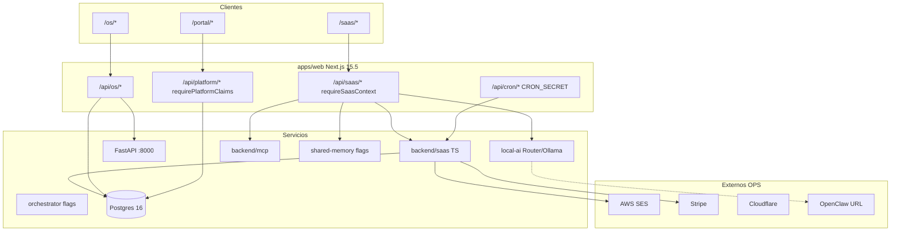

# NELVYON — MASTER CONTEXT (Biblia oficial)

> **Fecha del documento:** 2026-07-21 (sync auditoría cierre)  
> **Idioma:** español (España)  
> **Rol:** narrativa maestra de contexto CTO / Enterprise para cualquier IA o humano  
> **Tipo:** biblia de contexto (no sustituye el SSOT operativo diario)

---

## Preámbulo — Autoridad, leyenda y uso

### Jerarquía de autoridad documental

**[VERIFICADO]** Reglas vinculantes. Ante contradicción entre documentos, aplicar este orden:

| Prioridad | Documento | Rol |
|-----------|-----------|-----|
| 1 (máxima operativa diaria) | `docs/HANDOVER.md` | **SSOT diario** — estado actual + próximo paso EXACTO (nunca vacío) |
| 2 | `docs/DATABASE.md` | Schema, migraciones, RLS, dominios de tablas |
| 3 | `docs/DECISIONS.md` | ADRs 001–032 (decisiones estructurales) |
| 4 | `docs/KNOWN_ISSUES.md` | KI abiertos e historial |
| 5 (ceder si hay drift) | `docs/AI_CONTEXT.md`, filas históricas de `docs/ROADMAP.md`, claims históricos de `docs/LAUNCH_READY.md`, `docs/INFRASTRUCTURE.md` “hasta-514”, líneas de `docs/PROJECT_STATUS.md` que digan Workforce **CONDITIONAL** | Pueden estar envejecidos |

**Este archivo (`NELVYON_MASTER_CONTEXT.md`)** = **narrativa biblia** de contexto largo (qué es NELVYON, arquitectura, inventario, ADRs, glosario, protocolo IA).  
**No** es el SSOT del “qué hacer ahora”. Eso es siempre **HANDOVER**.

**Ejemplo de resolución de contradicción [VERIFICADO 2026-07-21]:**

| Tema | Doc envejecido | Doc que gana | Valor correcto |
|------|----------------|--------------|----------------|
| Última migración | INFRASTRUCTURE “hasta 514” · ROADMAP “511” | HANDOVER / CLAUDE / DATABASE | **`518_workflows_list_columns.sql`** (517/518 prod verified · ADR-002/039) |
| Shared Memory staging | PROJECT_STATUS “BLOCKED” | HANDOVER + KI-021 | **verified:true** (flags OFF) |
| verify-all | AUDITORIA previa “NOT_READY KI-027” | HANDOVER / CTO_FINAL_VERIFY 2026-07-21 | **CONDITIONAL_READY** — KI-027 ✅ |
| Workforce | PROJECT_STATUS “CONDITIONAL” (si aparece) | HANDOVER + ADR-029 | **PASS** |
| Veredicto go-live | Claims históricos LAUNCH_READY | HANDOVER | **CONDITIONAL_READY** (SES ✅ · Stripe STARTER P1 · prod≤511) |
| Producto enterprise completo | Marketing / roadmap aspiracional | HANDOVER + auditoría | **NO** |

### Leyenda de etiquetas de verificación (obligatoria)

| Etiqueta | Significado |
|----------|-------------|
| **[VERIFICADO]** | Hecho contrastable en repo, docs o código a la fecha de este documento (2026-07-20) |
| **[PARCIAL]** | Implementado o documentado con matices, drift, evidencia incompleta o “wired ≠ live” |
| **[NO VERIFICADO / OPS]** | Depende de infra externa, secretos, cuenta cloud o acción humana; **no inventar READY** |
| **[HISTÓRICO]** | Estado o decisión del pasado; no usar como “estado actual” sin cruzar HANDOVER |

**Prohibido en este documento y en cualquier respuesta IA:** inventar métricas, claims READY/PASS no respaldados, valores de secretos, historias de fundación no documentadas, ROI garantizado, o declarar producto “enterprise completo / terminado / perfecto”.

### Nota de onboarding para IAs

1. Leer **este documento** completo → onboarding de contexto.  
2. Leer inmediatamente **`docs/HANDOVER.md`** → **próxima acción exacta**.  
3. Trabajar. Al cerrar cambios importantes → documentación viva (HANDOVER + CHANGELOG + docs de área).  
4. Freezes: **no invalidar** Model Router certificado, MCP certificado/soak, Workforce PASS ni Elite PASS con cambios o cargas competidoras mientras corran soaks/certs.

### Freezes vigentes (no debilitar)

**[VERIFICADO]** HANDOVER 2026-07-20:

- **Model Router** certificado (ADR-015)  
- **MCP** certificado + soak (~2h) (ADR-016)  
- **Workforce PASS** (ADR-029)  
- **Elite PASS** (ADR-026)  
- No mocks silenciosos en prod; no debilitar tests para “pasar verde”

### Documentación viva (regla permanente)

**[VERIFICADO]** `.cursor/rules/live-documentation.mdc` + ADR-009:

Tras **cualquier cambio importante** (código, config, migraciones, infra, integraciones):

1. Actualizar `docs/HANDOVER.md` (estado + último trabajo + próximo paso EXACTO).  
2. Añadir entrada en `docs/CHANGELOG.md`.  
3. Actualizar docs de área (`DATABASE`, `INTEGRATIONS`, `INFRASTRUCTURE`, `ENVIRONMENTS`, `DEPLOYMENTS`, `KNOWN_ISSUES`, `DECISIONS`, `TODO`, `ROADMAP`, `PROJECT_STATUS` según aplique).  
4. Ejecutar `node scripts/sync-handover-metadata.mjs` si aplica.  
5. **Sin secretos** en docs. **Nunca inventar** estados. **Nunca borrar** historial en CHANGELOG / DECISIONS / ROADMAP.

---

# 1. Qué es NELVYON

### 1.1 Definición operativa

**[VERIFICADO]** NELVYON es, simultáneamente:

1. Una **agencia de marketing digital 100% operada por IA**, y  
2. Una **plataforma SaaS B2B multi-tenant**,

en un **monorepo pnpm 10.33**, con deploy target **Railway** (**Node 20** + **Postgres 16**).

Fuentes alineadas: `CLAUDE.md`, `docs/CONSTITUTION_NELVYON_AI.md`, `docs/HANDOVER.md`, este MASTER_CONTEXT.

### 1.2 Misión

**[PARCIAL — derivada de docs de producto / constitución; no es claim comercial externo]**

Operar marketing digital y un SaaS B2B con agentes, packs y automatizaciones de IA, manteniendo:

- aislamiento multi-tenant estricto,  
- evidencia reproducible (tests, certificaciones, audits),  
- aprobación humana en acciones sensibles (Constitución P5),  
- honestidad BFF (sin mock silencioso que finja éxito).

### 1.3 Visión

**[PARCIAL — formulación de producto documentada]**

Cerebro operativo **especializado** (no chatbot generalista) al servicio de:

- SaaS (`/saas/*`),  
- OS de packs (`/os/*`),  
- portal de agencia (`/portal/*`),  
- operaciones de marketing, ventas, CRM, automatización y estrategia empresarial.

### 1.4 Objetivo técnico / de producto

**[VERIFICADO — formulación operativa]**

Entregar una plataforma **demostrablemente** segura, observable y operable (código + gates locales), con go-live condicionado a ops externas (SES Live, Stripe Live, Railway, Cloudflare, Shared Memory remoto, etc.). Docker+ingest local **verificado** (Bloque 1, 2026-07-20). Staging DB **516** + SM verified (KI-026). KI-027 cerrado (verify-all **CONDITIONAL_READY**). Veredicto actual: **CONDITIONAL_READY** — **no** “enterprise completo”.

### 1.5 Filosofía

**[VERIFICADO]** Tres pilares documentados:

| Pilar | Fuente | Regla |
|-------|--------|-------|
| Constitución IA P1–P10 | `CONSTITUTION_NELVYON_AI.md` | Verdad, privacidad, aislamiento, aprobación humana, offline-first |
| Estándar de calidad ADR-019 | `QUALITY_STANDARD.md` + `enterprise-quality.mdc` | Excelencia demostrable > volumen; “cerrado” ≠ “funciona” |
| Documentación viva ADR-009 | `live-documentation.mdc` | HANDOVER nunca vacío; sin secretos; sin invención |

### 1.6 Problema que resuelve

**[VERIFICADO — formulación de producto]**

Operar **marketing digital + SaaS B2B** con **agentes/packs de IA** de forma **segura multi-tenant** (JWT SaaS, claims de plataforma, RLS en cliente, `service_role` controlado en BFF), sin depender de mocks silenciosos ni de claims de “producto terminado” sin evidencia.

### 1.7 Por qué existe

**[VERIFICADO — sin inventar founding story]**

Existe como **agencia operada por IA + plataforma SaaS**. No hay en este briefing una narrativa fundacional adicional (fecha de fundación, founders story, métricas de mercado, ROI garantizado). **No se inventa.**

### 1.8 Qué NELVYON no es (límites explícitos)

**[VERIFICADO]**

| Afirmación prohibida / incorrecta | Realidad documentada |
|-----------------------------------|----------------------|
| “Producto enterprise completo / terminado / perfecto” | **NO** — CONDITIONAL_READY |
| “Chatbot generalista cloud-first” | Cerebro especializado; PRIVATE_MODE; Router local certificado |
| “OpenClaw obligatorio” | Plugin opcional OFF (ADR-006) |
| “Shared Memory = producto completo” | Wired + flags OFF (ADR-024) |
| “Labs 461/461 = producto listo” | Cierre eval Labs ≠ producto completo (ADR-014) |

### 1.9 Superficies de producto (mapa rápido)

**[VERIFICADO]**

| Superficie | Rutas | Auth principal |
|------------|-------|----------------|
| SaaS | `/saas/*`, `/api/saas/*` | `requireSaasContext` |
| OS | `/os/*`, `/api/os/*` | plataforma / packs |
| Portal | `/portal/*`, `/api/platform/portal/*` | `requirePlatformClaims` |
| Platform BFF | `/api/platform/*` | `requirePlatformClaims` |
| Cron | `/api/cron/*` | `CRON_SECRET` |
| FastAPI | `:8000` | stack Python agentes/packs/voice |

---

# 2. Qué es NELVYON OS

### 2.1 Propósito

**[VERIFICADO]**

NELVYON **OS** (Operating System) es el motor de **packs de marketing ejecutados por IA**: orquesta jobs, entregables, QA y (cuando aplica) auto-aprobación hacia el portal cliente.

### 2.2 Funcionamiento

**[VERIFICADO]**

| Pieza | Ubicación / hecho |
|-------|-------------------|
| Motor | `runGrowthPack` en `apps/web/src/lib/packs/packOrchestrator.ts` |
| Kickoff | `/api/os/packs/[packId]/kickoff/route.ts` |
| Auto-aprobación | QA ≥ **85** → `dbAutoApprovePackDeliverables` |
| Regla dura | No pasar `coming_soon` → `available` **sin** kickoff real |

### 2.3 Packs autónomos documentados

**[VERIFICADO]**

| PackId | Rol |
|--------|-----|
| `local-business-growth` | Crecimiento negocio local |
| `ecommerce-growth` | Crecimiento ecommerce |
| `saas-b2b-growth` | Crecimiento SaaS B2B |

**SKUs autónomos documentados:** `NELVYON-LANDING`, `NELVYON-SEO`, `NELVYON-CHATBOT`.

**Alias [VERIFICADO en CLAUDE.md]:** pack OS `analytics-insights` → alias kickoff de `analytics-setup-pack`.

### 2.4 Módulos / dominios OS (alto nivel)

**[PARCIAL]** El árbol `/os/*` es amplio (~**91** páginas UI aprox.). Dominios recurrentes en migraciones/docs:

- Pack runs y entregables (`nelvyon_pack_runs`, artefactos)  
- Certificaciones sectoriales / learning loop / competitor gap  
- Recurring services / retainer autopilot  
- Agentes OS (`backend/os-agents/`)  
- Portal de aprobación de entregables (capa Agency Portal)

### 2.5 Arquitectura OS (resumen)

**[VERIFICADO]**

```
Cliente / operador → /os/* UI
                 → /api/os/* (Next BFF)
                 → packOrchestrator / FastAPI :8000
                 → Postgres (os_*, pack runs)
                 → (opcional) auto-approve QA≥85 → portal
```

### 2.6 Relación con SaaS

**[VERIFICADO]**

| Relación | Hecho |
|----------|-------|
| Producto | OS ejecuta packs de agencia; SaaS es la plataforma tenant-facing |
| Datos | Ambos usan Postgres; dominios de tablas distintos (`os_*` vs `saas_*`) |
| Auth | SaaS = `requireSaasContext`; portal/platform = `requirePlatformClaims` |
| UI | SaaS usa `SaasShellLayout`; OS tiene superficies propias `/os/*` |
| Bridge | Módulos SaaS (brief-to-launch, pack-store, entregables, autopilot) conectan con capacidad de packs |

**[PARCIAL]** “Módulo en nav SaaS relacionado con packs” ≠ necesariamente “pack OS live en prod con todos los ops OK”.

---

# 3. Qué es NELVYON SaaS

### 3.1 Objetivo

**[VERIFICADO]**

Plataforma **multi-tenant B2B** para CRM, comunicación, captación, automatización, billing, IA privada y operaciones de marketing — con layout unificado dark glass y APIs reales detrás de la UI.

### 3.2 Funcionamiento

**[VERIFICADO]**

| Aspecto | Hecho |
|---------|--------|
| Auth | `requireSaasContext` — JWT en cookies **httpOnly** (`backend/saas/saasRequestContext.ts`, ADR-003) |
| Layout | `SaasShellLayout` + `SaasSidebar` (`activeId` desde `saasNav`) |
| Diseño | dark glass `bg-[#020817]`, acento `#0084ff` |
| API | `dynamic = "force-dynamic"` en rutas que leen estado de DB |
| Servicios | `backend/saas/*.ts` — clases de servicio puras, **sin Express** |
| Paquete auth | `@nelvyon/auth` |

### 3.3 Módulos desde `saasNav` (catálogo completo)

**[VERIFICADO]** Fuente: `apps/web/src/features/saas-shell/saasNav.ts` (`SAAS_NAV_ITEMS` + `SaasNavId`).

#### Grupo principal

| id | Label | href |
|----|-------|------|
| `dashboard` | Dashboard | `/saas/dashboard` |
| `setup` | Configuración | `/saas/setup` |
| `inbox` | Bandeja Unificada | `/saas/inbox` |
| `crm` | CRM | `/saas/crm` |
| `pipeline` | Pipeline | `/saas/pipeline` |
| `calendar` | Calendario | `/saas/calendar` |

#### Grupo comunicación

| id | Label | href |
|----|-------|------|
| `campanias` | Email Campañas | `/saas/campanias` |
| `deliverability` | Deliverability | `/saas/deliverability` |
| `sms` | SMS Marketing | `/saas/sms` |
| `social` | Redes Sociales | `/saas/social` |
| `whatsapp` | WhatsApp | `/saas/whatsapp` |
| `dialer` | Dialer | `/saas/dialer` |
| `secuencias` | Secuencias | `/saas/secuencias` |

#### Grupo captación

| id | Label | href |
|----|-------|------|
| `publicidad` | Publicidad Digital | `/saas/publicidad` |
| `seo` | SEO | `/saas/seo` |
| `reputacion` | Reputación | `/saas/reputacion` |
| `funnels` | Funnels | `/saas/funnels` |
| `web-builder` | Web Builder | `/saas/web-builder` |

#### Grupo gestión

| id | Label | href |
|----|-------|------|
| `workflows` | Workflows | `/saas/workflows` |
| `formularios` | Formularios | `/saas/formularios` |
| `citas` | Agenda / Citas | `/saas/citas` |
| `helpdesk` | Helpdesk | `/saas/helpdesk` |
| `prospecting` | Prospección | `/saas/prospecting` |
| `snippets` | Snippets | `/saas/snippets` |
| `countdown` | Temporizadores | `/saas/countdown` |
| `objetos` | Objetos Personalizados | `/saas/objetos` |
| `encuestas` | Encuestas & NPS | `/saas/encuestas` |
| `documentos` | Documentos & Contratos | `/saas/documentos` |
| `facturas` | Facturas a Clientes | `/saas/facturas` |
| `qr` | Códigos QR | `/saas/qr` |
| `ab-testing` | A/B Testing | `/saas/ab-testing` |
| `lms` | LMS — Cursos | `/saas/lms` |
| `store` | Tienda Online | `/saas/store` |
| `affiliates` | Programa Afiliados | `/saas/affiliates` |
| `loyalty` | Fidelización | `/saas/loyalty` |
| `memberships` | Membresías | `/saas/memberships` |

#### Grupo IA

| id | Label | href |
|----|-------|------|
| `pack-store` | Pack Store | `/saas/packs` |
| `data-playbooks` | Playbooks | `/saas/playbooks` |
| `brief-to-launch` | Lanzar Pack | `/saas/brief-to-launch` |
| `compliance` | Compliance | `/saas/compliance` |
| `benchmark` | Benchmark | `/saas/benchmark` |
| `ai` | Panel IA | `/saas/ai` |
| `autopilot` | Autopilot | `/saas/autopilot` |
| `agentes` | Agentes IA | `/saas/agentes` |
| `chat` | Asistente IA | `/saas/chat` |
| `copywriter` | Copywriter IA | `/saas/copywriter` |

#### Grupo cuenta

| id | Label | href |
|----|-------|------|
| `entregables` | Entregables | `/saas/entregables` |
| `reportes` | Reportes | `/saas/reportes` |
| `attribution` | Atribución | `/saas/reportes?tab=attribution` |
| `integraciones` | Integraciones | `/saas/integraciones` |
| `marketplace` | Marketplace | `/saas/marketplace` |
| `herramientas` | Herramientas | `/saas/herramientas` |
| `voice` | Voz | `/saas/voice` |
| `pwa` | Instalar App | `/saas/pwa` |
| `auditoria` | Auditoría | `/saas/auditoria` |
| `lead-scoring` | Lead Scoring | `/saas/lead-scoring` |
| `comunidades` | Comunidades | `/saas/comunidades` |
| `partner` | Partner Zone | `/saas/partner` |
| `subcuentas` | Subcuentas / Agencia | `/saas/subcuentas` |
| `team` | Equipo | `/saas/team` |
| `white-label` | White Label | `/saas/white-label` |
| `webhooks` | Webhooks | `/saas/webhooks` |
| `api-keys` | API Keys | `/saas/api-keys` |
| `billing` | Facturación | `/saas/billing` |
| `settings` | Configuración | `/saas/settings` |
| `security` | Seguridad Enterprise | `/saas/security` |

**[PARCIAL]** “Módulo en nav” ≠ “certificado ops live” (SES/Stripe/OAuth/Twilio pueden estar bloqueados por KI externas). Comentario en código: *“only modules with real tenant APIs + wired UI”* — aún así, ops externas pueden impedir uso productivo.

### 3.4 Servicios backend SaaS (selección)

**[VERIFICADO / PARCIAL]** Ejemplos en `backend/saas/`:

- `SaasCampaniasService` — campañas email, bounce, SES empty state  
- `SaasWorkflowService` — workflows scheduled + trigger, idempotencia ~4 min  
- `SaasBillingService` — plan desde `saas_tenants.plan`  
- `SaasLeadScoringService` — SSOT lead scoring (ADR-023; drop `scored_leads` mig 513)  
- CRM / pipeline / inbox / helpdesk / invoice / voice / autopilot / integraciones — servicios dedicados por dominio

### 3.5 Arquitectura SaaS (resumen)

**[VERIFICADO]**

```
Browser /saas/*
  → SaasShellLayout + saasNav
  → /api/saas/* (requireSaasContext, force-dynamic)
  → backend/saas/* services
  → Postgres 16 (saas_*)
  → (opcional) Private AI Router / MCP / Shared Memory (flags)
  → SES / Stripe / OAuth providers (ops)
```

### 3.6 Legacy y prohibiciones SaaS

**[VERIFICADO]** CLAUDE.md:

- No tocar rutas `pages/api/saas/*` — responden **410** (legacy).  
- No tratar hubs GHL mock históricos como verdad de producto.  
- `SAAS_HIDDEN_ROUTES` documenta redirects 301 legacy F62 → módulos reales.

---

# 4. Arquitectura completa

### 4.1 Diagrama de capas

**[VERIFICADO]**



### 4.2 Frontend

**[VERIFICADO]**

| Ítem | Valor |
|------|-------|
| App | Next.js **15.5** App Router — `apps/web` |
| UI | React **19**, TypeScript **5.9**, Tailwind CSS **v4** |
| SaaS shell | `SaasShellLayout`, `SaasSidebar` |
| Marketing | componentes `nelvyon-marketing/*` |
| Legacy | `frontend/` Vite — **no tocar** en path prod |
| Mobile | `apps/mobile/` (workspace) |

### 4.3 Backend TypeScript

**[VERIFICADO]**

- `backend/saas/*` — servicios SaaS  
- `backend/email/*` — SES  
- `backend/mcp/*` — MCP productivo  
- `backend/shared-memory/*` — memoria compartida (flags)  
- `backend/openclaw/*` — bridge opcional OFF  
- `backend/orchestrator/*`, `backend/ai-panel/*`, `backend/automations/*`  
- `backend/autonomous/*` — workforce / Elite  
- `backend/local-ai/*` — Router, Ollama, RAG, benchmarks  
- `backend/os-agents/*` — agentes OS  
- `backend/db/*` — migraciones SQL + cliente  
- `backend/labs/*` — NELVYON-LABS adapters/closure  
- `backend/apikeys/*`, `backend/billing/*`, `backend/gdpr/*`, `backend/integrations/*`, etc.

### 4.4 Backend Python (FastAPI)

**[VERIFICADO]**

- Entrada: `backend/main.py` — puerto **8000**  
- Routers: agentes IA, packs, voice, métricas, jobs, etc.  
- Settings: Pydantic explícito (ADR-007)  
- Observabilidad: `/metrics` Prometheus-format (ver §12)

### 4.5 Base de datos

**[VERIFICADO]** Postgres **16**; migraciones numeradas `backend/db/migrations/*.sql` (**411** archivos; última **`515_shared_memory_rls.sql`**). Detalle en §7.

### 4.6 API / BFF

**[VERIFICADO / PARCIAL conteos]**

| Familia | Conteo aprox. | Auth |
|---------|---------------|------|
| `/api/saas/*` | ~**239** (inventory 2026-07-16 decía 228 — drift anotado) | `requireSaasContext` |
| `/api/os/*` | **71** | OS/platform |
| `/api/platform/*` | ~**76** | `requirePlatformClaims` |
| `/api/cron/*` | **16** | `CRON_SECRET` |
| Públicos | contratos, funnels, webhooks Stripe, etc. | tokens / firmas |

**Honestidad BFF [VERIFICADO auditoría 2026-07-20]:** EMPTY_* + `bffDegraded`; claims 500; no auth-swallow en billing/CRM/automations; POST fail-closed (502 sin mock).

### 4.7 Workers / jobs

**[VERIFICADO / PARCIAL]**

- FastAPI job queue + handlers productivos (`core/job_queue.py`, `productive_job_handlers`)  
- Cron Next `/api/cron/*` (lista completa §4.8)  
- GHA `production-cron.yml`  
- Idempotencia workflows SaaS (~4 min) documentada

### 4.8 Cron — 16 rutas (nombres exactos)

**[VERIFICADO]** Directorios bajo `apps/web/src/app/api/cron/`:

| # | Ruta | Nombre |
|---|------|--------|
| 1 | `/api/cron/saas-workflows` | `saas-workflows` |
| 2 | `/api/cron/saas-sequences` | `saas-sequences` |
| 3 | `/api/cron/saas-ceo-brief` | `saas-ceo-brief` |
| 4 | `/api/cron/saas-dunning` | `saas-dunning` |
| 5 | `/api/cron/saas-elite-maintenance` | `saas-elite-maintenance` |
| 6 | `/api/cron/saas-competitor-gap` | `saas-competitor-gap` |
| 7 | `/api/cron/workflow-date` | `workflow-date` |
| 8 | `/api/cron/stripe-meter-flush` | `stripe-meter-flush` |
| 9 | `/api/cron/pwa-push-dispatch` | `pwa-push-dispatch` |
| 10 | `/api/cron/status-check` | `status-check` |
| 11 | `/api/cron/social-publish` | `social-publish` |
| 12 | `/api/cron/local-pack-email-queue` | `local-pack-email-queue` |
| 13 | `/api/cron/os-sector-certification` | `os-sector-certification` |
| 14 | `/api/cron/os-competitor-gap` | `os-competitor-gap` |
| 15 | `/api/cron/os-learning-loop` | `os-learning-loop` |
| 16 | `/api/cron/os-recurring-services` | `os-recurring-services` |

**Protección [VERIFICADO]:** Bearer / header con `CRON_SECRET`. CEO brief degrada graceful si falta schema (ADR-008); mig 494 es fix definitivo.

### 4.9 Docker

**[VERIFICADO]**

| Archivo | Uso |
|---------|-----|
| `Dockerfile` (raíz) | Build Next.js prod |
| `apps/web/Dockerfile` | Railway Web |
| `backend/Dockerfile` | FastAPI (+ alembic en imagen) |
| `backend/docker-compose.test.yml` | Tests (Postgres/Redis de prueba) |
| `backend/local-ai/docker-compose.yml` | Stack local-ai (pgvector / servicios IA) |

**[VERIFICADO 2026-07-20 — Bloque 1]** Docker local-ai **UP** · Postgres **healthy** `:5434` · Ollama **UP** · ingest `verified:true` (chunks **1559**). Fix tsx/`pg`: ADR-030.

### 4.10 Railway

**[VERIFICADO]** ADR-011 + INFRASTRUCTURE:

| Servicio | Artefacto | Puerto |
|----------|-----------|--------|
| Web | `apps/web/Dockerfile` | 3000 |
| API Python | `backend/Dockerfile` | 8000 |

- `releaseCommand`: `pnpm migrate:prod` / `pnpm -C apps/web migrate:prod`  
- Healthcheck Web: `/api/health/live`  
- Node 20 + Postgres 16  

**[NO VERIFICADO / OPS]** Deploy concreto pendiente de acción humana/CEO según HANDOVER.

### 4.11 Cloudflare

**[NO VERIFICADO / OPS]** DNS/WAF manual — bloqueador externo listado en HANDOVER.

### 4.12 AWS (SES)

**[VERIFICADO código / NO VERIFICADO OPS live]**

- Cliente: `backend/email/sesClient.ts`  
- Vars: `SES_REGION`, `SES_ACCESS_KEY_ID`, `SES_SECRET_ACCESS_KEY`, `SES_FROM_EMAIL`  
- **KI-014:** production access DENIED (sandbox) — dominio verificado históricamente (KI-013 resuelto)  
- Runbook: `docs/OPS_SES_PROD.md`

### 4.13 Stripe

**[VERIFICADO código / NO VERIFICADO OPS live]**

- Webhook → `UPDATE saas_tenants SET plan`  
- Vars: `STRIPE_SECRET_KEY`, `STRIPE_WEBHOOK_SECRET`, `STRIPE_PRICE_ID_STARTER`, `STRIPE_PRICE_ID_PRO`, `STRIPE_PRICE_ID_AGENCY`, `STRIPE_PRICE_ID_AGENCY_PARTNER` (opcional partner)  
- Runbook: `docs/OPS_STRIPE_PROD.md`  
- Cron: `stripe-meter-flush`

### 4.14 OpenClaw

**[VERIFICADO]**

- Default **OFF** — `DisabledOpenClawBridge` (ADR-006)  
- Solo si Shared Memory ON + flag; bridge real pendiente URL/sandbox  
- Ops: `NELVYON_OPENCLAW_BRIDGE_URL` / `NELVYON_OPENCLAW_BRIDGE_ENABLED`  

### 4.15 RAG

**[VERIFICADO]**

- Facade `UnifiedRagStore` (ADR-025)  
- Preferencia: LocalRagRetriever → fallback NelvyonRagStore  
- Rollback: `NELVYON_RAG_PREFER_LOCAL=0`  
- KI-005 mitigado (facade); ops pgvector residual remoto (KI-018)  
- **[VERIFICADO Bloque 1]** ingest local `verified:true` · **1559** chunks · Postgres `:5434` healthy

### 4.16 Memoria (Shared Memory)

**[VERIFICADO staging / OPS parcial]**

- Runtime ADR-024; mig **514** schema + **515** RLS en repo  
- Flag default OFF: `NELVYON_SHARED_MEMORY_ENABLED`  
- **Bloque 2 2026-07-21:** KI-022…026 ✅ staging · **`506a`** + `507`…`516` · **`507` no editada** · última mig staging **`516_fastapi_rls_repair.sql`** · KI-021 Shared Memory staging **`verified:true`** (`shared_memory_schema_evidence.json`, method `node-pg`) · KI-026 **`516`** + **ADR-032** dual-plane · CLI **production** / `@nelvyon/web`  
- **Wired ≠ product complete** · `claimComplete` Brain sigue **false** · veredicto **CONDITIONAL_READY** (**NOT READY**)

### 4.17 IA privada

**[VERIFICADO]**

- ADR-005: `UnconfiguredProvider` por defecto; no obligatorio para arrancar  
- Router certificado → `LocalModelRouterProvider` (ADR-015)  
- Rutas: `/api/saas/private-ai/inference`, `/router-health`, metrics  
- Rollback router: `NELVYON_LOCAL_ROUTER_ENABLED=0`  
- Modelo doc constitución: `llama3.2:3b-instruct-q4_K_M`; embeddings `nomic-embed-text` (768)

### 4.18 Agentes

**[VERIFICADO / PARCIAL]**

- OS agents: `backend/os-agents/`  
- Autonomous workforce: `backend/autonomous/` — PASS ADR-029  
- Elite sandbox-first: ADR-026 PASS  
- Runtime agentes ~**23**; workflows certificados sandbox ~**45** [PARCIAL]  
- Panel: `/saas/ai` (wired + flags)

### 4.19 Automatizaciones

**[VERIFICADO / PARCIAL]**

- SaaS workflows + secuencias + crons  
- `backend/automations/` (prep/contracts post-MCP)  
- Packages: `packages/automation-blueprints/` (Make/n8n/Zapier JSON)  
- MCP tools policy: destructivas denied; high → approval_required (ADR-016)

### 4.20 CRM

**[VERIFICADO]**

- UI: `/saas/crm`, `/saas/pipeline`, inbox  
- API SaaS + platform reporting (`/api/platform/crm/*`, reports)  
- Tablas: `saas_contacts`, `saas_deals`, `saas_pipeline_*`  
- Auth: tenant isolation vía `requireSaasContext` + RLS cliente / service_role BFF

---

# 5. Tecnologías utilizadas

### 5.1 Stack principal (con por qué — ADRs)

**[VERIFICADO]**

| Tecnología | Capa | Por qué (ADR / doc) |
|------------|------|---------------------|
| **pnpm 10.33** monorepo | Tooling | ADR-001 — un artefacto Docker/Railway; workspaces |
| **Next.js 15.5** App Router | Frontend + BFF | ADR-001 — SSR, API routes, deploy único `apps/web` |
| **React 19** | UI | Stack producto documentado CLAUDE |
| **TypeScript 5.9** | Tipado | Calidad enterprise / typecheck gates |
| **Tailwind CSS v4** | Estilos | Convención SaaS dark glass |
| **Postgres 16** | DB | Deploy Railway; RLS; migraciones SQL |
| **SQL migraciones numeradas** | Schema | ADR-002 — path crítico Next/TS; Railway `migrate.ts` |
| **Alembic (secundario)** | Python schema | ADR-002 — no sustituye SQL numeradas |
| **JWT cookies httpOnly** | Auth SaaS | ADR-003 — XSS; alineación BFF |
| **service_role DATABASE_URL** | DB access | ADR-004 — RLS cliente; bypass BFF controlado |
| **AWS SES** | Email | Stack email documentado; ops KI-014 |
| **Stripe** | Billing | Webhook → plan tenant |
| **FastAPI / Python** | Agentes OS | Packs, voice, métricas :8000 |
| **Pydantic Settings explícito** | Config Python | ADR-007 — evitar AttributeError |
| **Ollama / local models** | IA privada | Router cert ADR-015; PRIVATE_MODE |
| **MCP propio** | Tools IA | ADR-016 — sin vendor SDK obligatorio |
| **Redis (opcional)** | Cache/cola | Fallback in-memory documentado |
| **Sentry / PostHog (opcionales)** | Observabilidad producto | Opcionales; no confundir con Prometheus scrape live |
| **Railway** | Deploy | ADR-011 releaseCommand migrate:prod |
| **GitHub Actions** | CI/CD | 14 workflows — ver §13 |
| **Docker Compose** | Local test / local-ai | test.yml + local-ai/docker-compose.yml |
| **Cloudflare** | DNS/WAF | Ops manual |
| **Gitleaks / Trivy** | Security CI | ADR-013 — sin vendor Labs copy |
| **Playwright** | E2E | workflows playwright-saas / smokes |

### 5.2 Variables de entorno (nombres solo — sin valores)

**[VERIFICADO]** CLAUDE.md + ADRs + HANDOVER. **Nunca pegar secretos aquí.**

#### Auth / app

- `JWT_SECRET` (≥32 chars)  
- `TRACKING_SECRET` (HMAC open/click; fallback documentado: JWT_SECRET — preferir dedicado)  
- `NEXTAUTH_SECRET`  
- `NEXTAUTH_URL`  
- `NEXT_PUBLIC_APP_URL`  
- `CRON_SECRET`  
- `STAGING_QA_PASSWORD` (smokes/e2e/seed — **sin default silencioso**)

#### Base de datos

- `DATABASE_URL`  
- `SUPABASE_SERVICE_ROLE_KEY` (si aplica path Supabase)  
- `NEXT_PUBLIC_SUPABASE_URL` + anon (solo browser)

#### Email SES

- `SES_REGION`  
- `SES_ACCESS_KEY_ID`  
- `SES_SECRET_ACCESS_KEY`  
- `SES_FROM_EMAIL`

#### Stripe

- `STRIPE_SECRET_KEY`  
- `STRIPE_WEBHOOK_SECRET`  
- `STRIPE_PRICE_ID_STARTER`  
- `STRIPE_PRICE_ID_PRO`  
- `STRIPE_PRICE_ID_AGENCY`  
- `STRIPE_PRICE_ID_AGENCY_PARTNER` (opcional)

#### Flags IA / memoria / MCP (defaults OFF salvo router cert path según env)

- `NELVYON_LOCAL_ROUTER_ENABLED`  
- `NELVYON_MCP_PRODUCTIVE_ENABLED`  
- `NELVYON_SHARED_MEMORY_ENABLED`  
- `NELVYON_OPENCLAW_BRIDGE_ENABLED`  
- `NELVYON_OPENCLAW_BRIDGE_URL`  
- `NELVYON_RAG_PREFER_LOCAL`  
- `NELVYON_KNOWLEDGE_INGEST`  
- `NELVYON_GITLEAKS_ENABLED` / `NELVYON_TRIVY_ENABLED`  
- `PRIVATE_MODE`

**[NO VERIFICADO / OPS]** Presencia, rotación y valores reales en Railway/Cloudflare/AWS.

### 5.3 Por qué no otras alternativas (síntesis ADR)

**[VERIFICADO]**

| Decisión | Alternativa rechazada / secundaria | Motivo corto |
|---------|-----------------------------------|--------------|
| SQL numeradas | Solo Alembic | Path crítico es Next/TS + Railway migrate |
| JWT cookie | Solo bearer SPA | XSS + BFF Next |
| service_role server | anon key server | Bypass RLS controlado en BFF |
| OpenClaw plugin | Acoplamiento obligatorio | ADR-006 |
| MCP propio | Vendor SDK obligatorio | ADR-016 PRIVATE_MODE |
| Facade RAG | Dual store sin unificar | ADR-025 / KI-005 |
| Fail on critical audit | Fail on all high | ADR-012 — highs monitoreados (KI-012) |

---

# 6. Estructura completa del repositorio

### 6.1 Árbol de alto nivel

**[VERIFICADO]**

```
nelvyon-app/
├── apps/
│   ├── web/                 # Producto principal Next.js 15.5
│   └── mobile/              # App móvil (workspace)
├── backend/                 # Servicios TS + FastAPI Python
├── frontend/                # Legacy Vite — NO TOCAR path prod
├── packages/
│   ├── nelvyon-sdk/
│   ├── zapier-integration/
│   └── automation-blueprints/
├── docs/                    # Documentación viva + este MASTER_CONTEXT
├── scripts/                 # verify-all, smokes, preflights, sync
├── .github/workflows/       # 14 workflows CI/CD
├── .cursor/rules/           # enterprise-quality, live-documentation
├── CLAUDE.md                # Guía rápida stack/comandos
├── pnpm-workspace.yaml
└── package.json
```

### 6.2 `apps/web` — producto principal

**[VERIFICADO / PARCIAL]**

| Área | Path | Notas |
|------|------|-------|
| App Router pages | `src/app/` | `/saas`, `/os`, `/portal`, marketing |
| API routes | `src/app/api/` | saas, os, platform, cron, public, webhooks |
| SaaS shell | `src/features/saas-shell/` | layout, `saasNav.ts` |
| Packs OS | `src/lib/packs/` | `packOrchestrator.ts` |
| Auth platform | `src/lib/platformBffAuth.ts` | `requirePlatformClaims` |
| Security headers | `src/lib/security/headers.ts` | SSOT headers |
| E2E | `e2e/` | Playwright / staging flows |
| Tests | `src/__tests__/`, vitest via monorepo | |

**Conteos UI aprox. [PARCIAL]:** SaaS ~**92** páginas · OS ~**91** · Portal **7** · Marketing **21**.

### 6.3 `backend/` — carpetas importantes

**[VERIFICADO]** (selección de dominios presentes en repo/docs):

| Carpeta | Rol |
|---------|-----|
| `backend/saas/` | Servicios TS SaaS |
| `backend/db/migrations/` | SQL 001…515 (411 archivos) |
| `backend/db/scripts/` | probes, seeds, validaciones |
| `backend/local-ai/` | Router, Ollama, RAG, benchmarks, knowledge, docker-compose |
| `backend/mcp/` | MCP productivo |
| `backend/shared-memory/` | Shared Memory runtime/contracts |
| `backend/openclaw/` | Bridge opcional OFF |
| `backend/orchestrator/` | Orquestador (flags) |
| `backend/ai-panel/` | Contratos panel IA |
| `backend/automations/` | Automatizaciones / flow designs |
| `backend/autonomous/` | Workforce / Elite / LLM adapter |
| `backend/os-agents/` | Agentes OS |
| `backend/email/` | SES client + tracking |
| `backend/labs/` | NELVYON-LABS registry/harvest/closure |
| `backend/apikeys/` | API keys service |
| `backend/billing/` | Billing / dunning helpers |
| `backend/gdpr/` | Data subject / GDPR |
| `backend/integrations/` | Meta/Google ads, etc. |
| `backend/routers/` | FastAPI routers |
| `backend/services/` | Servicios Python |
| `backend/core/` | jobs, observability, rbac |
| `backend/ops/` | alerts YAML, runbooks |
| `backend/alembic/` | Migraciones Alembic secundarias |
| `backend/tests/` | pytest |
| `backend/main.py` | Entrypoint FastAPI :8000 |
| `backend/docker-compose.test.yml` | Compose tests |
| `backend/Dockerfile` | Imagen FastAPI |

### 6.4 `docs/` — documentación viva

**[VERIFICADO]** >100 markdowns. Canónicos de continuidad:

| Doc | Rol |
|-----|-----|
| `HANDOVER.md` | SSOT diario |
| `NELVYON_MASTER_CONTEXT.md` | Esta biblia |
| `DECISIONS.md` | ADRs |
| `DATABASE.md` | DB |
| `KNOWN_ISSUES.md` | KI |
| `CHANGELOG.md` | Historial |
| `CONSTITUTION_NELVYON_AI.md` | P1–P10 |
| `QUALITY_STANDARD.md` | ADR-019 |
| `AUDITORIA_TECNICA_ABSOLUTA.md` | Informe 2026-07-20 |
| `OPS_SES_PROD.md` / `OPS_STRIPE_PROD.md` | Ops billing/email |
| `PHASE2_*.md` | Arquitectura IA fase 2 |
| `STAGING_P0_SMOKES.md` | Smokes |

### 6.5 `scripts/` — operativos clave

**[VERIFICADO]**

| Script | Propósito |
|--------|-----------|
| `nelvyon-verify-all.mjs` | Orquestador verify-all → veredicto |
| `preflight-prod-env.mjs` | Preflight env producción |
| `preflight-local-ai-ingest.mjs` | Preflight ingest local-ai |
| `run-staging-p0-smokes.mjs` | Smokes P0 staging |
| `verify-shared-memory-schema.mjs` | Verifica schema Shared Memory |
| `nelvyon-knowledge-sync.mjs` | Sync conocimiento / Brain |
| `sync-handover-metadata.mjs` | Refresca metadata HANDOVER |
| `validate-post-elite-migrations.mjs` | Validación post-Elite migs |
| `nelvyon-labs-master-closure.mjs` | Cierre Labs (ADR-014) |

### 6.6 `packages/`

**[VERIFICADO]**

- `packages/nelvyon-sdk/` — SDK + tests  
- `packages/zapier-integration/` — integración Zapier  
- `packages/automation-blueprints/` — blueprints Make/n8n/Zapier  

### 6.7 `.github/workflows/` — 14 workflows

**[VERIFICADO]** Ver tabla completa en §13.

### 6.8 `.cursor/rules/`

**[VERIFICADO]**

- `enterprise-quality.mdc` — excelencia absoluta  
- `live-documentation.mdc` — docs vivas  

### 6.9 Reglas duras de estructura

**[VERIFICADO]** CLAUDE.md:

- No borrar migraciones existentes  
- No hardcodear `TRACKING_SECRET` / `JWT_SECRET`  
- No tocar legacy `pages/api/saas/*` (410)  
- Confirmar antes de acciones destructivas  

---

# 7. Base de datos

### 7.1 Sistema de migraciones

**[VERIFICADO]** ADR-002 + DATABASE.md + HANDOVER:

| Campo | Valor |
|-------|-------|
| Fuente de verdad | `backend/db/migrations/*.sql` + `migrate.ts` |
| Alembic | Secundario |
| Total archivos | **411** |
| Primera (orden) | `001_os_jobs.sql` (convención documentada) |
| Última | **`515_shared_memory_rls.sql`** |
| Deploy | Railway `releaseCommand` aplica migraciones |
| Comando local | `pnpm -C apps/web migrate` |

### 7.2 Multi-tenancy

**[VERIFICADO]**

- Tenant root: `saas_tenants`  
- Usuarios/contexto: `saas_users` + JWT tenant claims  
- Aislamiento: filtros por `tenant_id` en servicios + RLS en tablas cliente  
- BFF: `DATABASE_URL` como **service_role** (bypass RLS controlado) — ADR-004  
- **Nunca** anon key en servidor  

### 7.3 RLS

**[VERIFICADO]**

| Mig | Rol |
|-----|-----|
| `280_rls_service_role.sql` | Habilitar RLS tablas cliente |
| `515_shared_memory_rls.sql` | RLS defensivo Shared Memory (tenant isolation) |
| `516_fastapi_rls_repair.sql` | RLS dual-plane FastAPI/SaaS (KI-026 · ADR-032) |
| Auditoría | `backend/db/rls-audit-report.md` (referencia) |

### 7.4 Shared Memory

**[VERIFICADO]**

| Mig | Contenido |
|-----|-----------|
| `514_shared_memory.sql` | Schema Phase 2 (entries + audit); flag `NELVYON_SHARED_MEMORY_ENABLED` |
| `515_shared_memory_rls.sql` | RLS defensivo |

**[VERIFICADO staging]** KI-021 Shared Memory schema+RLS · **`verified:true`**. **Bloque 2 2026-07-21:** KI-022…026 ✅ (`400a`/`401a`/`407a` · **`506a`** + `507`…`516`; **`507` no editada**) · última mig staging **`516_fastapi_rls_repair.sql`** · KI-026 **`516`** + **ADR-032** dual-plane · Railway CLI **production** / `@nelvyon/web`.

### 7.5 Tablas clave por dominio

**[VERIFICADO]** Resumen DATABASE.md (no inventar tablas no listadas):

#### SaaS core

- `saas_tenants`, `saas_users`, `saas_contacts`, `saas_deals`, `saas_pipeline_*`  
- `saas_campanias_*`, `saas_workflows_*`, `saas_inbox_*`  
- `saas_autopilot_settings` (453), `saas_integrations_hub` (450)  

#### Billing

- `saas_tenants.plan` (Stripe webhook)  
- `saas_cpq_*` (452), Connect rebilling (500)  

#### OS / Packs

- `nelvyon_pack_runs`, `os_*` (certifications, learning, recurring, etc.)  

#### IA / Agentes

- `nelvyon_rag_chunks` (503+)  
- `saas_tenant_memory` (497)  
- `saas_agent_runs` (492)  
- `saas_mcp_tool_audit` (493)  
- `saas_ceo_brief_settings` / `saas_ceo_brief_runs` (494)  

#### Private AI

- Migs `503_private_ai_phase2.sql`, `504_private_ai_modular.sql`  

#### Recientes 508–516

| Mig | Contenido |
|-----|-----------|
| 508 | `saas_prospecting` |
| 509 | SEO tracked keywords |
| 510 | Enterprise performance indexes |
| 511 | Idempotency keys |
| 512 | Appointments `(tenant_id, start_at)` idx |
| 513 | Drop `scored_leads` (SSOT lead scoring) |
| 514 | Shared Memory schema |
| 515 | Shared Memory RLS |
| 516 | FastAPI RLS repair dual-plane (KI-026 · ADR-032) |

### 7.6 Problemas DB conocidos

**[PARCIAL / OPS]** DATABASE.md:

| Problema | Estado |
|----------|--------|
| CEO brief settings históricamente missing | Código mitigado; migrate 494 |
| Drift 495–514 staging/prod | Staging alcanzó **516** (`506a`+507…516); **507 no editada**; prod ya tenía 507 |
| Ingest pgvector | **[VERIFICADO 2026-07-20]** Docker UP · ingest `verified:true` · chunks **1559** · ADR-030 |
| KI-021 mig 515 remoto | **Resuelto staging** — Shared Memory **`verified:true`** |
| KI-022 staging inbox drift | **Resuelto staging** — `400a`+`401` |
| KI-023 staging `402_pipeline_deals` | **Resuelto staging** — `401a`+`402`…`407` |
| KI-024 staging `408_calendar_events` | **Resuelto staging** — `407a`+`408`…`506` (no `408a_*`; sort lex) |
| KI-025 staging `507_fastapi_runtime_schemas` | **Resuelto staging** — `506a` + `507`…`515` (**507** no editada) |
| KI-026 RLS tenant post-507 | **Resuelto staging** — `516_fastapi_rls_repair.sql` + **ADR-032** dual-plane (`ok:true`) |

### 7.7 Inventario completo de tablas

**[VERIFICADO]** No duplicar 411 migraciones aquí. Generar en Postgres:

```sql
SELECT tablename FROM pg_tables WHERE schemaname = 'public' ORDER BY 1;
SELECT name, executed_at FROM _migrations ORDER BY executed_at DESC LIMIT 20;
```

---

# 8. Estado real del proyecto

### 8.1 Veredicto

**[VERIFICADO]** Fuente: HANDOVER + `OS_UNIVERSAL_SERVICE_CATALOG.md` — **2026-07-24** (ADR-056 elite absolute audit)

| Campo | Valor |
|-------|-------|
| **Veredicto** | **AUDIT_FIXES_LOCAL** · **CONDITIONAL_READY** (**NOT READY** · `claimReady: false`) |
| **SHA / deploys** | tip **TBA** (ADR-056 fixes uncommitted · base **`6364c28c`**) · runtime staging ADR-055 **`53149384`** · deploy **`e514bbd7`** SUCCESS · staging https://ideal-victory-staging.up.railway.app · prod untouched |
| **ADR-056 audit** | P0 campaign launch block · P1 chat/ai-copy OpenAI gate · mcp.write honesty · shared-memory scopes · meta-ads-pack beta OAuth OFF · agency **109 PASS** · tsc **0** |
| **OS Catalog v1.2.0** | automations · reputation · sm_mcp_synthetic_staging → **IMPLEMENTED_VERIFIED (staging)** |
| **Packs ADR-055 (staging runtime)** | `automations-ops-pack` + `reputation-ops-pack` E2E **ALL_PASS** · 6 entregables/pack · auto-approve |
| **Tests locales** | agency **109 PASS** · tsc **0** · CampaignsLegal+saasCampanias+saasEnv+mcpProductive+catalog availability **PASS** |
| **Competitive honesty** | No live Meta/Google Ads OAuth spend · no GHL telephony dialer parity · no Odoo ERP/accounting/manufacturing · campaign mass-send legally blocked · official social pending CEO · no proven multi-tenant production customer outcomes in this audit |
| **Free tools** | Eval only · 0 installs |
| **Canary IA** | Staging mesh · `OLLAMA_HOST` Tailscale CGNAT private · OpenClaw staging_mock · SM/MCP synthetic ON · OpenAI 0 · prod canary doc PENDING_CEO |
| **Blocker claimReady** | Legal dossier Pepito + licencia escrita (gate reforzado · Pepito forbidden · no campañas mass-send) |
| Freezes Router / MCP / prod IA | **intactos** |
| Producto enterprise completo | **NO** · no competitive superiority claims |

### 8.2 Interpretación de CONDITIONAL_READY

**[VERIFICADO]**

- Gates **locales** verdes (`tsc`, lint, vitest principal, migs 508–516 validadas en evidencia local).  
- **Go-live bloqueado** por ops externas.  
- **No** = “listo para clientes en producción sin checklist ops”.  
- **No** = “producto enterprise completo”.

### 8.3 Clasificación: terminado / parcial / pendiente / externo

#### Terminado (con evidencia local / cert) — [VERIFICADO]

| Ítem | Evidencia |
|------|-----------|
| Workforce PASS | ADR-029 |
| Elite PASS | ADR-026 |
| Model Router CERTIFIED | ADR-015 |
| MCP CERTIFIED + soak ~2h | ADR-016 |
| Specialization CERTIFIED | Constitución / PHASE2 docs |
| Labs cierre eval 461/461 | ADR-014 (**≠** producto completo) |
| Hardening HMAC/RBAC/SSRF/XSS/BFF honesty | ADR-018…022 + auditoría 2026-07-20 |
| Lead scoring SSOT | ADR-023 + mig 513 |
| UnifiedRagStore facade | ADR-025 |
| Migraciones 514/515 **en repo** | HANDOVER |
| Docker + ingest (Bloque 1) | Compose local-ai **UP** · Postgres healthy `:5434` · Ollama **UP** · ingest `verified:true` · chunks **1559** · coverage **0.99** · claimComplete **false** · ADR-030 |

#### Parcial — [PARCIAL]

| Ítem | Matiz |
|------|-------|
| Shared Memory / Orquestador / Panel / OpenClaw | **Wired**, flags **OFF**; Shared Memory staging schema **verified:true** (KI-021); KI-026 ✅ (`516` + ADR-032) |
| Módulos saasNav | API+UI wired; ops providers pueden faltar |
| KI-020 CSRF Origin | Mitigado en código; smoke staging pendiente |
| KI-005 dual RAG | Mitigado por facade; residual ops pgvector remoto |
| KI-012 npm high transitive | Monitoreado; 0 critical gates |
| Conteos inventario páginas/API | Aprox. / drift 228→239 saas APIs |
| Observabilidad Prometheus scrape live | Código+tests; scrape/AM no comprobado aquí |
| Brain `claimComplete` | Sigue **false** pese a ingest verified (≠ producto READY) |

#### Pendiente / externo only — [NO VERIFICADO / OPS]

| # | Bloqueador | Acción |
|---|------------|--------|
| 1 | ~~Docker + ingest~~ | ✅ **DONE 2026-07-20** (Bloque 1) |
| 2 | ~~Shared Memory schema staging~~ | ✅ **DONE 2026-07-21** (KI-021 `verified:true`; KI-022…026 ✅; última mig **516**) |
| — | ~~KI-026 RLS tenant post-507~~ | ✅ **DONE 2026-07-21** — `516` + **ADR-032** dual-plane (`ok:true`) |
| 3 | SES Live | `docs/OPS_SES_PROD.md` (KI-014) — **próximo humano #1** |
| 4 | Stripe Live | `docs/OPS_STRIPE_PROD.md` |
| 5 | Railway deploy | Deploy + releaseCommand migrate |
| 6 | Cloudflare DNS/WAF | Ops manual |
| 7 | OpenClaw URL | `NELVYON_OPENCLAW_BRIDGE_URL` si aplica |
| 8 | `STAGING_QA_PASSWORD` | Requerido smokes (sin default silencioso) |
| — | KI-018 | OpenClaw / residuales ops post-Elite (Docker/pgvector local ya UP) |
| — | KI-009 | Railway SSH no configurado en entorno agente |

**Orden = HANDOVER** (no reordenar por intuición del agente).

### 8.4 Brain (conocimiento)

**[VERIFICADO]** HANDOVER 2026-07-20 (Bloque 1):

| Campo | Valor |
|-------|-------|
| Orphans | **0** |
| Coverage | **0.99** |
| Chunks | **1559** |
| `claimComplete` | **false** |
| Ingest | **`verified:true`** — Docker local-ai **UP** · Postgres **healthy** `:5434` · Ollama **UP** · ADR-030 |

### 8.5 Known Issues relevantes

**[VERIFICADO]** `KNOWN_ISSUES.md`:

| ID | Tema | Estado resumido |
|----|------|-----------------|
| **KI-014** | AWS SES sandbox / sin production access | Abierto ops — **Alta** |
| **KI-020** | CSRF Origin mutaciones cookie SaaS | Mitigado código; pendiente staging |
| **KI-021** | Shared Memory RLS 515 remoto | **Resuelto staging** — **`verified:true`** |
| **KI-022** | Staging inbox drift @401 (uuid vs integer) | **Resuelto staging** (`400a`+`401`) |
| **KI-023** | Staging migrate @ `402_pipeline_deals` (`tenant_id`) | **Resuelto staging** (`401a`+`402`…`407`) |
| **KI-024** | Staging migrate @ `408_calendar_events` (`tenant_id`) | **Resuelto staging** (`407a`+`408`…`506`; no `408a_*`) |
| **KI-025** | Staging migrate @ `507_fastapi_runtime_schemas` (42804 uuid vs integer) | **Resuelto staging** — `506a` + `507`…`515` (**507** no editada; prod ya tenía 507) |
| **KI-026** | RLS tenant policies missing after 507 (42883) | **Resuelto staging** — `516_fastapi_rls_repair.sql` + **ADR-032** dual-plane |
| **KI-018** | OpenClaw / residuales ops (Docker/pgvector local UP Bloque 1) | Abierto ops (no invalida PASS) |
| **KI-012** | npm audit high transitive | Monitoreado |
| **KI-005** | Dual RAG stores | Mitigado facade ADR-025 |
| **KI-009** | Railway SSH entorno agente | Ops |

**[HISTÓRICO]** KI-R\* resueltos existen en KNOWN_ISSUES — no reabrir sin evidencia.

### 8.6 Resolución de contradicciones documentales (sección dedicada)

**[VERIFICADO]** Aplicar jerarquía del preámbulo:

| Contradicción posible | Resolución |
|-----------------------|------------|
| INFRASTRUCTURE “Postgres hasta 514” vs HANDOVER 516 | Gana **HANDOVER** → última mig **516** |
| PROJECT_STATUS Workforce CONDITIONAL vs ADR-029 | Gana **ADR-029 / HANDOVER** → **PASS** |
| LAUNCH_READY claims históricos vs CONDITIONAL_READY | Gana **HANDOVER** |
| AI_CONTEXT / ROADMAP filas viejas | Ceder ante HANDOVER/DB/DECISIONS/KI |
| “Wired Shared Memory” leído como “completo” | Incorrecto → flags OFF; claimComplete false |
| Labs 461/461 leído como go-live | Incorrecto → cierre eval ≠ producto |

### 8.7 QA local (evidencia HANDOVER)

**[VERIFICADO]**

```powershell
pnpm -C apps/web exec tsc --noEmit
pnpm -C apps/web lint
pnpm -C apps/web exec vitest run backend/saas backend/email src/features/saas-crm backend/db --reporter=dot
node scripts/validate-post-elite-migrations.mjs
node scripts/nelvyon-knowledge-sync.mjs
node scripts/nelvyon-verify-all.mjs
node scripts/preflight-prod-env.mjs
```

### 8.8 Último trabajo documentado

**[VERIFICADO]** HANDOVER 2026-07-21:

- **Bloque 1:** Docker Desktop + compose local-ai UP · Postgres healthy `:5434` · Ollama UP · ingest `verified:true` · chunks **1559** · coverage **0.99** · claimComplete **false** · ADR-030
- **Bloque 2:** KI-022…026 ✅ staging (`506a`+507…516; **507 no editada**) · última mig **516** · KI-021 Shared Memory **`verified:true`** · KI-026 **`516`** + **ADR-032** dual-plane · CLI production / `@nelvyon/web` · **CONDITIONAL_READY** / claimComplete **false** / **NOT READY** · ADR-031/032
- Auditoría previa: BFF honesty EMPTY_* + `bffDegraded`; claims 500; no auth-swallow billing/CRM/automations  
- Informe: `docs/AUDITORIA_TECNICA_ABSOLUTA.md` · evidencia en `docs/CTO_FINAL_VERIFY.md` / `knowledge_ingest_evidence.json` / `shared_memory_schema_evidence.json` / `ki026_rls_isolation_evidence.json`

---

# 9. Cronología

**[HISTÓRICO / PARCIAL]** Fases de early → **2026-07-20**. No usar como estado actual sin HANDOVER.

| Fase / momento | Contenido | Etiqueta |
|----------------|-----------|----------|
| Early | Monorepo, OS packs, FastAPI, SaaS CRM/email/workflows | [HISTÓRICO] |
| Auth + RLS | JWT cookies (ADR-003), service_role (ADR-004), mig 280 RLS | [HISTÓRICO] |
| Fase 1 infra/seguridad | Gates, checklist CEO, overrides audit, releaseCommand | [HISTÓRICO] · ops abiertas [NO VERIFICADO / OPS] |
| 2026-07-07 | Settings Python Pydantic (ADR-007) | [HISTÓRICO] |
| 2026-07-09 | Docs vivas ADR-009; CEO brief graceful ADR-008; Railway verify ADR-010/011; deploys documentados | [HISTÓRICO] |
| 2026-07-10 | Security gates ADR-012; ops P2; staging elite gate SUCCESS (histórico CI) | [HISTÓRICO] |
| Private AI prep | ADR-005; migs 503–504; specialization cert path | [HISTÓRICO] |
| 2026-07-11 | Constitución IA v1.0 | [HISTÓRICO] |
| 2026-07-15 | Labs seguridad Trivy/Gitleaks ADR-013 | [HISTÓRICO] |
| 2026-07-16 | Labs maestro 461/461 ADR-014; Router→SaaS ADR-015; MCP cert+soak ADR-016; Prep ADR-017 | [VERIFICADO] certs |
| Post-MCP | Shared Memory runtime ADR-024; UnifiedRagStore ADR-025 | [VERIFICADO] wired/flags |
| Elite | PASS ADR-026 | [VERIFICADO] |
| Workforce | ADR-027…029 → PASS sin force-pass | [VERIFICADO] |
| Hardening | ADR-018…022 (HMAC, XSS, RBAC, SSRF, BFF) | [VERIFICADO] |
| Lead scoring SSOT | ADR-023 + mig 513 | [VERIFICADO] |
| Brain (pre-Bloque 1) | orphans 0 · coverage 0.95 · claimComplete false · ingest pending Docker | [HISTÓRICO] |
| Mig 514/515 | Shared Memory + RLS en repo | [VERIFICADO] |
| 2026-07-19 | Cierre Elite repo / INFRASTRUCTURE snapshot (nota: doc puede decir “hasta 514” — ceder a 515) | [HISTÓRICO] / drift anotado |
| **2026-07-20** | Auditoría técnica absoluta · **CONDITIONAL_READY** · verify-all 7/0/1/2 | [VERIFICADO] |
| **2026-07-20 Bloque 1** | Docker local-ai UP · Postgres healthy `:5434` · Ollama UP · ingest `verified:true` · chunks **1559** · coverage **0.99** · claimComplete **false** · ADR-030 | [VERIFICADO] |
| **2026-07-20 Bloque 2** | Shared Memory staging **BLOCKED** — KI-022/023/024 ✅ (`407a`+`408`…`506`) · última mig **506** · FATAL @507 (KI-025 · 42804 uuid vs integer) · 514/515 no aplicadas · verify NOT run · CLI production · ADR-031 | [HISTÓRICO] |
| **2026-07-21 Bloque 2** | KI-022…025 ✅ (`506a`+507…515; **507 no editada**) · última mig **515** · KI-021 Shared Memory **`verified:true`** · KI-026 abierto (histórico intermedio) · **CONDITIONAL_READY** / claimComplete **false** / **NOT READY** · CLI production | [HISTÓRICO] |
| **2026-07-21 KI-026** | KI-022…026 ✅ · `516_fastapi_rls_repair.sql` + **ADR-032** dual-plane · evidencia `ok:true` · SM **`verified:true`** · última mig **516** · **CONDITIONAL_READY** / claimComplete **false** / **NOT READY** · próximo = ops SES/Stripe | [VERIFICADO] |

---

# 10. Decisiones arquitectónicas

Fuente canónica: `docs/DECISIONS.md`. Catálogo **ADR-001 … ADR-032**. Una línea de **por qué** no sustituye el ADR completo.

| ADR | Título | Por qué | Etiqueta |
|-----|--------|---------|----------|
| **001** | Monorepo pnpm con `apps/web` como producto principal | Un solo artefacto Docker/Railway; App Router + BFF | [VERIFICADO] |
| **002** | Migraciones SQL numeradas vs solo Alembic | Path crítico Next/TS; Railway ejecuta migrate.ts | [VERIFICADO] |
| **003** | Auth SaaS JWT en cookies httpOnly | Seguridad XSS; alineación BFF Next | [VERIFICADO] |
| **004** | `DATABASE_URL` service_role (bypass RLS) | RLS para clientes; BFF necesita bypass controlado | [VERIFICADO] |
| **005** | Private AI: preparado pero no obligatorio | Deploy seguro; UnconfiguredProvider por defecto | [VERIFICADO] |
| **006** | OpenClaw como plugin opcional | Evitar acoplamiento a orchestrator externo | [VERIFICADO] |
| **007** | Settings Python Pydantic explícito | Evitar `AttributeError database_url` | [VERIFICADO] |
| **008** | CEO brief cron degradación graceful | Evitar 500 si falta tabla; mig 494 fix definitivo | [VERIFICADO] |
| **009** | Documentación viva en HANDOVER | Continuidad sin memoria humana/chats | [VERIFICADO] |
| **010** | Verificación prod vía Railway CLI + scripts | `DATABASE_URL` hostname interno; SSH en contenedor | [VERIFICADO] |
| **011** | releaseCommand unificado con migrate:prod | Comandos tsx inconsistentes; logs claros | [VERIFICADO] |
| **012** | Security Gates: fail on critical + overrides | Eliminar critical; highs visibles sin ocultar | [VERIFICADO] |
| **013** | NELVYON-LABS Seguridad: Trivy/Gitleaks sin vendor | Mejoras demostrables sin copiar monorepos Labs | [VERIFICADO] |
| **014** | NELVYON-LABS maestro 461/461 sin vendor copy | Cosechar patrones; stack propio; no vendor copy | [VERIFICADO] |
| **015** | Router certificado → SaaS Private AI | Unificar agentes con Router certificado sin fetch crudo | [VERIFICADO] |
| **016** | MCP Productivo enterprise (sin OpenClaw) | Capa segura de tools; PRIVATE_MODE | [VERIFICADO] |
| **017** | Prep post-MCP Shared Memory/OpenClaw/Orch (sin runtime) | Cero downtime durante soak; flags OFF | [VERIFICADO] |
| **018** | Auditoría maestra soak-safe: HMAC + CI | Firmas forjables/CI engañoso = riesgo inmediato | [VERIFICADO] |
| **019** | Estándar definitivo de calidad | Excelencia > velocidad de bloques | [VERIFICADO] |
| **020** | Auditoría elite soak-safe | P0/P1 reales sin invalidar soak MCP | [VERIFICADO] |
| **021** | Programa definitivo de excelencia | Verdad > declaración; certificar con artefactos | [VERIFICADO] |
| **022** | Hardening SaaS: RBAC/SSRF/BFF/XSS | Cerrar P0/P1 objetivos sin romper certs | [VERIFICADO] |
| **023** | Lead scoring SSOT | Eliminar dual stack HTTP / deuda de producto | [VERIFICADO] |
| **024** | Shared Memory runtime + orch/panel Fase 2 | Orden ADR-017; certs intactos; flags OFF default | [VERIFICADO] |
| **025** | RAG unificado via facade | Cerrar KI-005 sin tocar Router cert | [VERIFICADO] |
| **026** | Fase 2 Elite Real: sandbox-first | Agentes que completan trabajo validado; PASS con evidencia | [VERIFICADO] |
| **027** | Autonomous workforce: hierarchy/aliases/ephemeral | Consolidar inventario; no mintar agentes decorativos | [VERIFICADO] |
| **028** | Workforce promotions + canary gates | Promover con evidencia; creativos ephemeral-only | [VERIFICADO] |
| **029** | Workforce PASS sin force-pass | PASS solo con harness completo; FORCE_PASS → FAIL | [VERIFICADO] |
| **030** | `apps/web` tsconfig: map `pg` al runtime (no `@types/pg`) | Desbloquear ingest tsx; esbuild no transformaba `.d.ts` de `@types/pg` | [VERIFICADO] |
| **031** | Mig `400a_*` pre-401 reconcile (lexicographic insert) | Reparar KI-022 sin editar `401_inbox_conversations.sql` | [VERIFICADO] |
| **032** | Dual-plane tenant isolation (SaaS UUID vs FastAPI INT) | KI-026 RLS repair sin editar 507; policies por plano | [VERIFICADO] |

**Nota [VERIFICADO]:** En DECISIONS.md, ADR-011 aparece textual antes que ADR-010 por orden de inserción histórica; ambos existen. Catálogo vigente: **ADR-001 … ADR-032**.

---

# 11. Seguridad

### 11.1 Principios

**[VERIFICADO]** Constitución P3/P4/P5/P10 + ADRs seguridad.

### 11.2 Autenticación

**[VERIFICADO]**

| Superficie | Mecanismo |
|------------|-----------|
| SaaS API | `requireSaasContext` — JWT cookie httpOnly |
| Platform / portal | `requirePlatformClaims` |
| Cron | `CRON_SECRET` |
| HMAC tracking | `TRACKING_SECRET` / fail-closed `requireHmacSecret` (ADR-018) |

### 11.3 CSRF

**[PARCIAL]** KI-020: aserción Origin (`assertSaasOrigin`) mitigada en código; cierre ops = smoke staging.

### 11.4 RBAC / mutaciones privilegiadas

**[VERIFICADO]** ADR-022: write owner en api-keys, webhooks, team, store settings.

### 11.5 SSRF / egress

**[VERIFICADO]** `assertSafeEgressUrl` en webhooks; PRIVATE_MODE sin egress no autorizado.

### 11.6 XSS

**[VERIFICADO]** `sanitizeRichHtml` en contratos/funnels públicos; auditoría elite ADR-020/022.

### 11.7 OAuth

**[VERIFICADO]** Allowlist hosts en connect (`oauthAuthorizeAllowlist`).

### 11.8 Secrets

**[VERIFICADO]**

- No hardcodear `JWT_SECRET` / `TRACKING_SECRET`  
- No secretos en docs  
- Gitleaks en CI (ADR-013)  
- Fail-closed HMAC  

### 11.9 Supply chain

**[VERIFICADO]** ADR-012: fail on **critical**; overrides pnpm; highs monitoreados (KI-012 ~17 high; 0 critical en evidencia documentada). Trivy fs (ADR-013).

### 11.10 Headers

**[VERIFICADO]** SSOT `apps/web/src/lib/security/headers.ts`.

### 11.11 RLS / tenant isolation

**[VERIFICADO]** Ver §7. Nunca mezclar tenants (P4).

### 11.12 Acciones sensibles

**[VERIFICADO]** P5: envíos masivos, billing, deploy, borrado → aprobación humana. MCP: tools destructivas denied; high → approval_required.

---

# 12. Observabilidad

### 12.1 Demostrado en repo

**[VERIFICADO]** `NELVYON_OBSERVABILITY_REALITY.md`:

| Capacidad | Dónde |
|-----------|--------|
| `/metrics` Prometheus-format | FastAPI `routers/metrics.py` + tests |
| Contadores HTTP | `core/http_observability.py` |
| Contadores jobs | `core/job_observability.py` |
| Contratos jobs email/report/webhook/cleanup | `core/job_contracts.py` |
| Handlers productivos + auditoría | `productive_job_handlers` |
| Reglas alerta PromQL YAML | `backend/ops/alerts/phase9_alerts.yaml` |
| Correlación request | `X-Request-ID` middleware |

### 12.2 No comprobado aquí (ops / producto externo)

**[NO VERIFICADO / OPS]**

- Prometheus scrapeando `/metrics` en runtime prolongado  
- Alertmanager disparando notificaciones reales  
- OpenTelemetry traces distribuidas (no hay stack OTEL integrado documentado como listo)  
- On-call 24/7, SOC2, HA multi-AZ como claims de producto  

### 12.3 Ops dashboard

**[VERIFICADO]** `GET /api/platform/ops/summary` (auth platform admin / `CRON_SECRET` según ENVIRONMENTS).

### 12.4 Healthchecks

**[VERIFICADO]**

- Web Railway: `/api/health/live`  
- Deep health: `/api/health/deep` (protegido)  
- Private AI router-health: `certified=health.ok` (auditoría)  

### 12.5 Product analytics opcionales

**[PARCIAL]** Sentry / PostHog opcionales — no confundir con observabilidad SRE completa.

### 12.6 Audit trails

**[VERIFICADO / PARCIAL]** Tablas/audit: `saas_mcp_tool_audit`, CEO brief runs, private AI audit, unified audit view (499), security_events en jobs productivos.

---

# 13. DevOps

### 13.1 CI/CD — 14 GitHub Actions workflows

**[VERIFICADO]**

| Workflow | Archivo |
|----------|---------|
| ci-minimal | `ci-minimal.yml` |
| db-backup | `db-backup.yml` |
| load-test-saas | `load-test-saas.yml` |
| npm-publish-sdk | `npm-publish-sdk.yml` |
| os-gate | `os-gate.yml` |
| os-pack-gate | `os-pack-gate.yml` |
| os-saas-100-gate | `os-saas-100-gate.yml` |
| playwright-saas | `playwright-saas.yml` |
| production-cron | `production-cron.yml` |
| security-gates | `security-gates.yml` |
| staging-elite-gate | `staging-elite-gate.yml` |
| staging-smoke-beta-packs | `staging-smoke-beta-packs.yml` |
| staging-smoke-p0 | `staging-smoke-p0.yml` |
| web-quality-gates | `web-quality-gates.yml` |

### 13.2 Security gates

**[VERIFICADO]** Fail on critical (ADR-012); Gitleaks/Trivy flags (ADR-013); highs KI-012.

### 13.3 Smokes staging

**[VERIFICADO]** Requieren `STAGING_QA_PASSWORD` (sin default silencioso). Script: `node scripts/run-staging-p0-smokes.mjs`.

### 13.4 Backups

**[VERIFICADO / PARCIAL]** Workflow `db-backup.yml`; restore drill PASS 8/8 citado en INFRASTRUCTURE (evidencia histórica). Secret `DATABASE_URL` en GHA = ops.

### 13.5 Dependabot

**[VERIFICADO]** Semanal citado en ADR-012 consecuencias.

### 13.6 Package manager

**[VERIFICADO]** pnpm **10.33**; overrides en `pnpm-workspace.yaml`.

### 13.7 Node / Python

**[VERIFICADO]** Node **20** prod Docker; Python **3.10+** FastAPI (INFRASTRUCTURE).

---

# 14. Despliegue

### 14.1 Target

**[VERIFICADO]** Railway — Web (`apps/web`) + API Python (`backend`) + Postgres 16.

### 14.2 releaseCommand

**[VERIFICADO]** ADR-011: `pnpm migrate:prod` (apps/web); root `pnpm -C apps/web migrate:prod`.

### 14.3 Healthcheck

**[VERIFICADO]** `/api/health/live`.

### 14.4 Checklist ops (no declarar DONE sin evidencia)

**[NO VERIFICADO / OPS]** HANDOVER orden vigente (Bloque 1 ✅ · Bloque 2 Shared Memory ✅ · KI-026 ✅):

1. ~~Docker + ingest knowledge~~ ✅ **DONE 2026-07-20**  
2. ~~Migrate staging + verify Shared Memory~~ ✅ **DONE 2026-07-21** (KI-021 `verified:true`; KI-022…026 ✅; última mig **516**; `506a`; **507** no editada; **ADR-032**)  
2b. ~~**KI-026**~~ ✅ **DONE 2026-07-21** — `516_fastapi_rls_repair.sql` + **ADR-032** dual-plane  
3. SES production access  
4. Stripe live  
5. Railway deploy + Cloudflare DNS/WAF + OpenClaw URL si aplica  
6. Smokes con `STAGING_QA_PASSWORD`  

Runbooks: `docs/OPS.md`, `RAILWAY_DEPLOY_CHECKLIST.md`, `OPS_SES_PROD.md`, `OPS_STRIPE_PROD.md`.

### 14.5 Historial de deploys

**[HISTÓRICO]** Ver `docs/DEPLOYMENTS.md` (ej. 2026-07-09 prod Web SUCCESS; 2026-07-10 staging elite gate; 2026-07-19 cierre código sin deploy desde agente).

### 14.6 Rollback

**[PARCIAL]** Flags `NELVYON_*=0` para Router/MCP/Memory/OpenClaw/Trivy/Gitleaks; migraciones SQL no se borran; rollback de schema = ops/DBA (no inventar procedimiento no documentado).

### 14.7 Cloudflare

**[NO VERIFICADO / OPS]** DNS/WAF manual.

---

# 15. Tests

### 15.1 Suite principal Vitest (documentada)

**[VERIFICADO]** CLAUDE / HANDOVER:

```powershell
pnpm -C apps/web exec vitest run backend/saas backend/email src/features/saas-crm backend/db --reporter=dot
```

Expectativa histórica CLAUDE: suite principal sin fallos (conteos pueden drift — no inventar número exacto si no se acaba de correr).

### 15.2 Typecheck / lint

**[VERIFICADO]**

```powershell
pnpm -C apps/web exec tsc --noEmit
pnpm -C apps/web lint
```

### 15.3 Python

**[VERIFICADO]**

```bash
cd backend && python -m pytest tests/ -q --tb=short
```

### 15.4 E2E / Playwright

**[VERIFICADO / PARCIAL]** `playwright-saas.yml`; `apps/web/e2e/`; staging smokes P0.

### 15.5 Certificaciones / harness

**[VERIFICADO]**

| Harness | Estado |
|---------|--------|
| Router cert | CERTIFIED |
| MCP cert + soak | CERTIFIED |
| Elite | PASS |
| Workforce | PASS (no force-pass) |
| Labs master closure | 461/461 eval |
| verify-all | CONDITIONAL_READY |

### 15.6 Reglas de tests

**[VERIFICADO]**

- Nunca debilitar tests para verde artificial  
- Nunca mocks silenciosos en prod/BFF  
- Tests pueden ejercer mecanismos defensivos; no escribir exploits  

### 15.7 Skips

**[PARCIAL]** Ver `docs/TEST_SKIPS.md` si aplica — no inventar skips.

---

# 16. Calidad

### 16.1 Estándar ADR-019 + enterprise-quality

**[VERIFICADO]**

- Aceptar un cambio **solo** si es objetivamente más limpio, simple, rápido, seguro, mantenible, escalable, coherente, resiliente u observable — o elimina deuda/duplicidad con beneficio claro.  
- Si lo existente ya cumple → **no tocarlo**.  
- Justificar: **beneficio · coste · riesgo · evidencia**.  
- **Cerrado** ≠ “funciona”: E2E real · integrado · probado · securizado · observable · documentado · sin P0/P1 · sin mejora de alto impacto razonable pendiente sin justificar.  

### 16.2 Prohibido

**[VERIFICADO]**

- Placeholders / docs ficticias / TODO innecesarios  
- Mocks silenciosos  
- Deuda evitable  
- Declara “perfecto” / “terminado” / “enterprise completo” sin evidencia  
- “Funciona” como único criterio  

### 16.3 Constitución P1–P10 (resumen)

**[VERIFICADO]**

| # | Principio |
|---|-----------|
| P1 | Verdad verificable |
| P2 | Fuentes citadas o incertidumbre marcada |
| P3 | Privacidad PRIVATE_MODE |
| P4 | Aislamiento tenant |
| P5 | Aprobación humana acciones sensibles |
| P6 | JSON estructurado machine-readable |
| P7 | Límites explícitos (hardware/datos) |
| P8 | Offline-first |
| P9 | Calidad profesional de planes |
| P10 | Compliance GDPR/ads/licencias |

### 16.4 Evidencia obligatoria antes de cerrar bloque

**[VERIFICADO]** Build · lint · typecheck · tests · integración · seguridad · rendimiento si aplica · docs vivas · rollback/flag si el riesgo lo exige.

### 16.5 Excelencia > volumen

**[VERIFICADO]** No desarrollar por volumen de archivos o bloques marcados. Toda declaración PASS/READY apunta a artefacto.

---

# 17. Estado actual de la IA

### 17.1 Resumen ejecutivo IA

**[VERIFICADO]** 2026-07-20 (post-Bloque 1):

| Componente | Estado |
|------------|--------|
| Model Router | **CERTIFIED** (ADR-015) |
| MCP | **CERTIFIED** + soak ~2h (ADR-016) |
| Specialization | **CERTIFIED** |
| Shared Memory | **Wired**, flags **OFF** (ADR-024); staging **KI-021 `verified:true`** · KI-022…026 ✅ · última mig **516** · `506a` · **507** no editada · **ADR-032** dual-plane |
| OpenClaw | **OFF** (ADR-006); URL ops |
| Orquestador / Panel | **Wired** + flags |
| RAG | `UnifiedRagStore` (ADR-025) |
| Workforce | **PASS** |
| Elite | **PASS** |
| Brain / ingest | orphans **0** · coverage **0.99** · chunks **1559** · claimComplete **false** · ingest **`verified:true`** · Docker local-ai **UP** · Postgres healthy `:5434` · Ollama **UP** · ADR-030 |
| Labs | 461/461 eval ≠ producto completo |
| Enterprise AI producto completo | **NO** |

### 17.2 OpenClaw

**[VERIFICADO]**

- Default OFF — `DisabledOpenClawBridge`  
- Condición: Memory ON + flag  
- Ops: `NELVYON_OPENCLAW_BRIDGE_URL`  
- No acoplar runtime a OpenClaw (ADR-006)

### 17.3 RAG

**[VERIFICADO]**

- Facade unificada ADR-025  
- Prefer local retriever → fallback NelvyonRagStore  
- Chunks: `nelvyon_rag_chunks` — ingest live **1559** chunks (`verified:true`, Bloque 1)  
- LocalVectorStore / pgvector: Docker local-ai **UP** (Postgres `:5434` healthy)

### 17.4 Memoria

**[VERIFICADO staging / OPS parcial]**

- Shared Memory runtime + policy + API SaaS + MCP memory_* flag-gated  
- Flags OFF por defecto  
- RLS 515 en repo + **aplicada staging** · KI-021 **`verified:true`**  
- **Bloque 2 2026-07-21:** KI-022…026 ✅ (`506a`+507…516; **507** no editada) · última mig **516** · **ADR-032** dual-plane · claimComplete **false** · **CONDITIONAL_READY** / **NOT READY**

### 17.5 Embeddings

**[VERIFICADO]** Constitución §8: `nomic-embed-text` (768 dim).

### 17.6 Modelo privado

**[VERIFICADO]**

- Documentado: `llama3.2:3b-instruct-q4_K_M`  
- Hardware doc: RTX 3050 6 GB (limitaciones explícitas)  
- Cadena Private AI: `local_router` → `local_ollama`  
- Ollama **UP** (Bloque 1)  
- Rollback: `NELVYON_LOCAL_ROUTER_ENABLED=0`  
- Audit: `saas_private_ai_audit`  

### 17.7 MCP

**[VERIFICADO]**

- API `/api/saas/mcp`  
- Flag `NELVYON_MCP_PRODUCTIVE_ENABLED`  
- Policy: destructivas denied; high → approval_required  
- Freeze intacto  

### 17.8 Objetivos futuros (solo documentados — sin inventar roadmap comercial)

**[PARCIAL]** Derivados de ADRs/HANDOVER (ops + producto), **no** promesas de fecha:

1. ~~Ingest knowledge verificado (Docker UP + sync)~~ ✅ **DONE 2026-07-20** (Bloque 1; claimComplete sigue **false**).  
2. ~~Apply Shared Memory 514/515 en remoto + verify~~ ✅ **DONE 2026-07-21** (KI-021 `verified:true`; KI-022…026 ✅; última mig **516**; `506a`; **507** no editada; **ADR-032**).  
2b. ~~**KI-026**~~ ✅ **DONE 2026-07-21** — `516` + ADR-032 dual-plane.  
3. Activar flags Memory/MCP/Router en entornos con evidencia.  
4. Bridge OpenClaw solo si Memory ON + URL + decisión producto.  
5. Mantener freezes; no invalidar certs.  
6. SES/Stripe live para email/billing reales — **próximo ops**.  
7. Smokes staging con password requerido.  

**Prohibido:** inventar hitos de ROI, “AGI”, o fechas de “producto terminado”.

---

# 18. Cómo debe trabajar cualquier IA con este proyecto

### 18.1 Arranque de sesión (orden obligatorio)

**[VERIFICADO]**

1. Leer **`docs/NELVYON_MASTER_CONTEXT.md`** (este archivo) — narrativa y límites.  
2. Leer **`docs/HANDOVER.md`** — estado + **próximo paso EXACTO** (manda).  
3. Cruzar `DECISIONS.md` / `DATABASE.md` / `KNOWN_ISSUES.md` si el trabajo toca esas áreas.  
4. Comparar HANDOVER con `git log -1`, última migración, `git status` (auditoría de apertura).  

### 18.2 Durante el trabajo

**[VERIFICADO]**

- **Nunca** debilitar tests para verde artificial.  
- **Nunca** mocks silenciosos en prod / BFF.  
- **Nunca** romper freezes Router / MCP / Workforce / Elite.  
- **Nunca** inventar métricas, READY, secretos, founding stories, ROI.  
- **Nunca** declarar producto “terminado/perfecto/enterprise completo” sin evidencia.  
- Shared Memory / OpenClaw / Orch / Panel = **wired + flags OFF** ≠ producto completo.  
- Acciones sensibles → aprobación humana (P5).  
- Aislamiento tenant absoluto (P4).  
- Marcar incertidumbre con etiquetas de verificación.  
- Ante contradicción documental → jerarquía del preámbulo.  

### 18.3 Prioridad del próximo paso

**[VERIFICADO]** La prioridad operativa **es siempre** el bloque **“Próximo paso EXACTO”** de HANDOVER (humano/infra). No reordenar por intuición.

### 18.4 Al cerrar cambios importantes

**[VERIFICADO]**

1. Actualizar **HANDOVER** + **CHANGELOG** (+ docs de área).  
2. Evidencia: build/lint/typecheck/tests según área.  
3. Si toca migs → DATABASE + KNOWN_ISSUES si aplica.  
4. Si contradice docs antiguas → corregir o marcar histórico; **no** silenciar.  
5. `node scripts/sync-handover-metadata.mjs` si aplica.  

### 18.5 Estilo de cambios

**[VERIFICADO]** enterprise-quality + user rules de ingeniería:

- Diff mínimo; no refactors oportunistas.  
- Reutilizar patrones del repo.  
- No crear docs markdown no pedidos (excepto docs vivas obligatorias tras cambio importante).  

### 18.6 Commits / PRs

**[VERIFICADO]** Solo si el usuario lo pide explícitamente. Seguir protocolo git seguro del proyecto.

### 18.7 Soak / certificaciones

**[VERIFICADO]** No invalidar soak MCP ni Router certificado con cambios o cargas competidoras mientras corran.

---

# 19. Próximos pasos

**[VERIFICADO]** Orden exacto desde `docs/HANDOVER.md` (2026-07-21, Bloque 1 ✅ · Shared Memory staging ✅ · KI-026 ✅). Solo humano / infra:

1. ~~**Docker + ingest**~~ ✅ **DONE 2026-07-20**  
   Evidencia: `knowledge_ingest_evidence.json` (`verified:true`, chunks **1559**) · Postgres local-ai healthy `:5434` · Ollama UP · ADR-030

2. ~~**Staging migrate + Shared Memory verify**~~ ✅ **DONE 2026-07-21**  
   KI-022…026 ✅ (`506a`+507…516; **507 no editada**) · última mig staging **`516_fastapi_rls_repair.sql`** · KI-021 **`verified:true`** · **ADR-032** dual-plane · CLI **production** / `@nelvyon/web` · `claimComplete` **false** · **CONDITIONAL_READY** / **NOT READY**

2b. ~~**KI-026**~~ ✅ **DONE 2026-07-21** — `516_fastapi_rls_repair.sql` + **ADR-032** (`ki026_rls_isolation_evidence.json` `ok:true`)

3. **SES + Stripe live** — **próximo humano #1**  
   SES production access (`docs/OPS_SES_PROD.md`) + Stripe live (`docs/OPS_STRIPE_PROD.md`)

4. **Railway + Cloudflare + OpenClaw URL**  
   Railway deploy + Cloudflare DNS/WAF + `NELVYON_OPENCLAW_BRIDGE_URL` si aplica

5. **Smokes staging**  
   Exportar `STAGING_QA_PASSWORD` (ya no hay default silencioso) y ejecutar smokes

**No inventar un sexto paso ni reordenar.** Si HANDOVER cambia mañana, **gana HANDOVER**. **No** declarar producción READY.

---

# 20. Glosario

| Término | Definición operativa |
|---------|----------------------|
| **CONDITIONAL_READY** | Gates locales OK; go-live bloqueado por ops externas; **no** = producto completo |
| **BFF** | Backend-for-Frontend (rutas Next `/api/*`) |
| **pack** | Unidad de ejecución OS de marketing (`runGrowthPack`) |
| **packId** | p. ej. `local-business-growth`, `ecommerce-growth`, `saas-b2b-growth` |
| **SKU** | p. ej. `NELVYON-LANDING`, `NELVYON-SEO`, `NELVYON-CHATBOT` |
| **tenant** | Espacio aislado multi-cliente (`saas_tenants`) |
| **service_role** | Conexión DB backend que bypassa RLS (ADR-004) |
| **requireSaasContext** | Guard auth SaaS JWT cookie |
| **requirePlatformClaims** | Guard auth platform/OS/portal |
| **PRIVATE_MODE** | Modo IA privada / sin egress no autorizado |
| **UnifiedRagStore** | Facade RAG unificada (ADR-025) |
| **OpenClaw** | Bridge externo opcional; OFF por defecto |
| **Shared Memory** | Memoria compartida runtime (mig 514/515); flags OFF |
| **Model Router** | Router de modelos local certificado (ADR-015) |
| **MCP** | Model Context Protocol productivo (ADR-016) |
| **Workforce** | Fuerza de trabajo autónoma; **PASS** ADR-029 |
| **Elite** | Certificación Fase 2 Elite; **PASS** ADR-026 |
| **SaasShellLayout** | Layout dark glass `/saas/*` |
| **saasNav** | Catálogo de navegación SaaS (`saasNav.ts`) |
| **bffDegraded** | Respuesta BFF honesta de degradación |
| **verify-all** | Script agregador de gates → veredicto |
| **KI-*** | Known Issue en `KNOWN_ISSUES.md` |
| **ADR-*** | Architecture Decision Record en `DECISIONS.md` |
| **Brain** | Conocimiento/RAG/ingest (orphans/coverage/claimComplete) |
| **NELVYON-LABS** | Eval/cosecha de patrones (461/461 ≠ producto) |
| **SSOT** | Single Source of Truth |
| **soak** | Prueba de estabilidad prolongada (p. ej. MCP ~2h) |
| **wired** | Cableado en código con flags; no implica operativo live |
| **QA ≥ 85** | Umbral auto-approve entregables de pack |
| **freeze** | Prohibición de invalidar cert/soak en curso |
| **releaseCommand** | Comando Railway pre-start (migrate:prod) |
| **force-dynamic** | Next.js dynamic rendering forzado en APIs DB |
| **dark glass** | Skin SaaS `#020817` / acento `#0084ff` |

---

## Cómo usar este documento

1. **Onboarding de IA / contexto largo:** empezar aquí (`NELVYON_MASTER_CONTEXT.md`).  
2. **Estado y siguiente acción:** ir siempre a **`docs/HANDOVER.md`**.  
3. **Decisiones estructurales:** `docs/DECISIONS.md` (ADRs 001–030).  
4. **Schema / migs / tablas:** `docs/DATABASE.md`.  
5. **Bugs abiertos:** `docs/KNOWN_ISSUES.md`.  
6. **Informe auditoría 2026-07-20:** `docs/AUDITORIA_TECNICA_ABSOLUTA.md`.  
7. **Stack y comandos rápidos:** `CLAUDE.md`.  
8. **Constitución IA:** `docs/CONSTITUTION_NELVYON_AI.md`.  
9. **Calidad:** `docs/QUALITY_STANDARD.md`.  
10. Ante duda entre docs: aplicar **jerarquía del preámbulo**.  
11. Marcar incertidumbre con **[NO VERIFICADO / OPS]** o **[PARCIAL]** — nunca rellenar con ficción.  
12. Tras cambios importantes: documentación viva.  

### Tabla de enlaces canónicos

| Documento | Rol |
|-----------|-----|
| [`docs/HANDOVER.md`](./HANDOVER.md) | **SSOT operativo** — estado + próximo paso EXACTO |
| [`docs/DECISIONS.md`](./DECISIONS.md) | ADRs 001–030 |
| [`docs/DATABASE.md`](./DATABASE.md) | Migraciones, dominios, RLS, comandos DB |
| [`docs/KNOWN_ISSUES.md`](./KNOWN_ISSUES.md) | KI abiertos e historial |
| [`docs/AUDITORIA_TECNICA_ABSOLUTA.md`](./AUDITORIA_TECNICA_ABSOLUTA.md) | Informe CONDITIONAL_READY |
| [`docs/OS_AGENT_TEAM_AUDIT.md`](./OS_AGENT_TEAM_AUDIT.md) | Inventario real agentes/servicios/partners OS (2026-07-22) |
| [`docs/CHANGELOG.md`](./CHANGELOG.md) | Historial de cambios (no borrar) |
| [`docs/CONSTITUTION_NELVYON_AI.md`](./CONSTITUTION_NELVYON_AI.md) | P1–P10 IA privada |
| [`docs/QUALITY_STANDARD.md`](./QUALITY_STANDARD.md) | Estándar ADR-019 |
| [`docs/NELVYON_OBSERVABILITY_REALITY.md`](./NELVYON_OBSERVABILITY_REALITY.md) | Qué observabilidad está demostrada |
| [`docs/INFRASTRUCTURE.md`](./INFRASTRUCTURE.md) | Infra — ceder ante HANDOVER si drift mig |
| [`docs/DEPLOYMENTS.md`](./DEPLOYMENTS.md) | Historial deploys |
| [`docs/OPS_SES_PROD.md`](./OPS_SES_PROD.md) | Ops SES Live |
| [`docs/OPS_STRIPE_PROD.md`](./OPS_STRIPE_PROD.md) | Ops Stripe Live |
| [`docs/STAGING_P0_SMOKES.md`](./STAGING_P0_SMOKES.md) | Smokes P0 |
| [`CLAUDE.md`](../CLAUDE.md) | Guía rápida stack/comandos/reglas |
| [`docs/AI_CONTEXT.md`](./AI_CONTEXT.md) | Contexto técnico amplio — **ceder** si contradice HANDOVER/DB/DECISIONS/KI |

---

## Cierre de integridad

| Check | Valor |
|-------|-------|
| Fecha documento | **2026-07-22** |
| Título | NELVYON — MASTER CONTEXT (Biblia oficial) |
| Veredicto citado | **CONDITIONAL_READY** (**NOT READY**) |
| Producto enterprise completo / READY | **NO** |
| SHA vivo prod | **`06690725a67d`** (elite-next deploy `9d489e77`) |
| Workforce | **PASS** (ADR-029) |
| Elite | **PASS** (ADR-026) |
| OS agent fleet | **4 universos** + registry 11 · **ADR-033/034** · flags OFF |
| Router / MCP / Specialization | **CERTIFIED** · MCP productive **default OFF** |
| Shared Memory / OpenClaw | **Wired / OFF** |
| Migraciones | última **516** |
| ADRs | **001–036** |
| Próximo paso ops | **CNAME `app`** · CEO arch local-AI · ver `HANDOVER.md` |
| Secretos en este archivo | **Ninguno** |
| Invención deliberada | **Prohibida** |
| SSOT del próximo paso | **`docs/HANDOVER.md`** |

> Fin de `docs/NELVYON_MASTER_CONTEXT.md` — Biblia oficial de contexto NELVYON para cualquier IA.
