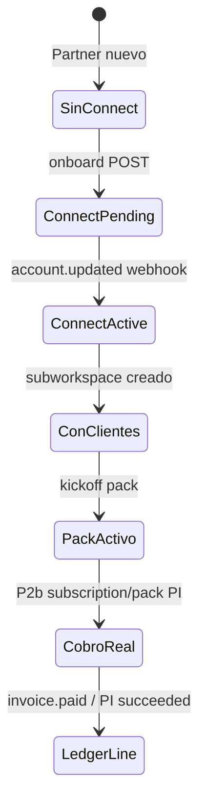

# Partner HQ — Flujo “Cómo cobro y qué hago” (diseño UX)

Documento de diseño para el siguiente paso **post-P2a**. Sin implementación de cobros (P2b). Objetivo: que un Agency Partner entienda en **< 2 minutos** dentro de `/dashboard/partners` cómo funciona su comisión y qué pasos seguir.

---

## 1. Problema

Hoy el partner ve:
- Banner Stripe Connect (estado)
- Métricas y tab Comisiones (ledger demo en staging)
- Catálogo wholesale

Falta un **hilo narrativo único**: “¿Cuánto gano? ¿Qué hago ahora? ¿Cuándo cobro de verdad?”

---

## 2. Principios

| Principio | Aplicación |
|-----------|------------|
| **3 pasos visibles** | Onboarding → Cliente → Pack (cobro real en P2b) |
| **Un número hero** | “Tu margen este mes: €X” (ledger real cuando exista; si no, estimado tachado + tooltip) |
| **Sin jerga Stripe** | “Conectar cuenta de cobro” en lugar de “Connect Express KYC” |
| **Progreso, no formulario** | Checklist con ✅ / ⏳ / 🔒 |

---

## 3. Ubicación en Partner HQ

Nuevo bloque **encima del banner Connect** (o fusionado):

```
┌─────────────────────────────────────────────────────────┐
│  Cómo funciona tu comisión                    [? Ayuda] │
│  ─────────────────────────────────────────────────────  │
│  ① Conecta cobros   ② Añade clientes   ③ Lanza packs   │
│     [Pendiente]        [0 clientes]       [0 activos]   │
│                                                         │
│  Margen mes: €348 real · Acumulado: €388                 │
└─────────────────────────────────────────────────────────┘
│  Stripe Connect — Estado: Pendiente    [Completar →]     │
└─────────────────────────────────────────────────────────┘
```

**Tab nueva (opcional):** “Empezar” — solo checklist + FAQ corto. Evita duplicar si el bloque superior es suficiente.

---

## 4. Copy por paso (español, listo para UI)

### Paso 1 — Conectar cuenta de cobro (Stripe)

**Título:** Conecta dónde quieres recibir tus márgenes  
**Texto:** Nelvyon retiene el coste wholesale (COGS); el resto es tuyo. Sin cuenta conectada no podemos transferirte comisiones cuando actives cobros a clientes (próximamente).  
**CTA:** `Completar onboarding` (existente)  
**Estados UI:**

| API `onboarding_status` | Badge | Mensaje |
|-------------------------|-------|---------|
| `not_started` | Sin configurar | Empieza aquí — 5 min |
| `pending` | Pendiente | Termina la verificación en Stripe |
| `active` | Completo | Listo para recibir transferencias |
| `restricted` | Revisión | Contacta soporte / completa datos en Stripe |

### Paso 2 — Añadir clientes

**Título:** Crea sub-workspaces para tus clientes  
**Texto:** Cada cliente tiene su workspace con tu marca. Tú defines el precio final al mercado; nosotros aplicamos wholesale.  
**CTA:** `Nuevo cliente` → `/dashboard/white-label/clients`  
**Progreso:** `X / 10 incluidos` (+ €29/mes por extra)

### Paso 3 — Lanzar Growth Packs

**Título:** Entrega valor en 72 h con un pack  
**Texto:** Local, Ecommerce o SaaS B2B. Al completar el pack, tu margen típico es €348–€648 según catálogo (venta sugerida − COGS).  
**CTA:** `Lanzar pack` → `/os/packs`  
**Nota P2a:** “Cobro automático al cliente — disponible pronto (P2b)”

---

## 5. Explicación de comisión (panel colapsable)

**Título:** ¿Cómo se calcula mi margen?

```
Lo que paga tu cliente (retail)  −  COGS Nelvyon (wholesale)  =  Tu margen
```

**Ejemplos fijos del catálogo (no editables en P2a):**

| Producto | Retail sugerido | COGS | Tu margen |
|----------|-----------------|------|-----------|
| Starter cliente/mes | €79 | €39 | **€40** |
| Local Growth Pack | €497 | €149 | **€348** |
| Ecommerce Pack | €697 | €199 | **€498** |

**Pie:** En la pestaña Comisiones verás cada línea del ledger cuando haya cobros reales. En staging pueden aparecer entradas de prueba.

---

## 6. FAQ mínimo (3 preguntas)

1. **¿Cuándo cobro de verdad?** — Cuando P2b active suscripciones/packs a tus clientes y tu Connect esté en estado Completo.  
2. **¿Puedo poner mis precios?** — Sí; el catálogo muestra márgenes sobre precios sugeridos.  
3. **¿Qué es el ledger?** — Registro auditable de cada cobro: bruto, wholesale y tu margen.

---

## 7. Datos que alimentan el flujo (ya existentes P2a)

| UI | API / fuente |
|----|----------------|
| Estado paso 1 | `GET /api/platform/partners/connect/status` → `connect` |
| Margen mes / total | `GET /api/platform/partners/hq` → `metrics.ledger_margin_*` o `ledger_entries` |
| Clientes paso 2 | `hq.metrics.total_clients` + wholesale `includedClientSlots` |
| Packs paso 3 | `hq.metrics.active_packs` |
| Lista comisiones | `GET /api/platform/partners/ledger` |

---

## 8. Wire de estados (checklist)



---

## 9. Criterios de aceptación (solo diseño / próxima implementación UX)

- [ ] Partner ve checklist 3 pasos sin salir de HQ
- [ ] Margen mes muestra ledger si `entry_count > 0`, si no estimado con etiqueta “proyección”
- [ ] Paso 1 CTA deshabilitado solo si `!connect.configured` (Stripe no configurado en env)
- [ ] Copy P2b visible pero sin botones de cobro activos
- [ ] Mobile: checklist en columna, CTA full-width

---

## 10. Fuera de scope

- Checkout a clientes finales (P2b)
- PaymentIntent packs (P2c)
- White-label portal (P2d)
- Traducciones i18n completas (fase posterior)

---

## Referencias

- `apps/web/src/app/dashboard/partners/page.tsx`
- `apps/web/src/lib/partners/wholesaleCatalog.ts`
- `docs/PARTNERS_P2_REBILLING_PORTAL_WL.md`
- `scripts/staging-smoke-p1-partners.mjs`
