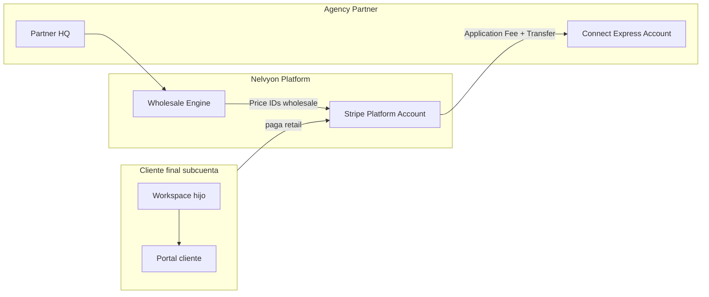

# P2 — Rebilling Stripe Connect + White-label Portal

Diseño técnico para Agency Partners. Base: catálogo wholesale P1 (`wholesaleCatalog.ts`, `agency_wholesale.py`).

---

## 1. Objetivo P2

| Entrega | Descripción |
|---------|-------------|
| **Rebilling** | Partner cobra al cliente final; Nelvyon retiene wholesale + transfiere margen al partner vía Stripe Connect |
| **WL Portal** | Cliente final ve `/portal` con dominio, marca y emails del partner |

**Fuera de scope P2:** marketplace de snapshots, OEM API, certificación automática.

---

## 2. Rebilling — Arquitectura Stripe Connect

### 2.1 Modelo de cuentas



| Actor | Stripe object | Rol |
|-------|---------------|-----|
| Nelvyon | Platform (`STRIPE_SECRET_KEY`) | Cobra, retiene wholesale, aplica application fee |
| Agency Partner | `Connect Express` (`acct_xxx`) | Onboarding KYC, recibe transfer del margen |
| Cliente final | `Customer` en platform o connected | Paga suscripción retail + packs one-time |

### 2.2 Tipos de línea de facturación

| Línea | Modelo Stripe | Wholesale (COGS) | Retail sugerido | Margen partner |
|-------|---------------|--------------------|-----------------|----------------|
| Suscripción partner | Subscription platform | €197/mes | — | N/A (paga partner) |
| Slot cliente extra | Subscription item | €29/mes | €79–149/mes | retail − €29 |
| Plan Starter subcuenta | Subscription + `application_fee_percent` o fixed fee | €39/mes | €79/mes | €40 |
| Plan Pro subcuenta | idem | €129/mes | €249/mes | €120 |
| Growth Pack kickoff | `PaymentIntent` one-time | €149–249 | €497–897 | según pack |

Fuente de precios: `WHOLESALE_GROWTH_PACKS`, `WHOLESALE_CLIENT_PLANS`, `AGENCY_PARTNER_SUBSCRIPTION`.

### 2.3 Flujo de cobro (suscripción subcuenta)

1. Partner crea sub-workspace (`POST /api/whitelabel/subworkspace`) → `client_workspace_id`.
2. Partner elige plan retail para el cliente en Partner HQ → `POST /api/platform/partners/clients/{id}/billing`.
3. Backend:
   - Resuelve `partner_stripe_account_id` del workspace padre.
   - Crea `Customer` (metadata: `workspace_id`, `partner_workspace_id`).
   - Crea `Subscription` con Price retail (Stripe Product por SKU).
   - `transfer_data.destination` = cuenta Connect del partner **o** `application_fee_amount` = wholesale mensual (Nelvyon retiene COGS).
4. Webhook `invoice.paid` → registra en `partner_rebilling_ledger`.
5. Partner HQ muestra MRR real (no solo estimado).

**Recomendación:** `application_fee_amount` fijo = wholesale mensual; el resto transfiere al partner. Más simple que % para packs con márgenes discretos.

### 2.4 Flujo pack one-time

1. Kickoff pack → al completar o al inicio (configurable): `PaymentIntent` por `suggestedRetailEur`.
2. `application_fee_amount` = `wholesaleEur` del pack.
3. `transfer_data.destination` = partner Connect account.
4. Evento `payment_intent.succeeded` → línea en ledger + desbloqueo portal pack.

### 2.5 Esquema de datos (nuevo)

```sql
-- partner_stripe_accounts
partner_workspace_id INT PRIMARY KEY,
stripe_account_id TEXT NOT NULL,
onboarding_status TEXT NOT NULL DEFAULT 'pending', -- pending|active|restricted
charges_enabled BOOLEAN DEFAULT FALSE,
payouts_enabled BOOLEAN DEFAULT FALSE,
created_at TIMESTAMPTZ DEFAULT NOW()

-- partner_client_billing
id UUID PRIMARY KEY,
partner_workspace_id INT NOT NULL,
client_workspace_id INT NOT NULL,
retail_plan_id TEXT, -- starter|pro
retail_pack_id TEXT,  -- optional last pack billed
stripe_customer_id TEXT,
stripe_subscription_id TEXT,
monthly_retail_eur NUMERIC(10,2),
monthly_wholesale_eur NUMERIC(10,2),
status TEXT DEFAULT 'active',
created_at TIMESTAMPTZ DEFAULT NOW()

-- partner_rebilling_ledger
id UUID PRIMARY KEY,
partner_workspace_id INT NOT NULL,
client_workspace_id INT,
event_type TEXT NOT NULL, -- subscription_invoice|pack_payment|affiliate_payout
stripe_event_id TEXT UNIQUE,
gross_eur NUMERIC(10,2),
wholesale_eur NUMERIC(10,2),
partner_margin_eur NUMERIC(10,2),
currency TEXT DEFAULT 'eur',
created_at TIMESTAMPTZ DEFAULT NOW()
```

### 2.6 API (propuesta)

| Método | Ruta | Descripción |
|--------|------|-------------|
| POST | `/api/platform/partners/connect/onboard` | Crea Account Link Express → onboarding |
| GET | `/api/platform/partners/connect/status` | Estado Connect del partner |
| POST | `/api/platform/partners/clients/{wsId}/billing` | Asigna plan retail + crea subscription |
| POST | `/api/platform/partners/clients/{wsId}/charge-pack` | PaymentIntent pack |
| GET | `/api/platform/partners/ledger` | Historial margen (Partner HQ tab Comisiones) |
| POST | `/api/webhooks/stripe-connect` | Webhooks Connect (account.updated, invoice.*, payment_intent.*) |

### 2.7 Webhooks críticos

| Evento | Acción |
|--------|--------|
| `account.updated` | Actualizar `partner_stripe_accounts` (charges/payouts enabled) |
| `invoice.paid` | Ledger + actualizar MRR en Partner HQ |
| `invoice.payment_failed` | Dunning subcuenta + alerta partner |
| `payment_intent.succeeded` | Ledger pack + confirmar entrega portal |
| `customer.subscription.deleted` | Marcar cliente inactive en HQ |

### 2.8 Variables de entorno

```
STRIPE_CONNECT_CLIENT_ID=ca_xxx
STRIPE_WEBHOOK_CONNECT_SECRET=whsec_xxx
STRIPE_PRICE_AGENCY_PARTNER_MONTHLY=price_xxx
STRIPE_PRICE_WHOLESALE_STARTER_MONTHLY=price_xxx
STRIPE_PRICE_RETAIL_STARTER_MONTHLY=price_xxx
STRIPE_PRICE_PACK_LOCAL_ONETIME=price_xxx
...
```

Mapeo en `agency_wholesale.py` → `resolve_stripe_price_id_wholesale(sku, tier)`.

### 2.9 Partner HQ — cambios P2

- Tab **Comisiones**: datos de `partner_rebilling_ledger` (reales, no estimados).
- Banner **Connect**: “Completa onboarding Stripe” si `onboarding_status !== active`.
- Por cliente: plan retail, próximo cobro, margen acumulado.

### 2.10 Riesgos y mitigaciones

| Riesgo | Mitigación |
|--------|------------|
| Partner sin Connect activo | Bloquear cobro a clientes hasta onboarding complete |
| Disputa/chargeback | Platform liability — Terms partner + reserve opcional |
| Doble stack Stripe (Python + Node) | Unificar webhooks en un router; ledger único Postgres |
| IVA B2B EU | `tax_id_collection` en Express; facturas según país partner |

---

## 3. White-label Portal — Propuesta Agency Partners

### 3.1 Superficies a rebrandear

| Superficie | Ruta / canal | Prioridad |
|------------|--------------|-----------|
| Portal web | `portal.{partner}.com` o `app.{partner}.com/portal` | P0 |
| Login cliente | `/client/sign-in` | P0 |
| Invite email | SendGrid template | P0 |
| Entregables PDF / informe pack | Generación con logo partner | P1 |
| Emails transaccionales | Aprobación entregable, reset password | P1 |

### 3.2 Resolución de marca (runtime)

Ya existe `GET /api/whitelabel/resolve?host=` y middleware `x-nelvyon-whitelabel`.

**Extensión P2:**

```typescript
// resolveWhitelabel.ts — añadir portal_host
type WhitelabelResolve = {
  workspace_id: number;
  brand_name: string;
  logo_url: string;
  primary_color: string;
  hide_nelvyon_branding: boolean;
  portal_custom_domain?: string; // portal.cliente-partner.com
}
```

| Host request | Resolución |
|--------------|------------|
| `portal.agenciaX.com` | `whitelabel_configs.portal_custom_domain` → partner workspace |
| `ideal-victory-staging.../portal` | Cookie/session + workspace del cliente portal user |
| Default | Nelvyon branding |

### 3.3 DNS (partner)

| Registro | Valor | Uso |
|----------|-------|-----|
| CNAME `portal` | `portal-proxy.nelvyon.com` (o Railway target) | Portal cliente |
| CNAME `app` | `cname.nelvyon.com` | App operador (ya en white-label) |
| TXT `_nelvyon` | token verificación | Propiedad dominio |

UI en `/dashboard/white-label` → sección **Portal cliente**:
- Campo `portal_custom_domain`
- Instrucciones DNS (reutilizar `get_dns_instructions`)
- Preview portal con marca aplicada

### 3.4 Schema DB

```sql
ALTER TABLE whitelabel_configs ADD COLUMN IF NOT EXISTS portal_custom_domain TEXT;
ALTER TABLE whitelabel_configs ADD COLUMN IF NOT EXISTS portal_verified_domain BOOLEAN DEFAULT FALSE;
ALTER TABLE whitelabel_configs ADD COLUMN IF NOT EXISTS portal_hide_powered_by BOOLEAN DEFAULT FALSE;
```

### 3.5 Frontend portal

| Componente | Cambio |
|------------|--------|
| `PortalAuthContext` / layout portal | Consumir `WhitelabelProvider` en brand mode `client` |
| `PortalPackProgressPanel` | Colores `primary_color`, logo partner |
| `/client/sign-in` | Logo + nombre partner, sin “Nelvyon” si `hide_nelvyon_branding` |
| `middleware.ts` | Resolver host portal antes de render |

**Gating:** solo planes `agency_partner`, `agency`, `enterprise`, `partner` con `partner_can_resell()`.

### 3.6 Emails white-label

Reutilizar `generate_whitelabel_email_template()` en `whitelabel_service.py`.

| Template | Trigger |
|----------|---------|
| `portal_invite` | `POST /api/v1/portal/invites` |
| `portal_deliverable_ready` | Entregable `portal_visible=true` |
| `portal_password_reset` | Login/recovery |

Headers:
- `From`: `{custom_email_from_name} <{custom_email_from_address}>` (verificado SendGrid domain)
- Fallback: `no-reply@{portal_custom_domain}`

### 3.7 Seguridad

- Portal JWT scoped a `client_id` + `workspace_id` (sin cambios).
- CORS: añadir `portal_custom_domain` a `WHITELABEL_CORS_ORIGINS`.
- Cookies: `SameSite=Lax`, dominio solo en path `/portal` si subpath; dominio custom = host completo.

### 3.8 Rollout por fases

| Fase | Entrega |
|------|---------|
| **P2a** | Connect onboarding + ledger + wholesale prices en Stripe |
| **P2b** | Rebilling suscripción subcuenta (Starter/Pro) |
| **P2c** | Pack one-time charge + portal WL (logo/colores) |
| **P2d** | Dominio portal custom + emails branded |

---

## 4. Dependencias P1 → P2

| P1 (cerrado) | P2 consume |
|--------------|------------|
| `wholesaleCatalog.ts` | Price IDs Stripe 1:1 |
| Partner HQ `/dashboard/partners` | Ledger real, Connect status |
| `agency_partner` plan | Gating WL + rebilling |
| Sub-workspaces white-label | `client_workspace_id` en billing |
| Portal pack progress | WL visual en entregables |

---

## 5. Criterios de aceptación P2

- [ ] Partner completa Connect Express y ve estado en HQ
- [ ] Cobro retail €79 Starter a cliente → ledger muestra €40 margen partner
- [ ] Pack Local cobrado → €348 margen en ledger tras `payment_intent.succeeded`
- [ ] Cliente accede a `portal.partner.com` con logo partner
- [ ] Email invite sin marca Nelvyon (plan agency_partner + hide branding)

---

## Referencias

- `apps/web/src/lib/partners/wholesaleCatalog.ts`
- `backend/core/agency_wholesale.py`
- `apps/web/src/app/dashboard/partners/page.tsx`
- `backend/services/whitelabel_service.py`
- `backend/services/affiliate_service.py` (patrón Connect existente)
- `docs/PARTNERS_WHITELABEL_PROGRAM.md`
