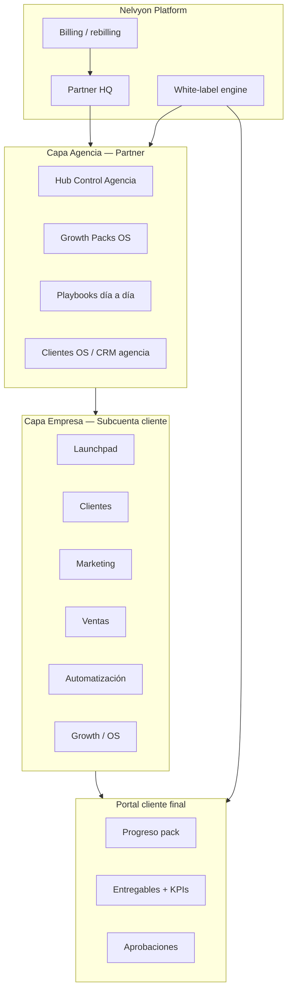

# Programa Partners / White-Label SaaS & Agencia — Diseño v1

**Objetivo:** Construir el programa de partners de Nelvyon como evolución de GHL (GoHighLevel) — misma lógica de agencia + subcuentas + rebilling, pero con **time-to-value en 2–3 clics**, **Growth Packs sectoriales** y **playbooks operativos** ya implementados.

**Base existente:** hubs Agencia/Empresa, 3 Growth Packs, 3 playbooks día a día, portal cliente con progreso pack, white-label, afiliados, billing `partner`.

---

## 1. Posicionamiento vs GHL

| Dimensión | GHL | Nelvyon Partners |
|-----------|-----|------------------|
| Onboarding subcuenta | Snapshots genéricos, curva alta | **Launchpad** + pack sectorial (Local / Ecommerce / SaaS B2B) |
| Entrega al cliente final | Agencia configura todo | **Portal cliente** con pack visible + aprobaciones |
| Operación agencia | Agency view + sub-accounts | **Capa Agencia** (hubs) + **Capa Empresa** por cliente |
| Monetización partner | SaaS Configurator + rebilling | Tiers partner + **rebilling packs** + margen servicios |
| IA / automatización | Workflows + AI Employee | **Resumen CEO Automatización** + recetas + plantillas élite |
| White-label | Dominio + branding | Ya en `/dashboard/white-label` — extender a portal + emails |

**Ventaja defendible:** un partner no vende “otro CRM”; vende **sistema de crecimiento de 72 h** con playbook, informe CEO y portal listo.

---

## 2. Arquitectura de capas



### Mapeo a rutas actuales

| Capa | Hub | Rutas clave |
|------|-----|-------------|
| Partner HQ | SaaS & Partners | `/dashboard/white-label`, `/billing`, `/dashboard/afiliados`, `/dashboard/executive-reports` |
| Agencia | Control Agencia | `/os/dashboard`, `/os/clientes`, `/os/packs` |
| Empresa | 6 hubs workspace | `/dashboard` (Launchpad), `/crm`, `/publicidad`, `/automatizacion`, … |
| Cliente | Portal | `/portal`, `/portal/projects/[id]`, `/client/sign-in` |

---

## 3. Tipos de partner

| Tier | Perfil | Subcuentas | White-label | Rebilling | Packs |
|------|--------|------------|-------------|-----------|-------|
| **Affiliate** | Referidor | 0 | No | Comisión 30% recurrente | — |
| **Agency Partner** | Agencia 5–50 clientes | Hasta plan | Logo + colores | Markup SaaS base | 3 packs incluidos |
| **White-Label SaaS** | “GHL killer” 50+ subcuentas | Ilimitado* | Dominio + ocultar Nelvyon | SaaS + packs + add-ons | Biblioteca + snapshots |
| **Enterprise OEM** | Grandes redes / franquicias | Custom | Full OEM + API | Contrato | Packs custom |

\* Límites por plan billing existente (`partner`, `agency`, `enterprise`).

---

## 4. Producto: “Snapshots Nelvyon” (mejor que GHL Snapshots)

Un **Snapshot Nelvyon** no es solo configuración CRM: es un **pack ejecutable + playbook + plantillas élite**.

### Catálogo v1 (ya construido)

| Snapshot ID | Pack | Playbook | Plantillas élite | Portal |
|-------------|------|----------|------------------|--------|
| `local-business-growth` | Local Growth | `LOCAL_GROWTH_PACK_DIA_A_DIA.md` | Ads local, funnel reservas, email bienvenida | pack_summary + KPIs |
| `ecommerce-growth` | Ecommerce Growth | `ECOMMERCE_GROWTH_PACK_DIA_A_DIA.md` | Ads shopping, funnel checkout, email carrito | idem |
| `saas-b2b-growth` | SaaS B2B Growth | `SAAS_B2B_GROWTH_PACK_DIA_A_DIA.md` | Ads lead gen, funnel demo, email nurture | idem |

### Flujo partner → subcuenta (target 3 clics)

1. **Clic 1:** Partner elige snapshot en `/os/packs` (capa Agencia).
2. **Clic 2:** Asigna subcuenta / cliente (`/os/clientes` → workspace switch).
3. **Clic 3:** Kickoff pack → Launchpad activo + portal invite al cliente final.

**Definition of done (automático):** pack `completed`, informe CEO en dashboard pack, ≥1 entregable `portal_visible`, smoke A1 verde.

---

## 5. White-label: alcance v1 → v2

### Ya existe (v1)

- Logo, colores, fuente, dominio custom, DNS, preview (`/dashboard/white-label`)
- Hub **SaaS & Partners** en capa Agencia
- Plan early adopter menciona multi-workspace + white-label

### v2 Partner (diseño)

| Superficie | Qué se rebrandea |
|------------|------------------|
| App operador | Sidebar, login, emails transaccionales |
| Portal cliente | `/portal`, sign-in `/client/sign-in`, emails invite |
| Informes CEO | PDF / vista pack con logo partner |
| Dominio | `app.partner.com`, `portal.partner.com` (CNAME) |

**Regla:** `hide_nelvyon_branding` solo en tier White-Label SaaS+.

---

## 6. Rebilling & economía

### Modelo de ingresos partner

```
Ingreso partner = (Precio venta al cliente) − (COGS Nelvyon) − (comisión plataforma si aplica)
```

| Línea | COGS Nelvyon | Partner marca |
|-------|--------------|---------------|
| SaaS base (workspace) | Plan wholesale | +€X/mes por subcuenta |
| Growth Pack kickoff | 1 crédito pack / ejecución | +€Y one-time o incluido en retainer |
| Add-ons (ads spend mgmt, IA extra) | Uso medido | Markup libre |
| Affiliate referral | 70% a Nelvyon | 30% recurrente (ya en `/partners`) |

### Panel partner (nuevo — Fase P1)

Ruta propuesta: `/dashboard/partners` (capa Agencia)

- MRR por subcuenta
- Packs ejecutados / mes
- Churn y health score (Resumen CEO agregado)
- Payouts afiliado vs rebilling agency

Integración: extender `partner_records` + billing Stripe Connect (fase posterior).

---

## 7. Onboarding partner (journeys)

### A) Affiliate (existente, mejorar copy)

1. Registro → `/dashboard/afiliados`
2. Link referral → tracking `POST /api/affiliates/click`
3. Panel comisiones

### B) Agency Partner (nuevo)

| Día | Acción | UI |
|-----|--------|-----|
| 0 | Aplicación + verificación | `/saas/partners` → form → aprobación manual |
| 1 | Tour capa Agencia + primer snapshot | Launchpad partner (variante) |
| 2 | Primera subcuenta + pack Local | Playbook asistido in-app |
| 7 | Certificación “Pack Operator” | Badge + listing partners |

### C) White-Label SaaS

- Checklist DNS + brand
- Sandbox subcuenta demo pre-cargada (snapshot ecommerce)
- Migración: import CSV contactos + 1 pack kickoff

---

## 8. Gobierno y calidad (mejor que GHL)

| Control | Mecanismo Nelvyon |
|---------|-------------------|
| Calidad entrega | QA score en pack run + umbral portal |
| Operación | Playbooks obligatorios por pack (checklist PM) |
| Cliente ve valor | Portal pack progress + aprobaciones |
| Partner ve riesgo | Resumen CEO Automatización agregado por subcuenta |
| Smoke producción | `staging-smoke-a1-packs`, `staging-smoke-portal-packs`, C5 |

**Certificación partner:** partner debe mantener ≥90% smoke interno en subcuentas activas (fase P2).

---

## 9. Roadmap de implementación

### Fase P0 — Documentación & UX (esta entrega)

- [x] Diseño programa (este doc)
- [ ] Página `/saas/partners` alineada con tiers
- [ ] Sección “Snapshots” en `/os/packs` con copy partner

### Fase P1 — Partner HQ (4–6 sem)

- [ ] `/dashboard/partners` — MRR, subcuentas, packs
- [ ] Wholesale pricing en billing
- [ ] Invite subcuenta desde `/os/clientes` (1 flujo)
- [ ] BFF proxy portal `/api/v1/portal/*` en web (staging)

### Fase P2 — Rebilling & WL portal (6–10 sem)

- [ ] Stripe Connect / rebilling markup
- [ ] White-label portal + emails
- [ ] Snapshot export/import (config pack + workflows + plantillas)

### Fase P3 — Escala OEM

- [ ] API partner provisioning
- [ ] Marketplace snapshots sectoriales
- [ ] SLA + soporte tier enterprise

---

## 10. Métricas de éxito

| Métrica | Target 90 días |
|---------|----------------|
| Partners Agency activos | 15 |
| Subcuentas con pack completado | 80% de altas |
| Time-to-first-value (kickoff → portal visible) | < 72 h |
| NPS cliente final (portal) | ≥ 40 |
| Margen bruto partner promedio | ≥ 55% |

---

## 11. Decisiones abiertas

1. **¿Un solo plan `partner` o SKUs separados Agency vs WL?** → Recomendación: 2 SKUs (`agency_partner`, `wl_saas`).
2. **¿Packs ilimitados en WL o créditos?** → Créditos + wholesale evita abuso.
3. **¿Portal en subdominio obligatorio para WL?** → Sí para tier WL; opcional Agency.
4. **¿Certificación manual o automática?** → Automática tras 3 packs exitosos + smoke.

---

## Referencias en repo

- Hubs: `apps/web/src/core/shell/hubNavConfig.ts`
- Capas: `apps/web/src/core/product/productLayer.ts`
- Launchpad: `apps/web/src/features/launchpad/NelvyonLaunchpad.tsx`
- Playbooks: `docs/agency-playbooks/*.md`
- Portal pack: `apps/web/src/features/client_portal_v1/portalPackProgress.ts`
- White-label: `apps/web/src/app/dashboard/white-label/page.tsx`
- Marketing partners: `apps/web/src/app/(marketing)/partners/page.tsx`
- Smokes: `scripts/staging-smoke-portal-packs.mjs`, `scripts/staging-smoke-a1-packs.mjs`
