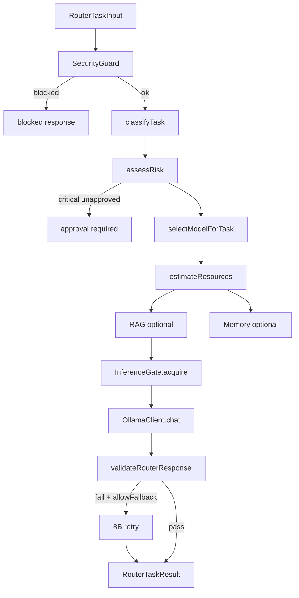

# Arquitectura — Model Router NELVYON

## Módulos

```
backend/local-ai/router/
├── types.ts              # Contratos RouterTaskInput, RouterDecision, ...
├── TaskClassifier.ts     # Reglas deterministas (sin LLM)
├── RiskAssessor.ts       # low | medium | high | critical
├── ModelRegistry.ts      # Perfiles 3B / 8B
├── RoutingPolicy.ts      # selectModelForTask, planRag, planMemory
├── ResourceBudget.ts     # RAM/VRAM + reserva Windows
├── InferenceGate.ts      # Mutex 8B, circuit breaker Ollama
├── RouterQueue.ts        # Cola priorizada, cancelación, recovery
├── RouterValidator.ts    # Post-respuesta: citas, JSON, secretos
├── LocalModelRouter.ts   # Orquestador principal
├── routerBenchmarkSuite.ts
└── index.ts
```

## Flujo



## Concurrencia

- **1 tarea 8B** a la vez (serializada).
- **N tareas 3B** limitadas (`ROUTER_MAX_FAST_CONCURRENT`, default 1).
- Cola máxima: `ROUTER_MAX_QUEUE` (default 32).
- Pool Postgres: `LOCAL_AI_POOL_MAX=2` (sin cambiar certificación).

## Integración futura

| Consumidor | Estado |
|---|---|
| `SpecializationPipeline` | Prototipo inline — migrar a router |
| `PrivateAiRouter` / SaaS API | Pendiente Fase 2+ |
| OpenClaw / MCP | No iniciado |
