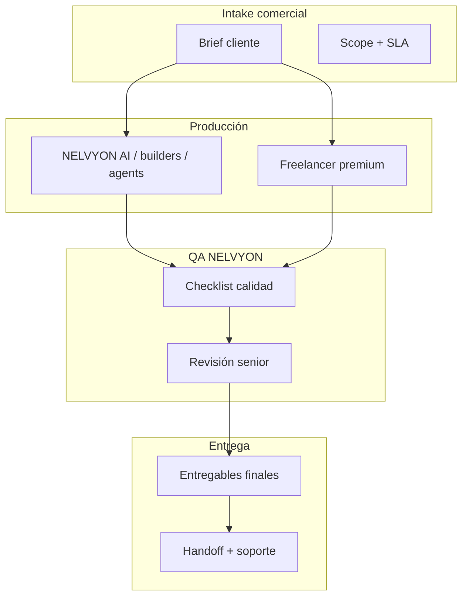

# NELVYON SERVICES — Master Plan (Fase diseño operativo)

**Frente activo:** NELVYON SERVICES  
**Estado OS:** congelado (solo bugs críticos)  
**Fuera de alcance:** SaaS, OS shell, web pública, marketing producto  
**Fecha:** 2026-06-07  
**Objetivo:** Operar la entrega de **servicios de marketing digital premium** con calidad repetible, trazable y escalable.

---

## 1. Principios operativos

| Principio | Regla |
|-----------|-------|
| Calidad antes que volumen | Ningún entregable sale sin checklist QA firmado |
| Honestidad comercial | Separar lo que NELVYON ejecuta en producto vs lo que ejecuta talento humano |
| Reutilizar plataforma | Usar builders, agents, integraciones y runbooks existentes — **sin abrir frentes OS/SaaS** |
| Un servicio = un playbook | Cada SKU tiene proceso, entregables, tiempos y perfil freelancer definidos |
| Evidencia auditable | Brief, versiones, aprobaciones y handoff documentados (fuera de código OS si hace falta: Notion/Drive/contract) |

### Modelo de entrega híbrido

---

## 2. Auditoría completa de servicios actuales

### 2.1 Inventario plataforma (qué ya existe)

NELVYON tiene **dos capas** que alimentan SERVICES:

| Capa | Qué es | Madurez | Ubicación |
|------|--------|---------|-----------|
| **Premium OS templates** | 23 runbooks + previews `/os/*-premium/preview` — checklists operativos, **no APIs de diseño/ads** | Cerrado PASA real (paperwork) | `backend/ops/runbooks/*_premium_nelvyon_v1.md`, `apps/web/src/templates/*-premium/` |
| **Producto ejecutable** | Builders, chatbots, ads APIs, agents LLM + ZIP | Variable por integración | `backend/services/`, `backend/os-agents/`, `apps/web/src/features/builders/`, `publicidad/` |

**Referencia maestra:** `backend/ops/runbooks/nelvyon_master_operations_v1.md` (registro 23 servicios premium OS).

### 2.2 Mapeo catálogo objetivo (11) → activos actuales

| # | Servicio objetivo | Cobertura actual | Producción real | Gaps principales |
|---|-------------------|------------------|-----------------|------------------|
| 1 | **Branding** | Branding Premium agent + whitelabel + runbook | Agent LLM + policy whitelabel | Sin Figma/Adobe sync; sin revisión legal trademark |
| 2 | **Logos** | Subpaso en branding + DALL·E en design pipeline | Imágenes IA conceptuales | **Sin SKU logo**; sin vector/SVG; sin manual de uso exportable estándar |
| 3 | **Web corporativa** | Web Premium agent + `os_web_builder_service` | Builder + ZIP + publish | Preview OS = checklist; QA depende de proceso humano |
| 4 | **Landing pages** | `landing_builder_service` + LandingPremiumAgent | Builder + funnels + A/B | No fila propia en registry OS; acoplado a web premium |
| 5 | **Ecommerce** | Ecommerce Premium + `os_store_builder_service` + Stripe | Tienda AI + checkout | Premium template ≠ tienda live sin config Stripe |
| 6 | **SEO** | SeoPremiumAgent + qa_engine + GSC/Semrush | Informes LLM + ZIP | Rank tracking **condicional** (API keys); sin crawler propio |
| 7 | **Google Ads** | `google_ads_service`, OAuth TS, `ads_agent_service` | API con credenciales | Mock sin tokens; UI campaña fina |
| 8 | **Meta Ads** | `meta_ads_service`, MetaDataFetcher | API con credenciales | Igual que Google |
| 9 | **TikTok Ads** | Copy LLM en agents sectoriales | **Solo estrategia/copy** | **Sin TikTok Marketing API**; no en launcher unificado |
| 10 | **Automatizaciones IA** | Consultoría premium agent + `workflow_engine` | CRM workflows reales | Marketing cross-channel = mayormente informe; no ESP turnkey |
| 11 | **Chatbots IA** | `chatbot_service` + livechat + dashboard | Widget GPT-4o + leads | Premium template = paperwork; agent no despliega bot |

### 2.3 Matriz readiness (resumen ejecutivo)

| Servicio | Listo para vender hoy | Requiere humano premium | Requiere dev/integración |
|----------|----------------------|-------------------------|--------------------------|
| Branding | Condicionado | Sí (dirección de arte) | No |
| Logos | No (como SKU) | Sí | Fase 2 (pipeline assets) |
| Web corporativa | Sí | Sí (UX/copy/revisión) | Mantenimiento menor |
| Landing pages | Sí | Sí | No |
| Ecommerce | Condicionado (Stripe) | Sí | Config pagos |
| SEO | Condicionado | Sí (estrategia + links) | APIs opcionales |
| Google Ads | Condicionado (cuentas) | Sí (estratega paid) | Credenciales cliente |
| Meta Ads | Condicionado | Sí | Credenciales cliente |
| TikTok Ads | No | Sí | **Fase 2 API** |
| Automatizaciones IA | Parcial | Sí (consultor) | Fase 2 playbooks ejecutables |
| Chatbots IA | Sí | Sí (conversación design) | OpenAI key |

### 2.4 Activos reutilizables por SERVICES (sin tocar OS/SaaS)

| Activo | Uso en SERVICES |
|--------|-----------------|
| OS agents (`backend/os-agents/agents/*PremiumAgent.ts`) | Borrador acelerado de entregables |
| Builders (`os_web_builder`, `landing_builder`, `os_store_builder`) | Producción asistida |
| `qa_engine.py` | Gate técnico contenido generado |
| Runbooks premium | Base de checklists operativos |
| `chatbot_service.py` | Despliegue chatbot cliente |
| `google_ads_service` / `meta_ads_service` | Ejecución paid media |
| Golden path `/os/excellence/golden-path` | Referencia calidad ingeniería (no cliente) |

---

## 3. Catálogo premium — definición por servicio

Escala de tiempos: **días laborables** (D), equipo estándar = 1 freelancer + 1 revisor NELVYON.  
Tier **Standard** = entrega sólida; **Premium** = máxima calidad + iteraciones + soporte post-entrega.

---

### 3.1 Branding

**Estado actual:** Agent + whitelabel + runbook branding premium.  
**Promesa comercial:** Identidad de marca coherente, aplicable a web, ads y comunicaciones.

#### Proceso operativo

| Fase | Actividades | Responsable |
|------|-------------|-------------|
| 1. Intake | Brief marca, competencia, público, restricciones legales | Account + cliente |
| 2. Discovery | Workshop 90 min, moodboard, arquetipo de marca | Brand strategist |
| 3. Estrategia | Propuesta de posicionamiento, arquitectura de marca, tono de voz | Strategist + copy |
| 4. Diseño | Paleta, tipografías, sistema visual, aplicaciones | Diseñador senior |
| 5. QA NELVYON | Checklist § + coherencia cross-canal | QA lead |
| 6. Entrega | Brand book PDF + tokens + guía de uso | Account |
| 7. Handoff | Sesión 60 min + 14 días soporte correcciones menores | Account |

#### Entregables

- Documento estrategia de marca (15–25 pp)
- Brand book PDF (identidad, color, tipografía, voz, ejemplos)
- Kit digital (PNG/SVG logo principal, variantes, favicon)
- Plantilla presentación (PPT/Key/Google Slides)
- Matriz de aplicaciones (web, social, email, print básico)

#### Checklist calidad

- [ ] Propuesta de valor diferenciada y comprobable
- [ ] Paleta con códigos HEX/RGB/CMYK y ratios de contraste WCAG AA
- [ ] Tipografías con licencia documentada
- [ ] Logo legible a 32px y en monocromo
- [ ] Tono de voz con 5 ejemplos do/don't
- [ ] Sin conflicto evidente con marcas registradas (disclaimer firmado)
- [ ] Alineado con política whitelabel si aplica tenant

#### Herramientas

| Tipo | Herramientas |
|------|--------------|
| NELVYON | BrandingPremiumAgent, whitelabel policy, brand book LLM draft |
| Diseño | Figma, Illustrator, Coolors, WhatFontIs |
| Colaboración | Notion, Google Drive, Loom |
| QA | Contrast checker, Brandfetch (referencia competencia) |

#### Tiempos estimados

| Tier | Plazo | Revisiones incluidas |
|------|-------|----------------------|
| Standard | 10–15 D | 2 rondas |
| Premium | 20–30 D | 4 rondas + submarcas opcionales |

#### Perfil freelancer ideal

- **Rol:** Brand strategist / director de marca senior
- **Experiencia:** 5+ años, portfolio B2B y B2C
- **Skills:** Positioning, naming, identity systems, presentación a C-level
- **Idiomas:** ES nativo; EN profesional
- **Soft skills:** Facilitación workshop, gestión feedback ejecutivo

---

### 3.2 Logos

**Estado actual:** Subproducto de branding; DALL·E conceptual. **SKU independiente en Fase 2.**  
**Promesa comercial:** Logo memorable, versátil y listo para uso digital e impreso.

#### Proceso operativo

| Fase | Actividades |
|------|-------------|
| 1. Intake | Nombre, sector, valores, referencias amor/odio |
| 2. Research | Benchmark 10 competidores, semiótica sector |
| 3. Concepto | 3 direcciones creativas (moodboard cada una) |
| 4. Refinamiento | 1 dirección elegida, 2 variantes finales |
| 5. Vectorización | Master vector + export kit |
| 6. QA | Escala, monocromo, fondos, favicon |
| 7. Entrega | Kit + mini guía de uso |

#### Entregables

- 3 concept boards (fase exploración)
- Logo master vector (AI, SVG, PDF)
- Variantes: horizontal, vertical, isotipo, monocromo, invertido
- Export kit: PNG @1x/@2x/@4x, ICO, favicon
- Mini brand sheet (1 pág): zona de protección, tamaños mínimos, usos prohibidos

#### Checklist calidad

- [ ] Legible en 24–32px (favicon)
- [ ] Funciona en fondo claro y oscuro
- [ ] Vector limpio (sin nodos redundantes)
- [ ] Máximo 3 colores en versión principal
- [ ] No depende de efectos (sombras/degradados) para reconocimiento
- [ ] Archivos nombrados con convención `cliente_logo_variante.ext`

#### Herramientas

| Tipo | Herramientas |
|------|--------------|
| NELVYON | DALL·E (exploración), BrandingPremiumAgent (narrativa) |
| Diseño | Illustrator, Figma, Vectorizer.ai (asistido) |
| QA | RealFaviconGenerator, SVGOMG |

#### Tiempos estimados

| Tier | Plazo |
|------|-------|
| Standard | 5–8 D |
| Premium | 12–18 D (+ animación logo opcional) |

#### Perfil freelancer ideal

- **Rol:** Logo designer / identity designer
- **Experiencia:** 3+ años, portfolio 50+ marcas
- **Skills:** Semiótica, tipografía custom, vector impecable
- **Entregable clave:** SVG production-ready

---

### 3.3 Web corporativa

**Estado actual:** `os_web_builder_service` + WebPremiumAgent — **más maduro del catálogo.**  
**Promesa comercial:** Web multipágina profesional, rápida, SEO-ready y alineada a marca.

#### Proceso operativo

| Fase | Actividades |
|------|-------------|
| 1. Intake | Sitemap deseado, referencias, integraciones (form, CRM, analytics) |
| 2. Arquitectura | Mapa de páginas, wireframes low-fi |
| 3. Contenido | Copy por página, SEO titles, CTAs |
| 4. Diseño | UI high-fi desktop + mobile |
| 5. Build | NELVYON web builder + ajustes código |
| 6. QA | Performance, responsive, forms, analytics, SEO on-page |
| 7. Publicación | Dominio, SSL, Search Console |
| 8. Handoff | Manual editor + 30 días soporte bugs |

#### Entregables

- Sitemap y wireframes aprobados
- Web publicada (5–12 páginas típico: Home, Empresa, Servicios, Casos, Blog, Contacto, Legal)
- Copy final en español (EN opcional premium)
- Integración analytics (GA4) + Search Console
- Informe PageSpeed (objetivo LCP mobile < 2.5s aspiracional)
- Backup export / credenciales documentadas

#### Checklist calidad

- [ ] Responsive 375 / 768 / 1280 sin roturas
- [ ] Meta title/description únicos por página
- [ ] Schema.org Organization + WebSite
- [ ] Formulario contacto envía y registra leads
- [ ] Imágenes optimizadas (WebP donde aplique)
- [ ] Política privacidad y cookies enlazadas
- [ ] HTTPS activo; sin mixed content
- [ ] Golden path técnico si cambios en repo cliente

#### Herramientas

| Tipo | Herramientas |
|------|--------------|
| NELVYON | os_web_builder, WebPremiumAgent, qa_engine |
| Diseño | Figma, Relume (wireframes) |
| Dev | Vercel/Netlify, GitHub |
| QA | PageSpeed Insights, Screaming Frog (lite), BrowserStack |

#### Tiempos estimados

| Tier | Páginas | Plazo |
|------|---------|-------|
| Standard | 5–7 | 15–25 D |
| Premium | 8–15 | 30–45 D |

#### Perfil freelancer ideal

- **Rol:** Web designer + front-end (híbrido)
- **Experiencia:** 4+ años, sitios corporativos reales
- **Skills:** Figma, HTML/CSS, UX writing, SEO on-page básico
- **Plus:** Experiencia con builder NELVYON o Next.js

---

### 3.4 Landing pages

**Estado actual:** `landing_builder_service` + LandingPremiumAgent.  
**Promesa comercial:** Página de conversión enfocada en una campaña u oferta.

#### Proceso operativo

| Fase | Actividades |
|------|-------------|
| 1. Intake | Oferta, avatar, objeción #1, CTA, fuente tráfico |
| 2. Estrategia | Hipótesis AIDA/PAS, estructura secciones |
| 3. Copy | Headline, subheads, bullets, CTA, thank-you |
| 4. Diseño | UI conversión, above-the-fold |
| 5. Build | landing_builder + variantes A/B si premium |
| 6. QA | Form, pixels, speed, mobile |
| 7. Launch | UTM, ads connection brief |

#### Entregables

- 1 landing publicada (+ variante B en premium)
- Copy completo documentado
- Wire de integración CRM/form
- Pixel Meta + Google configurados (si cliente provee acceso)
- Informe baseline conversión (primeros 7 días post-launch)

#### Checklist calidad

- [ ] CTA visible sin scroll en mobile
- [ ] Tiempo carga < 3s mobile (objetivo)
- [ ] Un solo objetivo de conversión principal
- [ ] Prueba social creíble (logos, testimonios, datos)
- [ ] Form validado end-to-end
- [ ] No leak de navegación (menú mínimo)
- [ ] Tracking events documentados

#### Herramientas

| Tipo | Herramientas |
|------|--------------|
| NELVYON | landing_builder, funnelApi, LandingPremiumAgent |
| Copy | Hemingway, ChatGPT (asistido bajo guía) |
| QA | Hotjar/Clarity (si cliente), PageSpeed |

#### Tiempos estimados

| Tier | Plazo |
|------|-------|
| Standard | 5–10 D |
| Premium | 12–18 D (+ A/B + 2 iteraciones post-datos) |

#### Perfil freelancer ideal

- **Rol:** Copywriter de conversión + diseñador landing
- **Experiencia:** 3+ años en performance marketing
- **Skills:** CRO, UX mobile-first, headlines
- **Métrica:** Ha mejorado CR en campañas reales (case study)

---

### 3.5 Ecommerce

**Estado actual:** `os_store_builder_service` + Stripe.  
**Promesa comercial:** Tienda online funcional con catálogo, checkout y analítica básica.

#### Proceso operativo

| Fase | Actividades |
|------|-------------|
| 1. Intake | Catálogo, SKUs, envíos, pasarela, políticas |
| 2. Arquitectura | Categorías, filtros, PDP template |
| 3. Diseño | PLP/PDP/cart/checkout brand-aligned |
| 4. Carga producto | Import CSV o alta manual |
| 5. Pagos | Stripe test → live |
| 6. QA | Compra test, emails transaccionales, stock |
| 7. Go-live | Dominio, SSL, políticas legales |

#### Entregables

- Tienda publicada (hasta N SKU según tier)
- Plantillas PLP/PDP/checkout
- Stripe conectado (modo live)
- Políticas envío/devolución/privacidad
- Manual gestión pedidos y catálogo
- Dashboard analítica ventas básica

#### Checklist calidad

- [ ] Compra guest y con cuenta probada
- [ ] Confirmación email pedido
- [ ] Impuestos/envío configurados o documentados
- [ ] Imágenes producto consistentes (ratio, fondo)
- [ ] Mobile checkout sin fricción
- [ ] 404 y estados vacíos diseñados
- [ ] Backup catálogo exportable

#### Herramientas

| Tipo | Herramientas |
|------|--------------|
| NELVYON | os_store_builder, EcommercePremiumAgent, Stripe |
| Ops | Stripe Dashboard, Google Merchant (opcional) |
| Diseño | Figma, Photoshop (packshots) |

#### Tiempos estimados

| Tier | SKUs | Plazo |
|------|------|-------|
| Standard | hasta 25 | 20–35 D |
| Premium | hasta 100 | 45–60 D |

#### Perfil freelancer ideal

- **Rol:** Ecommerce specialist / Shopify-experienced dev
- **Experiencia:** 4+ años tiendas D2C
- **Skills:** Catalog setup, Stripe, CRO checkout
- **Plus:** Fotografía producto o coordinación estudio

---

### 3.6 SEO

**Estado actual:** SeoPremiumAgent + integraciones GSC/Semrush condicionales.  
**Promesa comercial:** Visibilidad orgánica con auditoría, plan de acción y contenido optimizado.

#### Proceso operativo

| Fase | Actividades |
|------|-------------|
| 1. Intake | Dominio, mercados, competidores, CMS |
| 2. Auditoría técnica | Crawl, indexación, Core Web Vitals |
| 3. Keyword research | Intención, volumen, dificultad, mapa URLs |
| 4. On-page | Titles, metas, H1, interlinking |
| 5. Contenido | Briefs artículos pilares (premium) |
| 6. Off-page plan | Estrategia enlaces (premium, ejecución parcial) |
| 7. Informe | Roadmap 90 días priorizado |

#### Entregables

- Informe auditoría SEO (40–80 pp o equivalente interactivo)
- Keyword map + asignación URLs
- Lista fixes técnicos priorizados (P0/P1/P2)
- 5–20 páginas optimizadas on-page (según tier)
- Dashboard baseline GSC (si acceso)
- Plan contenidos 90 días (premium)

#### Checklist calidad

- [ ] robots.txt y sitemap revisados
- [ ] Sin errores críticos indexación (GSC)
- [ ] Titles únicos < 60 caracteres
- [ ] Canonicals correctos
- [ ] Schema apropiado por tipo página
- [ ] Plan keywords alineado a negocio (no vanity)
- [ ] Informe accionable con owner por tarea

#### Herramientas

| Tipo | Herramientas |
|------|--------------|
| NELVYON | SeoPremiumAgent, gsc_service, seo_apis (Semrush) |
| SEO | Screaming Frog, Ahrefs/Semrush, GSC, GA4 |
| QA | qa_engine (meta/schema en generados) |

#### Tiempos estimados

| Tier | Plazo |
|------|-------|
| Standard (auditoría + on-page core) | 10–15 D |
| Premium (+ contenido + plan links) | 25–40 D |

#### Perfil freelancer ideal

- **Rol:** SEO strategist / consultor técnico
- **Experiencia:** 5+ años, casos ranking competitivos
- **Skills:** Technical SEO, content strategy, GSC
- **Evitar:** Solo “informes genéricos IA” sin validación

---

### 3.7 Google Ads

**Estado actual:** API + `ads_agent_service` + mock sin credenciales.  
**Promesa comercial:** Campañas Search/Display/Performance Max con estructura profesional y reporting.

#### Proceso operativo

| Fase | Actividades |
|------|-------------|
| 1. Intake | Objetivo, CPA/ROAS target, presupuesto, landing |
| 2. Auditoría cuenta | Estructura, conversiones, tagging |
| 3. Estrategia | Tipo campaña, segmentación, calendario |
| 4. Setup | Campañas, ad groups, keywords, negativas |
| 5. Creatividades | RSA headlines/descriptions |
| 6. QA | Conversion tracking, billing, políticas |
| 7. Launch | Go-live + monitor 72h |
| 8. Optimización | Informe semana 2 y 4 |

#### Entregables

- Documento estrategia paid (Google)
- Estructura campaña exportable / screenshots
- Set RSA (mín. 8 headlines, 4 descriptions por ad group)
- Lista keywords + negativas
- Informe setup tracking (GA4 + conversions)
- Reporte performance 30 días (premium)

#### Checklist calidad

- [ ] Conversiones primarias definidas y disparando
- [ ] Presupuesto diario coherente con objetivo
- [ ] Landing alineada con intención anuncio
- [ ] Extensiones configuradas (sitelinks, callouts)
- [ ] Naming convention documentada
- [ ] Sin overlap cannibalización entre campañas
- [ ] UTM consistentes

#### Herramientas

| Tipo | Herramientas |
|------|--------------|
| NELVYON | google_ads_service, ads_agent_service, AdsPremiumAgent |
| Google | Ads Editor, Keyword Planner, Tag Assistant |
| Reporting | Looker Studio, GA4 |

#### Tiempos estimados

| Tier | Plazo setup |
|------|-------------|
| Standard | 5–8 D |
| Premium | 12–15 D + 30 D optimización |

#### Perfil freelancer ideal

- **Rol:** Google Ads specialist (Search certificado)
- **Experiencia:** 3+ años, presupuesto gestionado > 5k€/mes
- **Skills:** RSA, PMax, conversion tracking GA4
- **Certificaciones:** Google Ads Search/Measurement deseable

---

### 3.8 Meta Ads

**Estado actual:** `meta_ads_service` + integración en ads agent.  
**Promesa comercial:** Campañas Facebook/Instagram con creatividades y audiencias profesionales.

#### Proceso operativo

| Fase | Actividades |
|------|-------------|
| 1. Intake | Objetivo funnel, pixel/CAPI status, creatividades disponibles |
| 2. Auditoría | BM, pixel, eventos, catálogo si ecommerce |
| 3. Estrategia | TOF/MOF/BOF, audiencias, placements |
| 4. Setup | Campañas Advantage+ o manual según caso |
| 5. Creatividades | Estáticos + carruseles (+ video premium) |
| 6. QA | Events Manager, dominio verificado |
| 7. Launch + learning | Monitor 72h–7d |
| 8. Reporting | Semanal primer mes |

#### Entregables

- Plan media Meta
- Campañas configuradas + naming doc
- Pack creatividades (mín. 5 assets por funnel stage standard)
- Documento pixel/CAPI events
- Informe 30 días con recomendaciones

#### Checklist calidad

- [ ] Pixel o CAPI recibiendo eventos clave
- [ ] UTMs en todos los ads
- [ ] Texto dentro políticas Meta (claims, discriminación)
- [ ] Audiencias custom/lookalike documentadas
- [ ] Landing mobile-first
- [ ] Exclusión compradores si aplica retargeting

#### Herramientas

| Tipo | Herramientas |
|------|--------------|
| NELVYON | meta_ads_service, MetaDataFetcher, publicidad/api |
| Meta | Ads Manager, Events Manager, Creative Hub |
| Diseño | Canva, Figma, CapCut (video) |

#### Tiempos estimados

| Tier | Plazo |
|------|-------|
| Standard | 5–10 D |
| Premium | 15–20 D (+ video ads) |

#### Perfil freelancer ideal

- **Rol:** Meta Ads specialist / paid social
- **Experiencia:** 3+ años ecommerce o lead gen
- **Skills:** CAPI, Advantage+, creative testing
- **Plus:** Edición video corto Reels/Stories

---

### 3.9 TikTok Ads

**Estado actual:** **Solo copy/estrategia LLM — sin API ads.** Prioridad roadmap Fase 2.  
**Promesa comercial:** Campañas TikTok con creatividades nativas y targeting generación Z/alpha.

#### Proceso operativo (diseño objetivo Fase 1 = manual)

| Fase | Actividades |
|------|-------------|
| 1. Intake | Producto, hook, restricciones marca, budget |
| 2. Research | TikTok Creative Center, competencia |
| 3. Concepto | 3 hooks video 15–30s storyboard |
| 4. Producción | Video UGC-style o motion graphics |
| 5. Setup manual | Ads Manager TikTok (cuenta cliente) |
| 6. QA | Pixel TikTok, landing mobile |
| 7. Launch + iterate | Creative rotation semanal |

#### Entregables

- Estrategia TikTok Ads
- 3–6 videos anuncio (9:16)
- Copy on-screen + captions
- Setup campaña documentado (screenshots)
- Informe 14–30 días

#### Checklist calidad

- [ ] Primer frame detiene scroll (< 1s hook)
- [ ] Sonido/music royalty-safe
- [ ] Subtítulos quemados (accesibilidad)
- [ ] Landing < 2s mobile
- [ ] CTA claro verbal y visual
- [ ] Cumple políticas TikTok (before/after, claims)

#### Herramientas

| Tipo | Herramientas |
|------|--------------|
| NELVYON | AdsPremiumAgent (copy), AdsTiktokAgent (LLM) — **sin API** |
| TikTok | Ads Manager, Creative Center, CapCut |
| Producción | Smartphone 4K, UGC creators (premium) |

#### Tiempos estimados

| Tier | Plazo |
|------|-------|
| Standard | 10–15 D |
| Premium | 20–30 D (+ creator UGC) |

#### Perfil freelancer ideal

- **Rol:** TikTok paid social + short-form editor
- **Experiencia:** Campañas TikTok reales, no solo organic
- **Skills:** Hook writing, UGC direction, TikTok Ads Manager
- **Perfil nativo:** Consumo activo TikTok, entiende trends sin copiar cringe

---

### 3.10 Automatizaciones IA

**Estado actual:** Consultoría premium agent + workflow_engine (CRM-centric).  
**Promesa comercial:** Automatizar marketing y operaciones con IA de forma segura y medible.

#### Proceso operativo

| Fase | Actividades |
|------|-------------|
| 1. Intake | Procesos manuales, herramientas actuales, datos |
| 2. Mapa procesos | AS-IS → TO-BE, ROI estimado |
| 3. Diseño | Flujos (trigger → IA → acción → humano) |
| 4. Prototipo | 1–3 automatizaciones piloto |
| 5. QA | Errores, edge cases, privacidad |
| 6. Documentación | SOP + rollback |
| 7. Formación | Sesión equipo cliente 2h |

#### Entregables

- Informe consultoría automatización (diagnóstico + roadmap)
- Diagrama flujos (Miro/FigJam)
- 1–3 automatizaciones funcionando (Zapier/Make/n8n/webhook NELVYON)
- Playbook prompts IA por caso de uso
- Matriz riesgos + datos sensibles
- KPIs automatización (tiempo ahorrado, error rate)

#### Checklist calidad

- [ ] Cada flujo tiene owner humano de excepción
- [ ] Logs o notificaciones en fallos
- [ ] Sin PII en prompts a terceros sin consentimiento
- [ ] ROI documentado (horas/semana)
- [ ] Rollback probado
- [ ] No duplica workflows CRM existentes sin razón

#### Herramientas

| Tipo | Herramientas |
|------|--------------|
| NELVYON | ConsultoriaAutomatizacionPremiumAgent, workflow_engine, webhook_service |
| iPaaS | Make, Zapier, n8n |
| IA | OpenAI API, prompts versionados |
| Docs | Notion, Miro |

#### Tiempos estimados

| Tier | Automatizaciones | Plazo |
|------|------------------|-------|
| Standard | 1 piloto | 10–15 D |
| Premium | 3 + formación | 25–35 D |

#### Perfil freelancer ideal

- **Rol:** Automation consultant / solutions architect
- **Experiencia:** 4+ años iPaaS + marketing ops
- **Skills:** API thinking, prompt engineering, process mapping
- **Plus:** Experiencia CRM (HubSpot, Pipedrive) sin tocar SaaS NELVYON

---

### 3.11 Chatbots IA

**Estado actual:** `chatbot_service` producción + Bots Premium paperwork.  
**Promesa comercial:** Asistente IA 24/7 que captura leads y responde FAQs con handoff humano.

#### Proceso operativo

| Fase | Actividades |
|------|-------------|
| 1. Intake | Objetivos bot, tono, FAQs, compliance |
| 2. Conversación design | Flujos, intents, fallbacks |
| 3. Knowledge base | URLs, PDFs, scripts aprobados |
| 4. Configuración | chatbot_service, behaviors, embed |
| 5. Integración | Web, WhatsApp/Messenger (premium) |
| 6. QA | 50 preguntas test, edge cases, GDPR |
| 7. Launch | Soft launch 10% tráfico → 100% |
| 8. Tune | Revisión logs semana 1–2 |

#### Entregables

- Bot desplegado (widget embed documentado)
- Guía conversación + intents
- Base conocimiento curada
- Flujo captura leads (campos, CRM webhook)
- Informe métricas: sesiones, resolución, leads
- Playbook handoff a humano

#### Checklist calidad

- [ ] Responde top 20 FAQs correctamente
- [ ] Fallback elegante (no loops)
- [ ] Consentimiento datos si pide email/teléfono
- [ ] Tono alineado a marca
- [ ] Latencia < 5s respuesta típica
- [ ] Escalado humano probado
- [ ] Sin alucinaciones en pricing/legal (grounding)

#### Herramientas

| Tipo | Herramientas |
|------|--------------|
| NELVYON | chatbot_service, livechat_service, dashboard/chatbot |
| IA | OpenAI GPT-4o (config backend) |
| Canales | Messenger, Instagram DM (premium) |
| QA | Hoja test 50 preguntas, Botpress comparison (referencia) |

#### Tiempos estimados

| Tier | Plazo |
|------|-------|
| Standard | 8–12 D |
| Premium | 18–25 D (+ multicanal) |

#### Perfil freelancer ideal

- **Rol:** Conversational designer / chatbot implementer
- **Experiencia:** 2+ años bots B2B lead gen
- **Skills:** Flow design, prompt tuning, analytics
- **Plus:** Conocimiento GDPR y sector regulado (salud, legal)

---

## 4. Roadmap NELVYON SERVICES

### SERVICES-PHASE-1 — Fundación operativa (semanas 1–6)

**Objetivo:** Poder vender y entregar **6 servicios core** con calidad repetible sin código nuevo.

| Semana | Hito | Entregable |
|--------|------|------------|
| 1–2 | Formalizar catálogo | Este documento + fichas 1-pág por SKU (Notion) |
| 2 | Red freelancers | Pool 2 candidatos/servicio core; contrato marco + NDA |
| 3 | Playbooks intake | Brief único + plantilla scope (Google Doc) |
| 3–4 | QA gate humano | Checklist unificado derivado de runbooks premium |
| 4–5 | Piloto interno | 1 proyecto real cada uno: Web, Landing, Chatbot, SEO informe |
| 5–6 | Piloto paid | Google + Meta con cuenta test cliente |
| 6 | Go/No-Go Fase 1 | 4 entregas piloto aprobadas QA |

**Servicios activos Fase 1:**

1. Web corporativa  
2. Landing pages  
3. Chatbots IA  
4. SEO (auditoría + on-page)  
5. Google Ads  
6. Meta Ads  

**KPIs Fase 1:**

| KPI | Meta |
|-----|------|
| NPS entrega piloto | ≥ 8/10 |
| Retrabajo post-QA | < 15% horas |
| Entrega en plazo | ≥ 80% |
| Checklist completo | 100% proyectos |

---

### SERVICES-PHASE-2 — Catálogo completo + gaps técnicos (semanas 7–14)

**Objetivo:** Cerrar los 11 servicios y resolver gaps TikTok + Logos + automatización ejecutable.

| Semana | Hito |
|--------|------|
| 7–8 | Lanzar SKU **Branding** y **Logos** con pipeline manual Figma/Drive |
| 8–9 | **Ecommerce** piloto con Stripe real (1 tienda) |
| 9–10 | **TikTok Ads** — proceso manual + exploración TikTok Marketing API (documento técnico aparte, sin tocar OS) |
| 10–11 | **Automatizaciones IA** — 3 playbooks Make/n8n certificados |
| 11–12 | Paquetes comerciales (bundles: Brand + Web + SEO) |
| 13–14 | Segunda ronda pilotos cliente (2 por servicio nuevo) |

**KPIs Fase 2:**

| KPI | Meta |
|-----|------|
| Servicios con ≥ 2 entregas reales | 11/11 |
| TikTok campaña live (manual) | ≥ 1 |
| Logo kit vector estándar | Plantilla aprobada |
| Tiempo medio onboarding freelancer | < 3 D |

---

### SERVICES-PHASE-3 — Escala premium y excelencia (semanas 15–24)

**Objetivo:** Operación para **decenas de clientes simultáneos** con SLAs y marca NELVYON SERVICES.

| Área | Iniciativa |
|------|------------|
| Comercial | 3 tiers (Essential / Professional / Enterprise) por servicio |
| Operaciones | PM dedicado cada 5 proyectos activos |
| Calidad | Auditoría 10% entregas + revisión senior obligatoria paid media |
| Talento | Certificación interna NELVYON Partner (examen checklist) |
| Integración | TikTok Ads API si viabilidad Fase 2 confirmada |
| Reporting | Dashboard operativo SERVICES (Notion/Sheets — **no producto**) |
| SLAs | Respuesta 24h, revisiones en plazos fijos, escalación definida |

**KPIs Fase 3:**

| KPI | Meta |
|-----|------|
| Proyectos activos simultáneos | 20+ sin degradar QA |
| Margen bruto servicio | Definido por SKU (objetivo 40–55%) |
| Cliente recurrente | ≥ 30% compra 2º servicio en 6 meses |
| Incidentes calidad críticos | 0 sin postmortem |

---

## 5. Estructura comercial sugerida (referencia)

| Paquete | Servicios incluidos | Ideal para |
|---------|---------------------|------------|
| **Launch** | Logo + Landing + Meta Ads setup | Startups pre-seed |
| **Growth** | Web 7 páginas + SEO audit + Google Ads | Pymes B2B |
| **Commerce** | Ecommerce + Meta Ads + Chatbot | D2C |
| **Intelligence** | Automatizaciones + Chatbot + SEO contenido | Equipos lean |

*Precios fuera de alcance de este documento — definir en ficha comercial aparte.*

---

## 6. Riesgos y mitigaciones

| Riesgo | Mitigación |
|--------|------------|
| Confundir paperwork OS con producto cliente | Lenguaje comercial claro; entregables en Drive/URL cliente |
| Dependencia mock ads sin credenciales | Intake obligatorio acceso cuentas antes de kick-off |
| TikTok sin API | Proceso manual Fase 1–2; API solo Fase 3 si priorizado |
| Freelancer inconsistente | Pool certificado + 1 revisor NELVYON por entrega |
| Scope creep | Change request formal fuera del SOW |
| Tocar OS/SaaS por presión | Frente SERVICES solo ops; bugs críticos OS vía proceso separado |

---

## 7. Próximos pasos inmediatos (sin código)

1. Validar catálogo y tiempos con dirección comercial.  
2. Crear carpeta Notion/Drive `NELVYON-SERVICES` con brief template.  
3. Reclutar 3 freelancers piloto (web, paid, chatbot).  
4. Ejecutar **SERVICES-PHASE-1** piloto web + landing.  
5. No abrir tickets OS/SaaS para este frente.

---

## Anexo A — Referencias técnicas (solo lectura)

| Recurso | Ruta |
|---------|------|
| Master operations | `backend/ops/runbooks/nelvyon_master_operations_v1.md` |
| Runbooks premium (23) | `backend/ops/runbooks/*_premium_nelvyon_v1.md` |
| Web builder | `backend/services/os_web_builder_service.py` |
| Landing builder | `backend/services/landing_builder_service.py` |
| Store builder | `backend/services/os_store_builder_service.py` |
| Chatbot | `backend/services/chatbot_service.py` |
| Google/Meta ads | `backend/services/google_ads_service.py`, `meta_ads_service.py` |
| OS agents | `backend/os-agents/agents/*PremiumAgent.ts` |
| QA engine | `backend/services/qa_engine.py` |

---

*Documento de diseño operativo — NELVYON SERVICES Fase 1. No modifica OS ni SaaS.*
