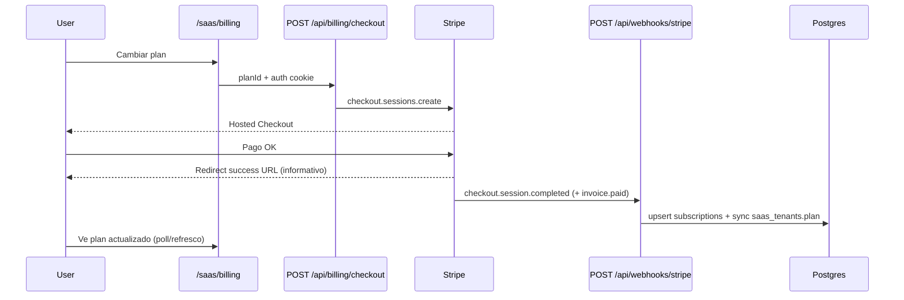

# Stripe Billing P0 — Checkout + Webhook E2E

Estado: **implementado y testeado en código** (jun 2026). Activación en producción depende de variables Railway + webhook en Stripe Dashboard.

---

## Qué funciona

| Área | Comportamiento |
|------|----------------|
| **Checkout** | `POST /api/billing/checkout` — planes `starter`, `pro`, `agency`; Price IDs solo desde env; metadata `user_id` + `tenant_id`; success/cancel URLs same-origin |
| **Webhook** | `POST /api/webhooks/stripe` — firma `STRIPE_WEBHOOK_SECRET`; idempotencia en `stripe_webhook_events` |
| **Eventos** | `checkout.session.completed`, `customer.subscription.created/updated/deleted`, `invoice.paid`, `invoice.payment_failed` |
| **DB sync** | `subscriptions` (plan, status, stripe IDs, period end) → `nelvyon_users.plan` → `saas_tenants.plan` (agency → enterprise) |
| **Seguridad** | Plan **no** se activa en success URL; solo vía webhook verificado |
| **Dunning** | `invoice.payment_failed` → past_due + DunningService; reactivación en `invoice.paid` / subscription updated |
| **Cancelación** | `customer.subscription.deleted` → downgrade a starter o flujo voluntary cancel |
| **UI SaaS** | `/saas/billing` — checkout Stripe; banner post-pago explicando activación vía webhook |
| **Portal** | `POST /api/saas/billing/portal` — Stripe Customer Portal |
| **Health** | `/api/health/deep` incluye check Stripe (vars + conectividad API) |

---

## Variables requeridas (Railway)

```env
STRIPE_SECRET_KEY=sk_live_...          # o sk_test_... en staging
STRIPE_WEBHOOK_SECRET=whsec_...
STRIPE_PRICE_ID_STARTER=price_...
STRIPE_PRICE_ID_PRO=price_...
STRIPE_PRICE_ID_AGENCY=price_...
NEXT_PUBLIC_APP_URL=https://app.nelvyon.com   # sin trailing slash

# Opcional
STRIPE_PRICE_ID_AGENCY_PARTNER=price_...   # wholesale partners (sin checkout directo)
STRIPE_API_KEY=...                         # alias legacy de STRIPE_SECRET_KEY
STRIPE_BILLING_PORTAL_FALLBACK=...         # URL manual si portal API falla
```

Sin `STRIPE_SECRET_KEY` o Price ID → checkout responde **503** con `code: missing_stripe_secret` o `missing_stripe_price`.

---

## Flujo E2E



---

## Probar en Stripe Test Mode

1. **Crear productos/precios** en [Stripe Dashboard → Test mode](https://dashboard.stripe.com/test/products).
2. Copiar Price IDs a Railway (`STRIPE_PRICE_ID_*`).
3. **Webhook endpoint** (Test mode):
   - URL: `https://<staging>/api/webhooks/stripe`
   - Eventos: `checkout.session.completed`, `customer.subscription.*`, `invoice.paid`, `invoice.payment_failed`
4. Copiar **Signing secret** → `STRIPE_WEBHOOK_SECRET`.
5. Login SaaS → `/saas/billing` → "Cambiar a Pro" → tarjeta test `4242 4242 4242 4242`.
6. Verificar:
   - Stripe Dashboard → Events → webhook 200
   - DB: `SELECT plan, status, stripe_subscription_id FROM subscriptions WHERE user_id = ...`
   - UI: badge plan en `/saas/billing`

### Stripe CLI (local / tunnel)

```bash
stripe login
stripe listen --forward-to localhost:3000/api/webhooks/stripe
# Copiar whsec_... a .env STRIPE_WEBHOOK_SECRET

stripe trigger checkout.session.completed
```

---

## Probar en Live Mode

1. Cambiar keys a `sk_live_` / `whsec_` live y Price IDs live.
2. Crear webhook endpoint **live** apuntando a `https://app.nelvyon.com/api/webhooks/stripe`.
3. Un checkout real de bajo importe (o cuenta interna).
4. **No confiar** en la URL de éxito — confirmar fila en `stripe_webhook_events` con `status = processed`.

---

## Manual en Railway / Stripe

| Paso | Dónde |
|------|--------|
| Variables env | Railway → service `apps/web` |
| Webhook URL + eventos | Stripe Dashboard → Developers → Webhooks |
| Customer Portal | Stripe Dashboard → Settings → Billing → Customer portal (activar) |
| Price IDs test vs live | Deben coincidir con el modo de la secret key |
| Migración idempotencia | `324_stripe_webhook_events.sql` (ya en repo) |

---

## Tests automatizados (local)

```bash
pnpm -C apps/web exec vitest run backend/stripe/__tests__/webhookHandler.test.ts backend/qa/__tests__/flows/billing.flow.test.ts --reporter=dot
```

Cobertura:
- Webhook sync plan → `saas_tenants`
- `invoice.payment_failed` / `invoice.paid`
- Firma requiere `STRIPE_WEBHOOK_SECRET`
- Flow billing: checkout completed, subscription updated/deleted, dunning, voluntary cancel

---

## Smoke CI recomendado

```bash
node scripts/staging-smoke-stripe-billing.mjs --skip-wait
```

Comprueba:
- Deep health Stripe component
- Webhook rechaza payload sin firma válida (≠ 200)
- Checkout 401 sin auth
- Checkout autenticado → URL Stripe o 503 explícito
- `GET /api/saas/billing` incluye `stripeConfigured`

Variables opcionales smoke: `STAGING_BASE_URL`, `STRIPE_SMOKE_EMAIL`, `STRIPE_SMOKE_PASSWORD`.

**Nota:** Si Stripe no está configurado en staging, el smoke emite `WARN` (no `FAIL`) en checkout 503 — útil para detectar vars faltantes sin bloquear otros P0.

---

## Archivos clave

| Archivo | Rol |
|---------|-----|
| `apps/web/src/app/api/billing/checkout/route.ts` | Creación checkout session |
| `apps/web/src/app/api/webhooks/stripe/route.ts` | Route + idempotencia |
| `backend/stripe/webhookHandler.ts` | Lógica eventos + DB sync |
| `backend/stripe/stripeApi.ts` | API Stripe + `createSubscriptionCheckoutSession` |
| `backend/billing/planConfig.ts` | Planes + env Price IDs |
| `backend/saas/SaasBillingService.ts` | Summary con `stripeConfigured` |
| `apps/web/src/app/saas/billing/page.tsx` | UI checkout + banners |

---

## Qué NO hace este P0

- `agency_partner` no tiene checkout Stripe directo (solo env var para mapeo webhook).
- Legacy `/billing/upgrade` sigue en FastAPI `/api/v1/payment/*` — SaaS usa `/api/billing/checkout`.
- Usage meters Stripe (metered billing) — quotas locales vía `SaasPlanQuotaService`, no Stripe Meters en este flujo.
