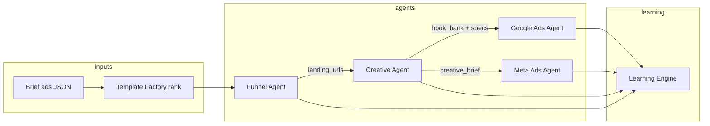

# NELVYON — Ads Agents Foundation

**Fase:** AUTONOMOUS-PHASE-J  
**Versión:** 1.0  
**Fecha:** 2026-06-07  
**Estado:** Diseño fundacional — **sin código, sin OS, sin SaaS, sin prod**  
**Complementa:** `ADS_AGENTS_ROADMAP.md` (auditoría estado actual) → **Foundation** (contratos + fases siguientes)

---

## 1. Objetivo

Definir la **base arquitectónica** de los 4 agentes ads para integración con Template Factory y Learning Engine en fases K–N. Hoy producen documentación LLM; la foundation especifica **contratos, QA, OAuth y handoffs** sin tocar rutas OS ni producción.

```
Brief ads ──► Funnel Agent (opcional) ──► Creative Agent ──► Google / Meta Agents
                    │                           │                    │
                    └── landing_url ────────────┴── creatives ───────┘
                                              │
                                    Template Factory (ads pack)
                                              │
                                    Learning Engine (outcome)
```

---

## 2. Mapa de agentes

| Agente | ID | Clase | Capa | Persistencia |
|--------|-----|-------|------|--------------|
| Google Ads Agent | `ads-google` | `AdsGoogleAgent` | LLM + API opcional | `ads_results` |
| Meta Ads Agent | `ads-meta` | `AdsMetaAgent` | LLM + API opcional | `ads_results` |
| Creative Agent | `ads-creatividades` | `AdsCreatividadesAgent` | LLM estrategia creativa | `ads_results` |
| Funnel Agent | `funnel_premium` | `FunnelPremiumAgent` | Pipeline 8 steps + ZIP | OS job store |

**Rutas actuales (referencia, no extender en J):**

- `POST /api/os/agents/ads` — Google, Meta, Creative
- OS job runner — Funnel premium

---

## 3. Google Ads Agent

### 3.1 Propósito

Diseñar y optimizar campañas **Search, PMAX y Demand Gen** con estructura cuenta, RSAs, negativas y checklist tracking.

### 3.2 Inputs (contrato foundation)

```json
{
  "userId": "uuid",
  "businessContext": "string — obligatorio",
  "agentId": "ads-google",
  "siteUrl": "https://landing-final.com",
  "googleAdsCustomerId": "opcional — override OAuth cliente",
  "analyticsPropertyId": "opcional — GA4",
  "metadata": {
    "sector": "solar",
    "objective": "lead_gen",
    "language": "es",
    "level": "professional",
    "template_id": "ads-google-search-solar-v1",
    "daily_budget_eur": 40,
    "launch": false
  }
}
```

| Campo | Fuente Phase K+ |
|-------|-----------------|
| `siteUrl` | Funnel Agent ZIP publish o Factory landing |
| `template_id` | Template Factory ads pack |
| `googleAdsCustomerId` | `oauth_connections` provider `google` |
| `launch` | **false** por defecto — gate ops |

### 3.3 Outputs (contrato foundation)

```json
{
  "result": "documento maestro: estructura campañas, negativas, RSAs",
  "insights": ["string"],
  "recommendedActions": ["string"],
  "artifacts": {
    "campaign_structure": {
      "campaigns": [
        {
          "name": "Solar Valencia — Search",
          "type": "SEARCH",
          "daily_budget_eur": 18,
          "ad_groups": [{ "name": "...", "keywords": [], "negatives": [] }]
        }
      ]
    },
    "rsa_templates": [{ "headlines": [], "descriptions": [] }],
    "tracking_checklist": ["conversion action", "GA4 link", "URL finals"],
    "mock": true,
    "template_id": "ads-google-search-solar-v1"
  }
}
```

### 3.4 QA foundation

| ID | Check | Tipo | Gate |
|----|-------|------|------|
| G-QA-01 | ≥ 1 campaña Search documentada | BLOQUEANTE | Pre-entrega |
| G-QA-02 | Lista negativas presente | BLOQUEANTE | Pre-entrega |
| G-QA-03 | RSAs ≥ 3 headlines, 2 descriptions | | Pre-entrega |
| G-QA-04 | `siteUrl` responde 200 | BLOQUEANTE | Pre-launch |
| G-QA-05 | Tracking checklist 100% | BLOQUEANTE | Pre-launch |
| G-QA-06 | `mock: false` verificado | BLOQUEANTE | Launch |
| G-QA-07 | Presupuesto ≤ umbral ops primera campaña | | Launch |

**Score:** `quality_score` del pack ads → umbral 85 (`ADS_AGENTS_ROADMAP`).

### 3.5 Dependencias OAuth

| Nivel | Requisito |
|-------|-----------|
| **Doc only** | Ninguno |
| **Enriquecimiento** | OAuth `google` → GA4, GSC context |
| **Launch real** | `oauth_connections` + `GOOGLE_ADS_DEVELOPER_TOKEN` + customer ID |

**Variables globales (NELVYON fallback):**

```
GOOGLE_ADS_CLIENT_ID
GOOGLE_ADS_CLIENT_SECRET
GOOGLE_ADS_REFRESH_TOKEN
GOOGLE_ADS_DEVELOPER_TOKEN
GOOGLE_ADS_CUSTOMER_ID
GOOGLE_ADS_LOGIN_CUSTOMER_ID
OAUTH_ENCRYPTION_KEY
```

**Flujo cliente diseño:**

```
GET /api/v1/oauth/authorize/google
  → callback → oauth_connections
  → AdsInput.googleAdsCustomerId auto-fill
  → launch gate: operator role + G-QA-06
```

---

## 4. Meta Ads Agent

### 4.1 Propósito

Diseñar campañas **Advantage+, catálogos, audiencias, CAPI** y reglas anti-fatiga creativa.

### 4.2 Inputs

```json
{
  "userId": "uuid",
  "businessContext": "string — obligatorio",
  "agentId": "ads-meta",
  "siteUrl": "https://landing-final.com",
  "metaAdAccountId": "act_XXXXX — opcional OAuth",
  "metadata": {
    "sector": "ecommerce",
    "objective": "sales",
    "channel": "meta_feed",
    "language": "es",
    "level": "premium",
    "template_id": "ads-meta-advantage-ecom-v1",
    "creative_template_ids": ["meta-01-1080x1080"],
    "daily_budget_eur": 55,
    "launch": false
  }
}
```

### 4.3 Outputs

```json
{
  "result": "plan Advantage+ con ad sets y creatividades",
  "insights": ["string"],
  "recommendedActions": ["string"],
  "artifacts": {
    "campaign_plan": {
      "objective": "OUTCOME_SALES",
      "ad_sets": [{ "name": "...", "targeting": {}, "budget_share": 0.4 }]
    },
    "creative_brief": [{ "format": "1080x1080", "hook": "...", "cta": "..." }],
    "capi_checklist": ["pixel", "server-side", "event_match_quality"],
    "mock": true,
    "template_id": "ads-meta-advantage-ecom-v1"
  }
}
```

### 4.4 QA foundation

| ID | Check | Tipo |
|----|-------|------|
| M-QA-01 | Funnel lógico 3–4 ad sets | BLOQUEANTE |
| M-QA-02 | Creative brief ≥ 3 variantes | |
| M-QA-03 | CAPI checklist completo | BLOQUEANTE pre-launch |
| M-QA-04 | Formatos 1:1 y/o 9:16 según channel | |
| M-QA-05 | Sin claims prohibidos sector regulado | BLOQUEANTE |
| M-QA-06 | `mock: false` + BM permisos | BLOQUEANTE launch |

### 4.5 Dependencias OAuth

| Nivel | Requisito |
|-------|-----------|
| **Doc only** | Ninguno |
| **Insights reales** | OAuth `meta` + `META_AD_ACCOUNT_ID` |
| **Launch** | `ads_management` scope + creatividades subidas |

**Variables:**

```
META_APP_ID
META_APP_SECRET
META_ACCESS_TOKEN
META_AD_ACCOUNT_ID
META_REDIRECT_URI
FB_PAGE_ACCESS_TOKEN
OAUTH_ENCRYPTION_KEY
```

---

## 5. Creative Agent

### 5.1 Propósito

**Rotación creativa, detección fatiga, bank de hooks** para paid media. No genera imágenes en foundation — produce brief y calendario; assets visuales vía Template Factory `ads` packs.

### 5.2 Inputs

```json
{
  "userId": "uuid",
  "businessContext": "string — obligatorio",
  "agentId": "ads-creatividades",
  "metadata": {
    "sector": "fitness",
    "funnel_stage": "prospecting",
    "platforms": ["meta_feed", "meta_stories"],
    "template_id": "ads-creative-hooks-fitness-v1",
    "existing_creatives_count": 0,
    "frequency_threshold": 3.5
  }
}
```

### 5.3 Outputs

```json
{
  "result": "calendario rotación + umbrales fatiga",
  "insights": ["fatiga remarketing antes que prospecting"],
  "recommendedActions": ["kill rules CPA > X", "batch 5 hooks semanal"],
  "artifacts": {
    "rotation_calendar": [{ "week": 1, "creatives": ["hook-A", "hook-B"] }],
    "fatigue_rules": { "frequency_max": 3.5, "ctr_decay_pct": 20 },
    "hook_bank": ["string"],
    "creative_specs": [{ "format": "1080x1920", "safe_zones": "..." }],
    "template_id": "ads-creative-hooks-fitness-v1"
  }
}
```

### 5.4 QA foundation

| ID | Check |
|----|-------|
| C-QA-01 | ≥ 3 hooks por funnel stage |
| C-QA-02 | Reglas fatiga documentadas |
| C-QA-03 | Specs formato alineados channel |
| C-QA-04 | Brand C2 (`SERVICES_QA_MASTER`) |
| C-QA-05 | Handoff a diseñador o Factory assets |

### 5.5 Dependencias OAuth

| Uso | OAuth |
|-----|-------|
| Estrategia doc | **No requiere** |
| Métricas fatiga reales | Meta + Google OAuth insights |
| Upload creatividades | Meta OAuth obligatorio |

**Handoff diseño:**

```
Creative Agent → artifacts.hook_bank
       ↓
Template Factory (ads pack static)
       ↓
Meta Ads Agent (creative_brief + asset refs)
```

---

## 6. Funnel Agent

### 6.1 Propósito

Pipeline **multi-paso** (análisis → arquitectura → CRO → SEO → HTML → ZIP) como destino de tráfico ads.

### 6.2 Inputs (`OsJobPayload`)

```json
{
  "clientName": "HelioVolt",
  "tenantId": "workspace-uuid",
  "primaryColor": "#0F766E",
  "secondaryColor": "#F59E0B",
  "sector": "solar",
  "objective": "lead_gen",
  "language": "es",
  "level": "premium",
  "template_id": "funnel-optin-offer-close-v1",
  "offer": "Estudio solar gratuito"
}
```

### 6.3 Outputs (8 steps)

| Step | Artefacto |
|------|-----------|
| S1 market_analysis | Markdown |
| S2 store_architecture | JSON páginas funnel |
| S3 product_strategy | Copy por etapa |
| S4 conversion_optimization | CRO spec |
| S5 seo_ecommerce | Meta + tracking doc |
| S6 delivery_report | Markdown ejecutivo |
| S7 funnel_codegen | HTML paso 1–3 |
| S8 bundle_publish | ZIP URL |

**Contrato handoff ads:**

```json
{
  "funnel_zip_url": "https://...",
  "landing_urls": {
    "opt_in": "https://staging.../step1",
    "offer": "https://staging.../step2",
    "close": "https://staging.../step3"
  },
  "template_id": "funnel-optin-offer-close-v1"
}
```

### 6.4 QA foundation

| ID | Check | Tipo |
|----|-------|------|
| F-QA-01 | 3 pasos HTML navegables | BLOQUEANTE |
| F-QA-02 | CTA único por paso alineado ads | BLOQUEANTE |
| F-QA-03 | Mobile 375px OK | BLOQUEANTE |
| F-QA-04 | SEO step 5 tracking documentado | |
| F-QA-05 | ZIP publicado accesible | BLOQUEANTE |
| F-QA-06 | `quality_score` ≥ 85 rubric landing adaptada | BLOQUEANTE |

### 6.5 Dependencias OAuth

**Ninguna** para generación. Opcional GA4 OAuth en step 5 para tracking real.

---

## 7. Orquestación foundation (Phase K diseño)



### 7.1 Orden de ejecución recomendado

| Secuencia | Cuándo |
|-----------|--------|
| 1. Funnel Agent | `objective` = lead_gen/sales + multi-step |
| 2. Creative Agent | Siempre antes de Meta; recomendado Google |
| 3. Google Ads Agent | `channel` incluye google_* |
| 4. Meta Ads Agent | `channel` incluye meta_* |

### 7.2 Eventos Learning Engine

Cada agente emite `template_outcome` parcial:

| Agente | `service` | `outcome` inicial |
|--------|-----------|-------------------|
| Funnel | `funnel` | `generated` → `qa_passed` |
| Creative | `meta_ads` | `generated` |
| Google | `google_ads` | `generated` |
| Meta | `meta_ads` | `generated` |

Cierre proyecto: `client_approval` + `conversion` 30d post-launch.

---

## 8. Integración Template Factory

| Agente | `template_id` source |
|--------|---------------------|
| Google | `ads-google-{sector}-{objective}-v{n}` |
| Meta | `ads-meta-{channel}-{sector}-v{n}` |
| Creative | `ads-creative-hooks-{sector}-v{n}` |
| Funnel | `funnel-{archetype}-v{n}` |

Factory ads pack incluye: RSA pools, creative specs, CAPI/GAds checklists embebidos.

**Ranking:** Learning Engine prioriza packs con mayor `conversion_score` en slice `(ads, sector, objective, channel)`.

---

## 9. Fases post-foundation

| Phase | Entregable | Toca código |
|-------|------------|-------------|
| **J** | Este doc + contratos JSON | ❌ |
| **K** | `artifacts` extendido en agents + template_outcomes | `backend/autonomous/` only |
| **L** | Orquestador ads secuencial | autonomous layer |
| **M** | OAuth cliente → auto-fill IDs | oauth + autonomous |
| **N** | Launch gate + mock badge UI | autonomous panel (no OS shell) |

---

## 10. Matriz resumen

| | Google | Meta | Creative | Funnel |
|---|--------|------|----------|--------|
| **Input clave** | businessContext + siteUrl | + metaAdAccountId | funnel_stage + platforms | clientName + offer |
| **Output clave** | campaign_structure | campaign_plan | hook_bank | funnel_zip_url |
| **QA bloqueante** | tracking + launch mock | CAPI + claims | hooks ≥ 3 | 3 steps HTML |
| **OAuth launch** | Google Ads | Meta BM | Meta upload | — |
| **OAuth enrich** | GA4/GSC | Insights | Insights | GA4 opcional |
| **Template Factory** | ads pack google | ads pack meta | creative specs | funnel archetype |
| **Learning** | google_ads service | meta_ads service | meta_ads service | funnel service |

---

## 11. Fuera de alcance Phase J

- Modificar `POST /api/os/agents/ads`
- `AdsAgentService.launch=true` en prod
- Nuevos módulos OS dashboard ads
- SaaS Ads dashboard tenant
- Variables Railway prod

---

## 12. Referencias

- `docs/autonomous/ADS_AGENTS_ROADMAP.md` — auditoría código actual
- `docs/autonomous/TEMPLATE_FACTORY_ROADMAP.md` — ads packs + scoring
- `docs/autonomous/LEARNING_ENGINE_ROADMAP.md` — outcomes + ranking
- `backend/os-agents/sectors/ads/shared.ts` — AdsInput/Output
- `backend/os-agents/agents/FunnelPremiumAgent.ts`
- `backend/services/google_ads_service.py` / `meta_ads_service.py`
- `docs/services/GOOGLE_ADS_SOP.md` / `META_ADS_SOP.md`
