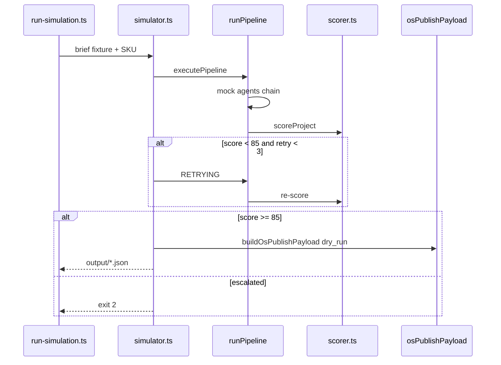

# NELVYON — Autonomous Phase B Simulation

**Versión:** 1.0  
**Fase:** AUTONOMOUS-PHASE-B  
**Estado:** Simulación semiautomática **offline** — sin DB, sin APIs, sin portal

---

## 1. Objetivo

Ejecutar el flujo multiagente de Phase A usando **agentes mock basados en reglas** (no LLM), evaluar QA 0–100, generar `OsPublishPayload` en **dry-run** y documentar qué se publicaría en `os_deliverables` sin tocar producción.

| SKU piloto | Fixture | Autonomía simulada |
|------------|---------|-------------------|
| Landing Page | `landing-heliovolt.json` | ~92% |
| Chatbot IA | `chatbot-sonrisa.json` | ~88% |
| SEO básico | `seo-alonso-vega.json` | ~86% |

---

## 2. Qué está en el repo

```
backend/autonomous/
├── types.ts                 # Contratos TS
├── simulator.ts             # Orquestador Phase B
├── agents/mockAgents.ts     # Agentes regla (sin LLM)
├── pipelines/runPipeline.ts # Pipelines por SKU
├── qa/scorer.ts             # QA mock 0–100
├── publish/osPublishPayload.ts
├── fixtures/briefs/         # Inputs JSON
├── fixtures/gold/           # Gold set chatbot
├── examples/                # Outputs JSON referencia
├── scripts/run-simulation.ts
├── output/                  # Generado local (gitignored)
└── __tests__/simulator.test.ts
```

**Aislado de:** SaaS, OS core, portal, backend crítico (auth, billing, migrate), web pública.

---

## 3. Cómo ejecutar una simulación manual

### 3.1 CLI (recomendado)

Desde la raíz del monorepo:

```bash
# Un SKU
pnpm -C apps/web exec tsx ../../backend/autonomous/scripts/run-simulation.ts landing
pnpm -C apps/web exec tsx ../../backend/autonomous/scripts/run-simulation.ts chatbot
pnpm -C apps/web exec tsx ../../backend/autonomous/scripts/run-simulation.ts seo

# Los 3 SKUs
pnpm -C apps/web exec tsx ../../backend/autonomous/scripts/run-simulation.ts all
```

**Salida:** consola (resumen) + archivos en `backend/autonomous/output/`:
- `landing-project.json` / `landing-os-publish.json`
- `chatbot-project.json` / `chatbot-os-publish.json`
- `seo-project.json` / `seo-os-publish.json`

### 3.2 Tests automatizados

```bash
pnpm -C apps/web exec vitest run ../../backend/autonomous/__tests__/simulator.test.ts
```

### 3.3 Simulación manual paso a paso (sin CLI)

1. Copiar fixture de `fixtures/briefs/`  
2. Recorrer agentes en orden (§4)  
3. Validar artefactos contra `AUTONOMOUS_JSON_CONTRACTS.md`  
4. Aplicar rubric `AUTONOMOUS_QA_RUBRICS.md` a mano o vía `scorer.ts`  
5. Si score ≥ 85 → construir `OsPublishPayload` con `dry_run: true`  
6. **No** enviar a OS ni portal

---

## 4. Orden de agentes por SKU

### 4.1 Landing (`NELVYON-LANDING`)

| # | Agente | Output artifact |
|---|--------|-----------------|
| 0 | `agent-pm` | `plan` (template, blockers) |
| 1 | `agent-strategist` | `strategy` |
| 2 | `agent-copywriter` | `copy` |
| 3 | `agent-designer` | `design` |
| 4 | `landing_builder_service` (mock) | `build` |
| 5 | `agent-seo` | patch en `copy` |
| 6 | `agent-qa` | `qa` |

### 4.2 Chatbot (`NELVYON-CHATBOT`)

| # | Agente | Output |
|---|--------|--------|
| 0 | `agent-pm` | `plan` |
| 1 | `agent-strategist` | `strategy` |
| 2 | `agent-copywriter` | `knowledge_base` |
| 3 | `agent-pm` + `chatbot_service` (mock) | `config` |
| 4 | `agent-qa` | `qa` |

### 4.3 SEO (`NELVYON-SEO`)

| # | Agente | Output |
|---|--------|--------|
| 0 | `agent-pm` | `plan` |
| 1 | `agent-strategist` | `priority` |
| 2 | `agent-seo` | `audit` |
| 3 | `agent-seo` | `keywords` |
| 4 | `agent-copywriter` | `on_page_fixes` |
| 5 | `agent-seo` | `report` |
| 6 | `agent-qa` | `qa` |

---

## 5. Inputs a usar (fixtures)

| SKU | Archivo | Cliente ficticio |
|-----|---------|------------------|
| Landing | `fixtures/briefs/landing-heliovolt.json` | HelioVolt solar |
| Chatbot | `fixtures/briefs/chatbot-sonrisa.json` | Clínica dental |
| SEO | `fixtures/briefs/seo-alonso-vega.json` | Despacho legal |

**Negativo (tests):** `landing-incomplete.json` → bloqueo intake.

---

## 6. Outputs esperados

### 6.1 Por proyecto (`*-project.json`)

```json
{
  "project_id": "sim-landing-...",
  "sku": "NELVYON-LANDING",
  "status": "OS_PUBLISH_READY",
  "artifacts": { "plan", "strategy", "copy", "design", "build" },
  "qa": { "score": 100, "passed": true },
  "agent_log": [ "...7 entries..." ],
  "simulation_mode": "phase-b-offline"
}
```

### 6.2 OsPublishPayload (`*-os-publish.json`)

Siempre incluye:

- `dry_run: true`  
- `deliverables[]` — lo que **se crearía** en OS  
- `os_actions[]` — acciones **no ejecutadas**  
- `note` — aviso explícito Phase B  

Ver ejemplos en `backend/autonomous/examples/`.

---

## 7. Evaluación QA

| Regla | Implementación Phase B |
|-------|------------------------|
| Score 0–100 | `qa/scorer.ts` — suma ítems rubric |
| Umbral 85 | `passed = score >= 85 && 0 bloqueantes` |
| Bloqueante | Cap score a 84 si falla ítem BLOQUEANTE |
| Reintentos | Máx 3; mock repair en intento 2+ |
| Escalación | `ESCALATE_OPERATOR` si sigue < 85 |

**Landing:** 25+25+20+15+15 pts (SOP, técnico, contenido, CRO, SEO).  
**Chatbot:** gold set mock `gold_set_useful_rate >= 0.8`.  
**SEO:** 10 secciones informe + 5 páginas on-page.

---

## 8. OsPublishPayload y `os_deliverables`

### 8.1 Qué se publicaría (simulado)

| SKU | Deliverables `client` | `internal` |
|-----|----------------------|------------|
| Landing | URL, copy JSON, handoff | QA PDF |
| Chatbot | snippet, config, KB | gold-set CSV, QA PDF |
| SEO | informe PDF, CSV, fixes JSON, keyword map, plan 90d | QA PDF |

### 8.2 Acciones OS (no ejecutadas en Phase B)

```json
[
  { "entity": "deliverable", "action": "create", "status": "published" },
  { "entity": "project", "action": "update_status", "status": "CLIENTE_REVISION" },
  { "entity": "task", "action": "complete", "task_key": "QA_AUTONOMOUS" }
]
```

**Mapeo futuro Phase D:**

| Campo payload | Entidad OS |
|---------------|------------|
| `deliverables[].value` | `os_deliverables.url / file_path` |
| `visibility: client` | visible en portal cliente |
| `visibility: internal` | solo ops OS |
| `qa_score` | metadata entregable |

---

## 9. Qué queda FUERA de producción

| Componente | Phase B |
|------------|---------|
| Base de datos | ❌ Sin escritura |
| APIs OpenAI / ads / GSC | ❌ Sin llamadas |
| `landing_builder_service` real | ❌ Mock build |
| `chatbot_service` deploy | ❌ Mock config |
| Portal cliente | ❌ Sin publicar |
| OS shell / SaaS | ❌ Sin modificar |
| Web pública | ❌ Sin deploy |
| LLM prompts Phase A | ⏳ No conectados (Phase C) |

---

## 10. Flujo completo (diagrama)



---

## 11. Validación antes de commit

```bash
pnpm -C apps/web exec vitest run ../../backend/autonomous/__tests__/simulator.test.ts
pnpm -C apps/web typecheck
```

No commitear si fallan tests o typecheck.

---

## 12. Siguiente paso (Phase C)

1. Conectar prompts Phase A a LLM en capa `services-autonomous/`  
2. Reemplazar `mockAgents` por invocaciones reales con fallback mock  
3. Integrar `qa_engine.py` + Playwright offline en CI  
4. Phase D: webhook delgado → `os_deliverables` (sin refactor portal)

---

*Phase B Simulation v1.0 — NELVYON Autonomous*
