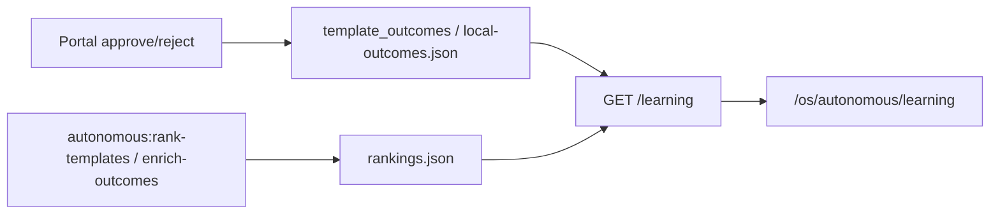

# AUTONOMOUS Phase O — Learning Dashboard interno

Dashboard OS interno para visualizar rankings, conversiones y rendimiento de plantillas autónomas.

## Resumen

| Pieza | Ubicación |
|-------|-----------|
| API | `GET /api/v1/os/autonomous/learning` |
| UI | `/os/autonomous/learning` |
| Service | `backend/services/os_autonomous_learning_service.py` |

**Autonomía:** 82% → **86%** (+4%)

---

## Qué muestra

- **Top plantillas** — `final_template_score`, `conversion_score`, `qa_score`, CR, leads, aprobación portal, revisiones
- **Por sector** — mejor plantilla y score por sector
- **Por servicio** — mejor plantilla por servicio (landing, chatbot, …)
- **Tendencia 30 días** — outcomes/día, CR promedio, leads (si hay `created_at`)
- **Estado GA4** — modo y mensaje (sin secretos ni property id)
- **Metadatos** — `storage_mode`, outcomes count, fecha rankings

---

## Cómo se alimenta



1. Outcomes desde DB (`ENABLE_TEMPLATE_LEARNING_DB`) o `local-outcomes.json`
2. Rankings desde `backend/autonomous/output/learning/rankings.json`
3. Enriquecimiento GA4 opcional vía `autonomous:enrich-outcomes` (Phase N)

---

## Cómo interpretar rankings

| Métrica | Significado |
|---------|-------------|
| `final_template_score` | Score compuesto (quality + conversion + usage + reliability) |
| `conversion_score` | Peso de CR/leads medidos o benchmark sectorial |
| `cold_start` | Menos de 3 muestras — score con penalización suave |
| `conversion_rate` | % GA4 o mock (8.2 = 8.2%) |
| `approved_by_client` | Mayoría de outcomes con aprobación portal |

Desempate: `final_template_score` → `conversion_score` → `quality_score`.

---

## Acceso

**Requisitos:**
- Sesión autenticada (JWT)
- Header `X-Workspace-Id`
- Rol workspace: **owner**, **admin** u **operator**

**No acceden:** `member`, `viewer`, clientes portal.

**URL:** [https://staging.nelvyon.com/os/autonomous/learning](https://staging.nelvyon.com/os/autonomous/learning) (staging)

Quick link en OS shell: **Learning** (hub operaciones).

---

## Seguridad

- RBAC `require_workspace_operator` en API
- UI gate `can(role, "os", "create")` (operator+)
- Workspace isolation en DB (`workspace_id`)
- Sin PII cliente (solo agregados por plantilla)
- GA4: flags booleanos, nunca `GOOGLE_APPLICATION_CREDENTIALS` ni tokens

---

## Limitaciones

- Rankings file debe generarse con jobs CLI (no auto-refresh en UI)
- Tendencia 30d vacía sin outcomes fechados recientes
- GA4 real requiere Phase N flags + enrich job
- No editable desde UI (read-only v1)
- Sin export CSV / alertas (Phase P+)

---

## Cómo activar GA4 real

Ver [AUTONOMOUS_PHASE_N_GA4_CONVERSION_LEARNING.md](./AUTONOMOUS_PHASE_N_GA4_CONVERSION_LEARNING.md):

```bash
export ENABLE_AUTONOMOUS_GA4=true
export GA4_PROPERTY_ID="..."
export GOOGLE_APPLICATION_CREDENTIALS="/secrets/ga4-sa.json"
pnpm -C apps/web autonomous:enrich-outcomes
```

Refrescar dashboard en `/os/autonomous/learning`.

---

## Comandos relacionados

```bash
pnpm -C apps/web autonomous:rank-templates
pnpm -C apps/web autonomous:enrich-outcomes
pnpm -C apps/web autonomous:learning
```

## Tests

```bash
pytest backend/tests/test_os_autonomous_learning.py -q
pnpm -C apps/web test -- src/features/osAutonomous/__tests__/OsAutonomousLearningView.test.tsx
```

---

## Siguiente paso recomendado

**Phase P — Alertas y export**

- Alertas CR caída post-deploy
- Export CSV rankings
- Cron auto-refresh rankings en staging
- Comparativa A/B templates por sector
