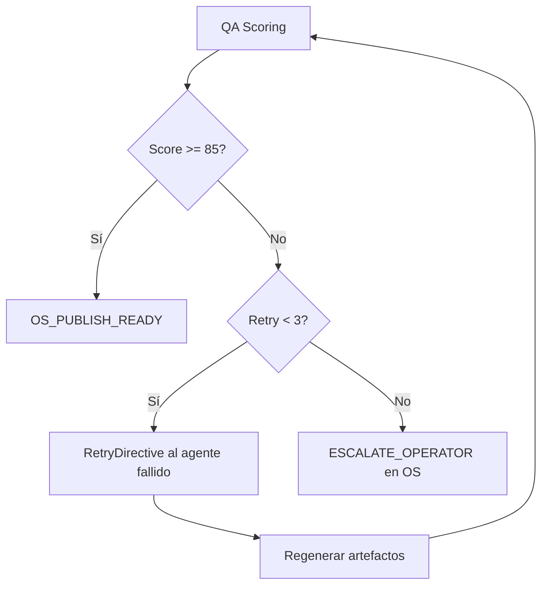

# NELVYON Autonomous — QA Rubrics

**Versión:** 1.0 · **Fase:** AUTONOMOUS-PHASE-A  
**SKUs:** Landing · Chatbot · SEO básico  
**Umbral global:** **Score ≥ 85** para liberar · **Bloqueo obligatorio** si < 85

---

## 1. Sistema de scoring global

### 1.1 Fórmula

```
SCORE = sop_compliance + technical + content + conversion_or_intent + seo_or_tracking
```

Cada dimensión suma **máx. 25 pts** en landing; variaciones por SKU en §2–§4.

### 1.2 Reglas de bloqueo

| Condición | Efecto |
|-----------|--------|
| Score total < 85 | `QA_BLOCKED` — no publicar OS |
| Cualquier ítem **BLOQUEANTE** falla | Score cap 84 aunque suma mayor |
| 3 reintentos sin ≥ 85 | `ESCALATE_OPERATOR` |
| Sector regulado sin disclaimer | Bloqueo automático |

### 1.3 Flujo de reintentos



| Intento | Estrategia |
|---------|------------|
| 1 | Agente con más fallos en `failed_agents` |
| 2 | Mismo agente + prompt repair + modelo upgrade |
| 3 | Plantilla alternativa o simplificación scope |
| 4+ | Tarea manual OS `AUTONOMOUS_ESCALATION` |

---

## 2. Rubric — Landing (`NELVYON-LANDING`)

**Peso total: 100 pts**

### 2.1 SOP compliance (25 pts)

| ID | Ítem | Pts | Tipo | Auto |
|----|------|-----|------|------|
| L-SOP-01 | Brief campos obligatorios completos | 5 | BLOQUEANTE | Sí |
| L-SOP-02 | 1 CTA principal único | 5 | BLOQUEANTE | Sí |
| L-SOP-03 | Thank-you page presente | 3 | | Sí |
| L-SOP-04 | Pack entregables mínimo (URL, copy JSON, QA PDF) | 4 | | Sí |
| L-SOP-05 | Tier scope respetado (1 landing Starter) | 4 | | Sí |
| L-SOP-06 | Exclusiones documentadas si aplican | 4 | | Sí |

### 2.2 Técnico (25 pts)

| ID | Ítem | Pts | Tipo | Auto |
|----|------|-----|------|------|
| L-TEC-01 | HTTPS activo staging/live | 5 | BLOQUEANTE | Sí |
| L-TEC-02 | Form submit OK (Playwright) | 5 | BLOQUEANTE | Sí |
| L-TEC-03 | Lighthouse mobile ≥ 85 | 5 | | Sí |
| L-TEC-04 | LCP < 2.5s staging | 4 | | Sí |
| L-TEC-05 | 0 console errors críticos | 3 | | Sí |
| L-TEC-06 | Responsive 375/768/1280 | 3 | | Sí |

### 2.3 Contenido (20 pts)

| ID | Ítem | Pts | Tipo | Auto |
|----|------|-----|------|------|
| L-CNT-01 | Headline comunica beneficio | 5 | | LLM rubric |
| L-CNT-02 | Subheadline clarifica oferta | 4 | | LLM rubric |
| L-CNT-03 | Sin claims prohibidos sector | 5 | BLOQUEANTE | LLM + rules |
| L-CNT-04 | Ortografía ES correcta | 3 | | Linter |
| L-CNT-05 | FAQ ≥ 3 preguntas | 3 | | Sí |

### 2.4 Conversión / CRO (15 pts)

| ID | Ítem | Pts | Tipo | Auto |
|----|------|-----|------|------|
| L-CRO-01 | CTA visible above fold mobile | 5 | BLOQUEANTE | Playwright |
| L-CRO-02 | Formulario ≤ 5 campos Starter | 3 | | Sí |
| L-CRO-03 | Prueba social presente | 4 | | Sí |
| L-CRO-04 | WCAG AA contraste CTA | 3 | | Sí |

### 2.5 SEO / tracking (15 pts)

| ID | Ítem | Pts | Tipo | Auto |
|----|------|-----|------|------|
| L-SEO-01 | Title único ≤ 60 chars | 4 | | Sí |
| L-SEO-02 | Meta description ≤ 155 chars | 4 | | Sí |
| L-SEO-03 | Pixel/GA4 dispara PageView | 4 | BLOQUEANTE | Sí |
| L-SEO-04 | Canonical correcto | 3 | | Sí |

### 2.6 Mapeo fallo → agente reintento

| Códigos fallo | Agente |
|---------------|--------|
| L-CNT-*, L-CRO-04 | `agent-copywriter` |
| L-TEC-03, L-TEC-04, L-CRO-01 | `agent-designer` |
| L-SEO-* | `agent-seo` |
| L-TEC-01, L-TEC-02 | `agent-pm` + builder |
| L-SOP-* | `agent-pm` |

### 2.7 Entregables finales (gate)

- [ ] URL staging/live  
- [ ] `copy-v{n}.json`  
- [ ] 3 PNG preview (desktop, mobile, thank-you)  
- [ ] `qa-report.pdf` score ≥ 85  
- [ ] `handoff-1pager.md`  

---

## 3. Rubric — Chatbot (`NELVYON-CHATBOT`)

**Peso total: 100 pts**

### 3.1 SOP compliance (25 pts)

| ID | Ítem | Pts | Tipo | Auto |
|----|------|-----|------|------|
| C-SOP-01 | Brief + FAQs mínimo tier (15 Starter) | 5 | BLOQUEANTE | Sí |
| C-SOP-02 | Widget snippet generado | 4 | BLOQUEANTE | Sí |
| C-SOP-03 | Handoff humano configurado | 5 | BLOQUEANTE | Sí |
| C-SOP-04 | Lead capture test OK | 4 | | Sí |
| C-SOP-05 | Documentación actualización FAQs | 4 | | Sí |
| C-SOP-06 | Tier canales respetado | 3 | | Sí |

### 3.2 Técnico (25 pts)

| ID | Ítem | Pts | Tipo | Auto |
|----|------|-----|------|------|
| C-TEC-01 | Bot responde en < 3s p95 | 5 | | Sí |
| C-TEC-02 | Widget carga sin error JS | 5 | BLOQUEANTE | Sí |
| C-TEC-03 | Webhook lead entrega payload | 5 | BLOQUEANTE | Sí |
| C-TEC-04 | Config export JSON válido | 5 | | Sí |
| C-TEC-05 | Rate limit / abuse básico | 5 | | Sí |

### 3.3 Contenido (25 pts)

| ID | Ítem | Pts | Tipo | Auto |
|----|------|-----|------|------|
| C-CNT-01 | Gold set ≥ 80% útil (50 preguntas) | 10 | BLOQUEANTE | Sí |
| C-CNT-02 | Sin alucinación precios/plazos | 5 | BLOQUEANTE | LLM eval |
| C-CNT-03 | Tono coherente persona | 5 | | LLM rubric |
| C-CNT-04 | Fallback definido | 3 | | Sí |
| C-CNT-05 | Disclaimer si sector regulado | 2 | BLOQUEANTE | Sí |

### 3.4 Conversación / intent (15 pts)

| ID | Ítem | Pts | Tipo | Auto |
|----|------|-----|------|------|
| C-INT-01 | Intents críticos cubiertos (≥ 90%) | 5 | | Sí |
| C-INT-02 | Escalación a humano en < 2 turnos si pedido | 5 | | Playwright chat |
| C-INT-03 | No loop infinito (máx 3 fallback seguidos) | 5 | BLOQUEANTE | Sí |

### 3.5 Compliance / tracking (10 pts)

| ID | Ítem | Pts | Tipo | Auto |
|----|------|-----|------|------|
| C-CMP-01 | RGPD aviso en widget | 4 | BLOQUEANTE | Sí |
| C-CMP-02 | Topics prohibidos bloqueados | 4 | BLOQUEANTE | Sí |
| C-CMP-03 | Logs sin PII innecesaria | 2 | | Sí |

### 3.6 Mapeo fallo → agente

| Códigos | Agente |
|---------|--------|
| C-CNT-*, C-INT-* | `agent-copywriter` |
| C-SOP-02, C-TEC-* | `agent-pm` + chatbot_service |
| C-CMP-* | `agent-strategist` |

### 3.7 Entregables finales

- [ ] Widget snippet JS  
- [ ] `bot-config-v{n}.json`  
- [ ] `kb-responses-v{n}.json`  
- [ ] Gold set results CSV  
- [ ] `qa-report.pdf`  
- [ ] Admin guide PDF  

---

## 4. Rubric — SEO básico (`NELVYON-SEO`)

**Peso total: 100 pts**

### 4.1 SOP compliance (25 pts)

| ID | Ítem | Pts | Tipo | Auto |
|----|------|-----|------|------|
| S-SOP-01 | Informe 10 secciones completas | 6 | BLOQUEANTE | Sí |
| S-SOP-02 | Páginas optimizadas = tier (5 Starter) | 5 | BLOQUEANTE | Sí |
| S-SOP-03 | Plan 90 días presente | 4 | | Sí |
| S-SOP-04 | CSV issues priorizados | 4 | | Sí |
| S-SOP-05 | Disclaimer no garantía ranking | 3 | BLOQUEANTE | Sí |
| S-SOP-06 | Accesos GSC documentados o waiver | 3 | | Sí |

### 4.2 Técnico (25 pts)

| ID | Ítem | Pts | Tipo | Auto |
|----|------|-----|------|------|
| S-TEC-01 | Crawl completado ≤ 50 URLs Starter | 4 | | Sí |
| S-TEC-02 | 0 URLs críticas 5xx | 5 | BLOQUEANTE | Sí |
| S-TEC-03 | robots.txt válido | 4 | | Sí |
| S-TEC-04 | sitemap.xml accesible | 4 | | Sí |
| S-TEC-05 | CWV muestra documentada | 4 | | PSI API |
| S-TEC-06 | Canonicals sin conflicto masivo | 4 | | Sí |

### 4.3 Contenido / on-page (25 pts)

| ID | Ítem | Pts | Tipo | Auto |
|----|------|-----|------|------|
| S-CNT-01 | Titles únicos en páginas optimizadas | 6 | BLOQUEANTE | Sí |
| S-CNT-02 | Meta descriptions en páginas optimizadas | 5 | | Sí |
| S-CNT-03 | H1 único por página optimizada | 5 | BLOQUEANTE | Sí |
| S-CNT-04 | Alt en imágenes principales | 4 | | Sí |
| S-CNT-05 | Sin keyword stuffing (LLM check) | 5 | | LLM |

### 4.4 Keywords / estrategia (15 pts)

| ID | Ítem | Pts | Tipo | Auto |
|----|------|-----|------|------|
| S-KW-01 | Mapa ≥ 10 keywords con intención | 5 | | Sí |
| S-KW-02 | Keyword asignada a URL objetivo | 5 | | Sí |
| S-KW-03 | Gap competidores (3 dominios) | 5 | | Sí |

### 4.5 Schema / tracking (10 pts)

| ID | Ítem | Pts | Tipo | Auto |
|----|------|-----|------|------|
| S-SCH-01 | JSON-LD válido (páginas clave) | 5 | | Validator |
| S-SCH-02 | GA4/GSC referenciados en informe | 5 | | Sí |

### 4.6 Mapeo fallo → agente

| Códigos | Agente |
|---------|--------|
| S-CNT-*, S-KW-* | `agent-seo` + `agent-copywriter` |
| S-TEC-* | `agent-seo` |
| S-SOP-* | `agent-pm` |
| S-SCH-* | `agent-seo` |

### 4.7 Entregables finales

- [ ] `seo-report-v{n}.pdf` (10 secciones)  
- [ ] `issues-prioritized.csv`  
- [ ] `on-page-fixes-v{n}.json`  
- [ ] `keyword-map-v{n}.json`  
- [ ] `plan-90d.md`  
- [ ] `qa-report.pdf`  

---

## 5. Informe QA estándar (`qa-report.pdf` estructura)

1. Resumen ejecutivo + **score total**  
2. Desglose 5 dimensiones  
3. Ítems bloqueantes (si los hubo)  
4. Warnings  
5. Versiones artefactos evaluados  
6. Historial reintentos  
7. Recomendación: `APROBADO` \| `APROBADO_OBSERVACIONES` \| `RECHAZADO`  

**Solo `APROBADO` o `APROBADO_OBSERVACIONES` con score ≥ 85** → `OsPublishPayload`.

---

## 6. Conexión NELVYON OS

| Evento QA | Acción OS |
|-----------|-----------|
| Score ≥ 85 | Crear `os_deliverables` + status proyecto `CLIENTE_REVISION` |
| Score < 85, retry ≤ 3 | Tarea OS `AUTONOMOUS_RETRY` (interna) |
| Score < 85, retry > 3 | Tarea OS `AUTONOMOUS_ESCALATION` asignada operador |
| Aprobado cliente | Flujo estándar `PROJECT_DELIVERY_SOP` |

**No modifica:** RLS, SaaS, portal UI, auth.

---

*QA Rubrics v1.0 — AUTONOMOUS-PHASE-A*
