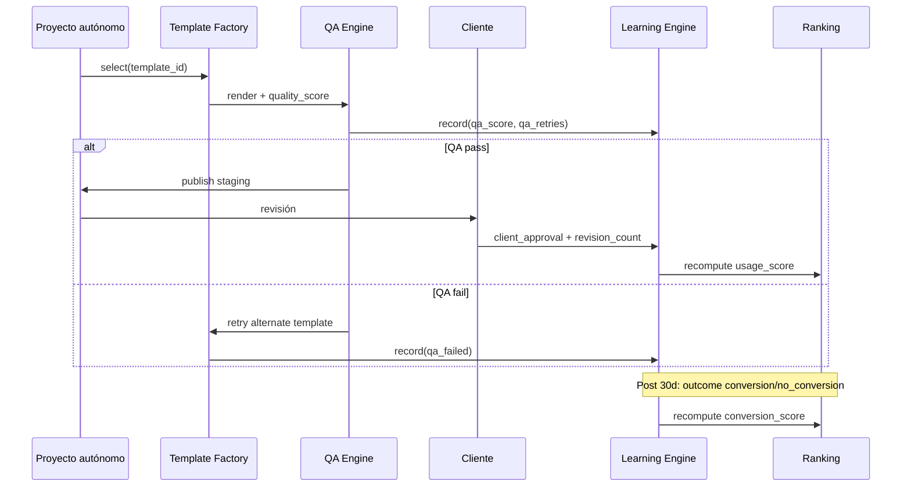

# NELVYON — Learning Engine Roadmap

**Fase:** AUTONOMOUS-PHASE-J  
**Versión:** 1.0  
**Fecha:** 2026-06-07  
**Estado:** Diseño ejecutable — **sin código, sin OS, sin SaaS, sin prod**  
**Extiende:** `LearningService` existente (`backend/os-agents/learning/`) → dominio **plantillas + servicios autónomos**

---

## 1. Objetivo

El **Learning Engine** cierra el ciclo: cada proyecto autónomo alimenta datos que **mejoran la selección de plantillas**, los prompts de agentes y el ranking factory. Hoy `LearningService` registra outcomes de agentes LLM; Phase J define el modelo ampliado para **template-centric learning**.

```
Proyecto autónomo
    │
    ├── template_id usada
    ├── QA score
    ├── revisiones cliente
    └── resultado final
            │
            ▼
    template_outcomes (nueva capa diseño)
            │
            ├── actualizar conversion_score / usage_score
            ├── ranking automático plantillas
            └── patrones → agent_learnings (existente)
```

---

## 2. Estado actual (auditoría)

| Componente | Ubicación | Capacidad hoy |
|------------|-----------|---------------|
| `LearningService` | `backend/os-agents/learning/LearningService.ts` | `recordOutcome`, `analyzePatternsForAgent`, `autoLearnCycle` |
| Tabla `agent_outcomes` | DB | user, agent, sector, input/output jsonb, quality_score, outcome_type |
| Tabla `agent_learnings` | DB | patterns, confidence, prompt_improvement |
| Umbral análisis | Código | ≥ 10 outcomes por agent+sector |
| Template tracking | — | ❌ No existe — Phase K |

**Gap Phase J:** No se persiste `template_id`, `service`, `client_approval`, ni `revision_count` en outcomes.

---

## 3. Modelo de datos — `template_outcome` (diseño)

Registro **uno por proyecto autónomo completado** (o por intento QA).

| Campo | Tipo | Obligatorio | Descripción |
|-------|------|-------------|-------------|
| `id` | uuid | Sí | PK |
| `project_ref` | string | Sí | ID job autonomous / OS project (referencia, no FK OS en J) |
| `template_id` | string | Sí | Plantilla usada (`landing-cro-v3`) |
| `template_version` | string | Sí | `factory_version` semver |
| `sector` | enum | Sí | `dental` … `saas_b2b` |
| `service` | enum | Sí | SKU: `landing`, `website`, `ecommerce`, `chatbot`, `google_ads`, `meta_ads`, `branding`, `funnel` |
| `objective` | enum | No | `lead_gen`, `booking`, … |
| `channel` | enum | No | `web`, `google_search`, … |
| `language` | enum | Sí | `es` default |
| `level` | enum | Sí | `starter` … `enterprise` |
| `qa_score` | int 0–100 | Sí | `quality_score` del paso QA |
| `qa_blocked` | bool | Sí | true si < 85 o BLOQUEANTE |
| `qa_retries` | int | Sí | Reintentos antes de aprobar |
| `client_approval` | enum | Sí | `pending` \| `approved` \| `approved_with_notes` \| `rejected` |
| `revision_count` | int | Sí | Rondas feedback cliente |
| `revision_reasons` | jsonb | No | Tags: `copy`, `design`, `legal`, `scope` |
| `outcome` | enum | Sí | Ver §4 |
| `outcome_value` | float | No | CR%, ROAS, NPS, etc. |
| `conversion_measured` | bool | Sí | false hasta GA4/pixel |
| `feedback_text` | text | No | Comentario cliente/operador |
| `agent_ids` | text[] | No | Agentes involucrados |
| `created_at` | timestamptz | Sí | |
| `closed_at` | timestamptz | No | Cierre proyecto |

---

## 4. Taxonomía `outcome`

| Valor | Definición | Impacto scores |
|-------|------------|----------------|
| `generated` | Artefacto creado, QA pendiente | Neutral |
| `qa_passed` | QA ≥ 85 | +quality signal |
| `qa_failed` | QA < 85 tras 3 retries | −usage, flag template |
| `published_internal` | Staging OS, no cliente | Neutral |
| `client_approved` | Aceptación formal | +usage, +conversion proxy |
| `client_rejected` | Rechazo cliente | −usage, analizar revision_reasons |
| `conversion` | CR/medida positiva | +conversion_score |
| `no_conversion` | Tráfico sin conversión 30d | −conversion_score |
| `escalated` | Operador manual | Neutral template, log patrón |

---

## 5. Eventos del ciclo de aprendizaje



### 5.1 Punto de captura por campo

| Campo | Cuándo se escribe |
|-------|-------------------|
| `template_id` | Factory select (inicio) |
| `qa_score` | Post `qaReport.json` |
| `qa_retries` | Cada retry loop |
| `client_approval` | Portal approve/reject o email |
| `revision_count` | Cada ronda `CLIENTE_REVISION` |
| `outcome` | Estado terminal proyecto |
| `outcome_value` | Métricas 30d post-live |

---

## 6. Ranking automático de plantillas

### 6.1 Scope de ranking

Ranking calculado **por slice**:

```
(category, sector, objective, channel, language, level)
```

Ejemplo: `landing × restaurant × lead_gen × web × es × professional`

### 6.2 Algoritmo `rank_templates(slice, limit=5)`

**Entrada:** outcomes últimos 180 días con `qa_score ≥ 70` o `client_approved`.

**Paso 1 — Métricas agregadas por `template_id`:**

| Métrica | Símbolo | Cálculo |
|---------|---------|---------|
| Usos | `n` | COUNT outcomes |
| QA media | `qa_avg` | AVG(qa_score) |
| Aprobación cliente | `appr_rate` | approved / (approved + rejected) |
| Revisiones media | `rev_avg` | AVG(revision_count) |
| Conversión | `conv_rate` | conversion / measured |
| Éxito primera pasada | `first_pass` | qa_passed sin retry / n |

**Paso 2 — Scores dinámicos (recalculados nightly):**

```
quality_score_live  = 0.6 × qa_avg + 0.4 × registry.quality_score
usage_score_live    = f(n, first_pass, appr_rate, rev_avg)  # § TEMPLATE_FACTORY §4.3
conversion_score_live = conv_rate × 100  (si measured) else registry.conversion_score
```

**Paso 3 — Rank score:**

```
RANK = 0.35 × quality_score_live
     + 0.35 × conversion_score_live
     + 0.30 × usage_score_live
     + BONUS_sector_match(0.05 si sector exacto)
     - PENALTY_rejection(0.10 × reject_rate si n ≥ 5)
```

**Paso 4 — Cold start (n < 3):**

- Usar `registry.factory_score` estático
- Penalizar −5 vs plantillas con n ≥ 5 (exploración vs explotación)
- Flag `exploration: true` en selector

**Paso 5 — Salida:**

```json
{
  "slice": { "category": "landing", "sector": "restaurant", "objective": "booking", "channel": "web", "language": "es", "level": "professional" },
  "ranked": [
    { "template_id": "landing-cro-v3", "rank_score": 82.4, "n": 12, "exploration": false },
    { "template_id": "landing-hero-split", "rank_score": 71.2, "n": 2, "exploration": true }
  ],
  "computed_at": "2026-06-07T03:00:00Z"
}
```

### 6.3 Reglas de negocio ranking

| Regla | Efecto |
|-------|--------|
| `qa_blocked` ≥ 3 en 30d | Template `suspended` 14 días |
| `client_rejected` ≥ 2 mismo sector | Bajar 15 pts rank en ese slice |
| `conversion` top 10% sector | Badge `performer` + boost +5 |
| Sin uso 180d | `deprecated` candidato |
| Sector regulado + rechazo legal | Bloqueo permanente slice |

---

## 7. Integración con `LearningService` existente

### 7.1 Dual write (diseño Phase K)

Cada evento template también alimenta agent learning cuando hay agente:

```typescript
// Pseudocódigo — no implementar en Phase J
await templateLearning.recordOutcome({ template_id, sector, service, qa_score, ... });
await learningService.recordOutcome(userId, agentId, sector, input, output, outcomeType);
```

### 7.2 Patrones cross-template

`analyzePatternsForTemplate(sector, service)` — análogo a `analyzePatternsForAgent`:

- Input: últimos 20 `template_outcomes` del slice
- LLM identifica: layouts que correlacionan con `client_approved` vs `qa_failed`
- Output: `template_learnings` (nueva tabla diseño) con `prompt_improvement` para copy pools

### 7.3 Ciclo automático

| Job | Frecuencia | Acción |
|-----|------------|--------|
| `recompute_template_scores` | Nightly 03:00 | Actualiza registry scores |
| `rank_all_slices` | Nightly 03:30 | Materializa `template_rankings` |
| `autoLearnCycle` | Existente 24h | Agent patterns (sin cambio) |
| `template_learn_cycle` | Weekly | LLM patterns por sector |

---

## 8. Tablas diseño (Phase K migration)

```sql
-- DISEÑO ONLY — no aplicar en Phase J

CREATE TABLE template_outcomes (
  id uuid PRIMARY KEY DEFAULT gen_random_uuid(),
  project_ref text NOT NULL,
  template_id text NOT NULL,
  template_version text NOT NULL,
  sector text NOT NULL,
  service text NOT NULL,
  objective text,
  channel text,
  language text NOT NULL DEFAULT 'es',
  level text NOT NULL,
  qa_score int,
  qa_blocked boolean DEFAULT false,
  qa_retries int DEFAULT 0,
  client_approval text DEFAULT 'pending',
  revision_count int DEFAULT 0,
  revision_reasons jsonb,
  outcome text NOT NULL,
  outcome_value numeric,
  conversion_measured boolean DEFAULT false,
  feedback_text text,
  agent_ids text[],
  created_at timestamptz DEFAULT now(),
  closed_at timestamptz
);

CREATE TABLE template_rankings (
  id uuid PRIMARY KEY DEFAULT gen_random_uuid(),
  slice_hash text NOT NULL,
  slice jsonb NOT NULL,
  ranked jsonb NOT NULL,
  computed_at timestamptz DEFAULT now()
);

CREATE INDEX idx_template_outcomes_slice
  ON template_outcomes (sector, service, template_id, created_at DESC);
```

---

## 9. API diseño (capa autonomous, no OS)

| Endpoint | Método | Uso |
|----------|--------|-----|
| `/autonomous/learning/outcome` | POST | Registrar outcome proyecto |
| `/autonomous/learning/rank` | GET | Query ranking por slice |
| `/autonomous/learning/template/{id}/stats` | GET | Métricas plantilla |
| `/autonomous/learning/cycle` | POST | Trigger manual recompute (ops) |

**Auth:** API key interna ops — no expuesto portal cliente.

---

## 10. Métricas dashboard ops (diseño)

| KPI | Fuente |
|-----|--------|
| Top 10 plantillas por `rank_score` | `template_rankings` |
| Plantillas suspended | outcomes `qa_blocked` |
| QA pass rate por sector | AVG primera pasada |
| Tiempo medio a `client_approved` | `closed_at - created_at` |
| Templates en exploración | n < 3 |

---

## 11. Plan ejecución

| Phase | Entregable |
|-------|------------|
| **J** | Este roadmap + JSON schemas + algoritmo ranking |
| **K** | Migración `template_outcomes` + seed piloto restaurant |
| **L** | Wire QA Phase H/I → `recordOutcome` |
| **M** | Nightly cron + selector factory usa `rank` |
| **N** | Client approval webhook → `usage_score` live |

### Checklist Phase J (solo diseño)

- [ ] Validar enums sector/service con `TEMPLATE_FACTORY_ROADMAP.md`
- [ ] Definir mapping `client_approval` ← estados OS portal (referencia, no integrar)
- [ ] Simular ranking manual con 5 filas Excel piloto
- [ ] Documentar cold-start policy con ops

---

## 12. Privacidad y alcance

- No almacenar PII cliente en `template_outcomes` — solo `project_ref` opaco
- Métricas agregadas cross-tenant solo para ranking global interno NELVYON
- Sin sync SaaS billing ni CRM

---

## 13. Referencias

- `backend/os-agents/learning/LearningService.ts`
- `backend/os-agents/learning/types.ts`
- `docs/autonomous/TEMPLATE_FACTORY_ROADMAP.md`
- `docs/autonomous/TEMPLATE_LIBRARY_MASTER.md`
- `docs/services/SERVICES_QA_MASTER.md` — estados revisión cliente
- `docs/autonomous/AUTONOMOUS_QA_RUBRICS.md`
