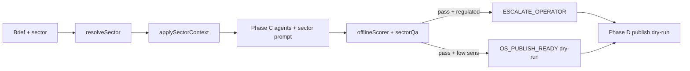

# NELVYON Autonomous — Phase E: Sector Agents Master

**Versión:** 1.0  
**Fecha:** 2026-06-07  
**Estado:** Implementado — documentación + capa `backend/autonomous/sectors/`  
**Commit de referencia:** post Phase D

---

## 1. Objetivo

Especializar el pipeline autónomo (Phases B–D) por **vertical de negocio** para maximizar autonomía sin tocar SaaS/OS core, portal ni producción real.

Cada sector aporta:
- Contexto de copy, SEO, ads, chatbot y automatizaciones
- QA sectorial adicional (umbral global **≥ 85** se mantiene)
- Escalado `ESCALATE_OPERATOR` en sectores regulados/sensibles
- **Dry-run por defecto** — sin publicación automática al cliente

---

## 2. Sectores prioritarios (10)

| # | Sector ID | Agente | Doc | Scoring 0–100 | Sensibilidad | Regulado |
|---|-----------|--------|-----|---------------|--------------|----------|
| 1 | `dental` | DENTAL_AGENT | [DENTAL_AGENT.md](./sectors/DENTAL_AGENT.md) | **82** | Alta | Sí |
| 2 | `legal` | LEGAL_AGENT | [LEGAL_AGENT.md](./sectors/LEGAL_AGENT.md) | **75** | Alta | Sí |
| 3 | `fitness` | FITNESS_AGENT | [FITNESS_AGENT.md](./sectors/FITNESS_AGENT.md) | **88** | Media | No |
| 4 | `beauty` | BEAUTY_AGENT | [BEAUTY_AGENT.md](./sectors/BEAUTY_AGENT.md) | **78** | Alta | Sí |
| 5 | `restaurant` | RESTAURANT_AGENT | [RESTAURANT_AGENT.md](./sectors/RESTAURANT_AGENT.md) | **90** | Baja | No |
| 6 | `real_estate` | REAL_ESTATE_AGENT | [REAL_ESTATE_AGENT.md](./sectors/REAL_ESTATE_AGENT.md) | **85** | Media | No |
| 7 | `ecommerce` | ECOMMERCE_AGENT | [ECOMMERCE_AGENT.md](./sectors/ECOMMERCE_AGENT.md) | **86** | Media | No |
| 8 | `solar` | SOLAR_AGENT | [SOLAR_AGENT.md](./sectors/SOLAR_AGENT.md) | **87** | Media | Parcial |
| 9 | `coaching` | COACHING_AGENT | [COACHING_AGENT.md](./sectors/COACHING_AGENT.md) | **89** | Baja | No |
| 10 | `saas_b2b` | SAAS_B2B_AGENT | [SAAS_B2B_AGENT.md](./sectors/SAAS_B2B_AGENT.md) | **91** | Baja | No |

**Scoring sectorial:** potencial de autonomía del pipeline (brief → QA → staging) para ese vertical, no calidad del negocio del cliente.

---

## 3. Integración técnica Phase C / D

### 3.1 Entrada sector

```typescript
// Brief field (auto-resolve)
{ "sector": "dental", ... }

// Explicit Phase C option
simulatePhaseC({ sku, brief, sector: "dental" });

// CLI
pnpm -C apps/web autonomous:phase-c chatbot --sector dental
```

### 3.2 Flujo



### 3.3 Archivos código

| Archivo | Rol |
|---------|-----|
| `backend/autonomous/sectors/types.ts` | Tipos sector |
| `backend/autonomous/sectors/sectorRegistry.ts` | Perfiles 10 sectores |
| `backend/autonomous/sectors/resolveSector.ts` | Resolución + aliases |
| `backend/autonomous/sectors/applySectorContext.ts` | Enriquece brief + artifacts |
| `backend/autonomous/sectors/sectorQa.ts` | QA sectorial + escalado |
| `backend/autonomous/types.ts` | `sector` en project + OsPublishPayload |
| `backend/autonomous/qa/offlineScorer.ts` | Merge sector QA |
| `backend/autonomous/simulatorPhaseC.ts` | Escalado regulado |
| `backend/autonomous/publish/osPublishPayload.ts` | Metadata sector |
| `POST /api/v1/os/autonomous/publish` | Campo opcional `sector` en metadata |

### 3.4 Reglas de seguridad (heredadas + Phase E)

| Regla | Comportamiento |
|-------|----------------|
| QA global | ≥ 85 obligatorio |
| Sectores regulados (`dental`, `legal`, `beauty`, `solar`) | `ESCALATE_OPERATOR` tras QA pass — revisión humana/legal |
| `dry_run` | Default `true` en OsPublishPayload |
| Portal / client_visible | Nunca automático |
| Promesa 100% | Prohibida en sectores regulados |

---

## 4. Uso por SKU

| SKU | Sector más natural | Ejemplo |
|-----|-------------------|---------|
| NELVYON-LANDING | restaurant, saas_b2b, solar | `--sector restaurant` |
| NELVYON-CHATBOT | dental, legal, ecommerce | `--sector dental` |
| NELVYON-SEO | real_estate, ecommerce, coaching | `--sector ecommerce` |

---

## 5. Autonomía actualizada

| Fase | Contribución |
|------|--------------|
| A | +10% |
| B | +25% |
| C | +37% |
| D | +8% |
| **E (sectores)** | **+5%** |

**Autonomía pipeline estimada: ~85%** (3 SKUs × 10 sectores en contexto; wrappers aún mock).

### Gap para 90–95%

| % | Qué falta |
|---|-----------|
| **90%** | Wrappers prod 1 SKU (Landing) + Playwright QA + 3 pilotos sector reales |
| **95%** | Portal handoff post-revisión + GSC/PSI SEO + chatbot live wrapper |
| **100%** | 11 SKUs + legal review workflow + métricas §9 autonomous plan |

---

## 6. Tests

```bash
pnpm -C apps/web exec vitest run ../../backend/autonomous/__tests__/sectorPhaseE.test.ts
cd backend && python -m pytest tests/test_os_autonomous_publish.py -q
```

---

## 7. Referencias

- `docs/autonomous/AUTONOMOUS_PHASE_D_OS_PUBLISH.md`
- `docs/autonomous/AUTONOMOUS_PHASE_C_LLM_QA.md`
- `docs/NELVYON_FINAL_STATE_AUDIT.md`
- `docs/autonomous/sectors/*.md`
