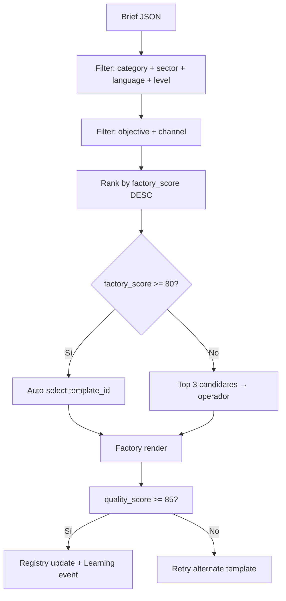

# NELVYON — Template Factory Roadmap

**Fase:** AUTONOMOUS-PHASE-J  
**Versión:** 1.0  
**Fecha:** 2026-06-07  
**Estado:** Diseño ejecutable — **sin código, sin OS, sin SaaS, sin prod**  
**Precede:** `TEMPLATE_LIBRARY_MASTER.md` (catálogo) → **Factory** (producción + scoring + selección)

---

## 1. Objetivo

La **Template Factory** es el sistema que **fabrica, versiona, clasifica y puntúa** plantillas reutilizables para servicios autónomos. No es la biblioteca estática: es el pipeline operativo que convierte brief + sector en plantilla parametrizada lista para QA y publicación.

```
Brief JSON ──► Factory Router ──► Renderer ──► QA Gate ──► Registry
                     │                              │
                     └── Learning Engine ◄──────────┘ (scores)
```

**Regla de oro:** Toda entrega autónoma referencia `template_id` + `factory_version` registrados antes de staging.

---

## 2. Categorías de producción

| Categoría | ID | Factory output | Renderer target |
|-----------|-----|----------------|-----------------|
| Landing templates | `landing` | HTML blocks + copy slots | `landingBuilderStaging.ts` schema |
| Website templates | `website` | Multi-page shell + nav map | `web-premium` / zip export |
| Ecommerce templates | `ecommerce` | PLP + PDP + cart shell | `ecommerce-premium` |
| Chatbot templates | `chatbot` | Flow JSON + intents | `flow_template_id` contract |
| Ads templates | `ads` | Google + Meta packs unificados | `ads-premium` + agent prompts |
| Branding kits | `branding` | Tokens + brand book + social | `branding-premium` |

**Nota ads:** Google y Meta comparten categoría `ads` en factory; subtipo `ads.google` / `ads.meta` en metadata.

---

## 3. Clasificación multidimensional

Cada plantilla en registry lleva **5 ejes** obligatorios para selección automática.

### 3.1 Sector (`sector`)

| ID | Prioridad factory S1 |
|----|----------------------|
| `dental` | P0 |
| `legal` | P0 |
| `restaurant` | P0 (piloto Phase H) |
| `ecommerce` | P0 |
| `fitness` | P1 |
| `beauty` | P1 |
| `real_estate` | P1 |
| `solar` | P1 |
| `coaching` | P1 |
| `saas_b2b` | P1 |
| `general` | Transversal fallback |

### 3.2 Objetivo (`objective`)

| ID | Descripción | Categorías típicas |
|----|-------------|------------------|
| `lead_gen` | Captación formulario / llamada | landing, ads |
| `booking` | Reserva cita / mesa | landing, chatbot, restaurant |
| `sales` | Venta directa / checkout | ecommerce, funnel |
| `awareness` | Marca / tráfico frío | ads, branding |
| `retention` | Remarketing / nurture | ads, chatbot |
| `trust` | Credibilidad sector regulado | legal, dental, web |
| `trial` | Demo / prueba SaaS | landing, saas_b2b |

### 3.3 Canal (`channel`)

| ID | Plataforma / superficie |
|----|-------------------------|
| `web` | Sitio propio / staging CDN |
| `google_search` | Google Ads Search / PMAX |
| `google_display` | Demand Gen / Display |
| `meta_feed` | FB/IG feed 1:1 |
| `meta_stories` | Stories/Reels 9:16 |
| `whatsapp` | CTA → WhatsApp |
| `email` | Landing desde email |
| `chat_widget` | Embed web chatbot |
| `organic_social` | Branding kit social |

### 3.4 Idioma (`language`)

| ID | Locale | Default |
|----|--------|---------|
| `es` | Español (España) | ✅ |
| `es_latam` | Español LATAM | Variante copy pool |
| `en` | English | Tier Premium |
| `ca` | Catalán | Opcional sector local |
| `eu` | Euskera | Opcional |

**Regla:** `language` afecta copy pools y meta legal; layout idéntico entre `es` / `es_latam`.

### 3.5 Nivel (`level`)

| ID | Tier NELVYON | Scope factory |
|----|--------------|---------------|
| `starter` | Standard | 1 layout · 1 CTA · sin variantes A/B |
| `professional` | Pro | 2 variantes · tracking completo |
| `premium` | Premium | Multi-step · funnel · ads pack |
| `enterprise` | Custom | Overrides manuales + white-label |

---

## 4. Sistema de scoring (3 dimensiones)

Cada plantilla acumula scores **0–100** por dimensión. El **Factory Score compuesto** alimenta el Learning Engine ranking.

### 4.1 `conversion_score` (0–100)

Mide potencial y rendimiento real de conversión post-publicación.

| Señal | Peso | Fuente |
|-------|------|--------|
| CR staging (form submit Playwright) | 25% | Phase H PW-CTA-01 |
| CR cliente 30d (si disponible) | 30% | GA4 / pixel |
| CTA clarity (LLM rubric) | 15% | QA content |
| Funnel step completion | 15% | Funnel Agent |
| Ads LP relevance (QS proxy) | 15% | Google Ads Agent doc |

**Fórmula inicial (sin datos cliente):**

```
conversion_score = 0.4 × qa_conversion_rubric + 0.35 × playwright_pass_rate + 0.25 × sector_benchmark
```

**Con datos cliente (≥ 30 sesiones):**

```
conversion_score = 0.5 × normalized_cr + 0.2 × qa_conversion_rubric + 0.15 × playwright + 0.15 × revision_penalty
```

| Umbral | Estado |
|--------|--------|
| ≥ 75 | `CONVERSION_STRONG` — prioridad selector |
| 50–74 | `CONVERSION_OK` |
| < 50 | `CONVERSION_WEAK` — no auto-select |

### 4.2 `quality_score` (0–100)

Alineado con `AUTONOMOUS_QA_RUBRICS.md` — calidad técnica y SOP.

| Dimensión | Peso landing | Peso ads | Peso branding |
|-----------|--------------|----------|---------------|
| SOP compliance | 25% | 25% | 25% |
| Técnico (Lighthouse, a11y) | 25% | 20% | 15% |
| Contenido | 20% | 25% | 30% |
| Legal / disclaimers | 15% | 10% | 15% |
| SEO / tracking | 15% | 20% | 15% |

**Bloqueo:** ítem BLOQUEANTE → `quality_score = min(calculated, 84)`.

**Gate factory:** `quality_score ≥ 85` para salir de factory a registry `status: active`.

### 4.3 `usage_score` (0–100)

Mide adopción, estabilidad y satisfacción operativa.

| Señal | Peso | Cálculo |
|-------|------|---------|
| Veces seleccionada (90d) | 20% | `log(1 + uses) / log(1 + max_uses)` × 100 |
| Tasa éxito primera pasada QA | 25% | `1 - (retries / uses)` |
| Aprobación cliente | 30% | % `client_approved` sin revisión |
| Revisiones promedio | 15% | `max(0, 100 - revisions × 20)` |
| Antigüedad sin incidente | 10% | Decay si > 6 meses sin uso |

**Fórmula:**

```
usage_score = Σ (peso_i × señal_normalizada_i)
```

Plantilla nueva (< 3 usos): `usage_score = 50` (neutral) hasta cold-start mínimo.

### 4.4 Score compuesto factory

```
FACTORY_SCORE = 0.40 × quality_score + 0.35 × conversion_score + 0.25 × usage_score
```

| FACTORY_SCORE | Acción selector |
|---------------|-----------------|
| ≥ 80 | **Auto-select** top-1 por sector+objetivo+canal |
| 65–79 | Candidata — operador confirma |
| < 65 | Solo manual / retirada `deprecated` |

---

## 5. Pipeline factory por categoría

### 5.1 Landing

```
Input:  brief.landing + sector + objective + channel + language + level
Steps:  1) Match layouts registry
        2) Inject copy pools sectoriales
        3) Apply design tokens marca
        4) Render blocks (Phase H wrapper)
        5) Playwright QA offline
        6) Compute quality_score + conversion_score proxy
Output: template_id, preview.html, blocks.json, scores.json
```

### 5.2 Website

```
Input:  brief.web + pages[] + sector + level
Steps:  1) Select shell (proactiv | sector fork)
        2) Map routes + copy per section
        3) RGPD banner if forms
        4) Lighthouse pass
Output: zip bundle + sitemap + scores
```

### 5.3 Ecommerce

```
Input:  brief.ecom + catalog_size + sector
Steps:  1) PLP/PDP template apply
        2) Policy pages boilerplate
        3) Stripe placeholder (no prod keys)
Output: store shell + scores
```

### 5.4 Chatbot

```
Input:  brief.chatbot + intents[] + sector + language
Steps:  1) Select flow_template_id
        2) Merge FAQ pool sector
        3) Legal disclaimers if regulated
        4) Gold-set probe (50 preguntas)
Output: flow.json + scores
```

### 5.5 Ads (Google + Meta)

```
Input:  brief.ads + platforms[] + budget + landing_url
Steps:  1) Select ads template pack (sector × format)
        2) RSA / creative brief generation
        3) Tracking checklist embed
        4) NO launch (doc only Phase J)
Output: google_plan.json + meta_plan.json + creative_brief.json + scores
```

### 5.6 Branding kits

```
Input:  brief.brand + sector + level
Steps:  1) Seed kit (comprado | generativo)
        2) Palette + typography lock
        3) Brand book HTML → PDF
        4) 9 social templates export
Output: tokens.json + brand_book.pdf + scores
```

---

## 6. Registry schema (objetivo Phase K)

```json
{
  "id": "landing-cro-v3",
  "category": "landing",
  "factory_version": "1.0.0",
  "classification": {
    "sector": ["restaurant", "general"],
    "objective": ["lead_gen", "booking"],
    "channel": ["web", "google_search", "meta_feed"],
    "language": ["es"],
    "level": ["starter", "professional"]
  },
  "scores": {
    "quality_score": 88,
    "conversion_score": 72,
    "usage_score": 45,
    "factory_score": 73.55,
    "last_computed_at": "2026-06-07T12:00:00Z"
  },
  "status": "active",
  "origin": "creada",
  "path": "templates/landing/landing-cro-v3/"
}
```

---

## 7. Selector automático (diseño)



**Prioridad desempate:** `conversion_score` > `quality_score` > `usage_score` > `created_at` DESC.

---

## 8. Plan de ejecución Phase J → K

| Phase | Entregable | Código |
|-------|------------|--------|
| **J** (actual) | Este roadmap + schemas + scoring | ❌ Ninguno |
| **K** | `templates/registry.json` + `scores.json` seed | Capa `backend/autonomous/factory/` |
| **L** | Selector wired en orquestador autonomous | Wrappers only |
| **M** | Learning Engine ranking live | Ver `LEARNING_ENGINE_ROADMAP.md` |

### Semana J (solo ops + diseño)

- [ ] Validar taxonomía 5 ejes con 3 briefs reales (restaurant, dental, solar)
- [ ] Definir pools copy por sector (sheet Notion)
- [ ] Seed `landing-cro-v3` scores manuales piloto
- [ ] Alinear QA rubrics → `quality_score` weights

---

## 9. Volumen objetivo factory (fase 1)

| Categoría | Templates activos S1 | S2 target |
|-----------|---------------------|-----------|
| Landing | 6 | 24 |
| Website | 4 | 8 |
| Ecommerce | 2 | 4 |
| Chatbot | 5 | 10 |
| Ads | 10 packs | 20 |
| Branding | 4 | 8 |

---

## 10. Fuera de alcance Phase J

| Item | Motivo |
|------|--------|
| Deploy Railway / Supabase prod | Congelado |
| Rutas `/os/*` nuevas | Congelado OS |
| SaaS template marketplace | Congelado SaaS |
| Launch campañas ads reales | Phase M+ con OAuth |

---

## 11. Referencias

- `docs/autonomous/TEMPLATE_LIBRARY_MASTER.md` — catálogo maestro
- `docs/autonomous/LEARNING_ENGINE_ROADMAP.md` — ranking y feedback loop
- `docs/autonomous/AUTONOMOUS_QA_RUBRICS.md` — quality_score source
- `docs/autonomous/AUTONOMOUS_JSON_CONTRACTS.md` — `template_id` en artefactos
- `docs/autonomous/AUTONOMOUS_PHASE_H_LANDING_PREVIEW_STAGING.md` — renderer landing
