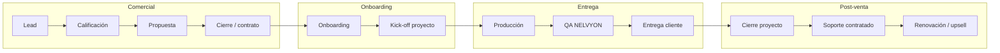

# NELVYON Operations Manual — Capa operativa de agencia

**Versión:** 1.0  
**Alcance:** Servicios marketing digital NELVYON (agencia)  
**Fuera de alcance:** Desarrollo OS, SaaS, portal, backend, frontend  
**Referencias:** `docs/services/*`, `docs/operations/*`

---

## 1. Propósito

Este manual define **cómo opera NELVYON como agencia premium**: desde el primer contacto comercial hasta la renovación del cliente, con roles claros, handoffs, QA y métricas.

**Principio rector:** Un solo hilo operativo por cliente — comercial → onboarding → entrega → cierre → renovación — sin perder trazabilidad ni calidad.

---

## 2. Flujo completo cliente (lead → renovación)

| Fase | Documento SOP | Owner principal |
|------|---------------|-----------------|
| Lead → contrato | `SALES_SOP.md` | Sales / BD |
| Contrato → kick-off | `CLIENT_ONBOARDING_SOP.md` | Account Manager |
| Relación día a día | `ACCOUNT_MANAGER_SOP.md` | Account Manager |
| Ejecución servicio | `PROJECT_DELIVERY_SOP.md` + SOP servicio | AM + Freelancer + QA |
| Cierre formal | `PROJECT_CLOSURE_SOP.md` | Account Manager |
| Renovación | `CLIENT_RENEWAL_SOP.md` | Sales + Account |

---

## 3. Roles y responsables

| Rol | Responsabilidad | Reporta a |
|-----|-----------------|-----------|
| **Business Development / Sales** | Pipeline, propuesta, cierre, renovación comercial | Dirección |
| **Account Manager (AM)** | Relación cliente, scope, handoffs, aceptaciones | Ops Lead |
| **Project Coordinator** | Tareas OS/Drive, cronograma, freelancers (puede ser mismo AM) | Ops Lead |
| **QA Lead** | Gate G3, liberación entrega | Ops Lead |
| **Freelancer / Partner** | Producción según SOP servicio | AM |
| **Ops Lead** | Métricas agencia, escalaciones, pool talento | Dirección |
| **Cliente — decisor** | Aprobaciones, brief, aceptación final | — |
| **Cliente — operativo** | Accesos, contenidos, feedback día a día | — |

### Matriz RACI simplificada (fases)

| Actividad | Sales | AM | QA | Freelancer | Cliente |
|-----------|-------|----|----|------------|---------|
| Calificar lead | R | C | — | — | I |
| Propuesta | R | C | — | — | I |
| Contrato | R | A | — | — | A |
| Onboarding | C | R | — | — | A |
| Kick-off | I | R | — | C | A |
| Producción | — | A | I | R | C |
| QA interno | — | I | R | C | — |
| Entrega cliente | I | R | C | I | A |
| Cierre | C | R | I | I | A |
| Renovación | R | C | — | — | A |

*R = Responsible · A = Accountable · C = Consulted · I = Informed*

---

## 4. Checkpoints QA (gates agencia)

Integración con `docs/services/SERVICES_QA_MASTER.md`:

| Gate | Momento | Owner | Bloquea |
|------|---------|-------|---------|
| **G0** | Brief completo pre kick-off | AM | Producción |
| **G1** | Cliente/proyecto OS + carpeta Drive | AM | Freelancer start |
| **G2** | Checklist SOP freelancer sin 🔴 | Freelancer | QA interno |
| **G3** | Informe QA NELVYON APROBADO | QA Lead | Entrega cliente |
| **G4** | Pack entregables + handoff | AM | Facturación final hito |
| **G5** | Aceptación cliente + cierre admin | AM | Archivo proyecto |

**Checkpoint comercial (pre-G0):** propuesta alineada con tier (`NELVYON_SERVICE_TIERS.md`) y SOP servicio — validado por AM antes de firmar.

---

## 5. Handoffs entre equipos

### H1 — Sales → Account (post-firma)

| Entregable handoff | Contenido |
|--------------------|-----------|
| Contrato / SOW firmado | Scope, tier, precio, plazos, revisiones |
| Contactos | Decisor + operativo + facturación |
| Propuesta ganadora | PDF + notas discovery |
| Riesgos comerciales | Expectativas especiales documentadas |

**SLA:** onboarding iniciado en **48h laborables** tras firma.

### H2 — Account → Freelancer (kick-off)

| Entregable handoff | Contenido |
|--------------------|-----------|
| Brief SOP servicio | Completado y firmado |
| Carpeta proyecto | Estructura `00-admin` … `06-comms` |
| Accesos | Checklist matriz accesos SERVICES_QA |
| Cronograma | Fechas hitos + rondas revisión |

**SLA:** freelancer confirma lectura SOP en **24h**.

### H3 — Freelancer → QA (pre-entrega)

| Entregable handoff | Contenido |
|--------------------|-----------|
| Checklist SOP firmado | 100% ítems aplicables |
| Evidencias | Loom, URLs, archivos en OS/Drive |
| Notas desviaciones | Cambios vs brief |

**SLA:** QA responde en **2–5 D** según tier.

### H4 — QA → Account (liberación)

| Entregable handoff | Contenido |
|--------------------|-----------|
| Informe QA G3 | APROBADO / CON OBS / RECHAZADO |
| Lista observaciones | 🟠🟡 pendientes cliente si aplica |

### H5 — Account → Cliente (entrega)

| Entregable handoff | Contenido |
|--------------------|-----------|
| Email handoff | URLs, credenciales vault, próximos pasos |
| Entregables OS | `client_visible` + portal si aplica |
| Manual / formación | Según SOP servicio |

### H6 — Account → Sales (pre-renovación)

| Entregable handoff | Contenido |
|--------------------|-----------|
| Informe salud cuenta | NPS, proyectos, incidencias |
| Oportunidades upsell | Servicios no contratados |
| Fecha fin contrato / soporte | Calendario renovación |

---

## 6. Riesgos frecuentes (agencia)

| Riesgo | Fase | Mitigación |
|--------|------|------------|
| Scope creep sin change order | Entrega | AM + SOW; plantilla CR |
| Expectativa “producto NELVYON” vs servicio humano | Venta | Propuesta lenguaje claro |
| Brief incompleto | Onboarding | G0 bloquea kick-off |
| Freelancer no disponible | Entrega | Pool backup; scorecard |
| Cliente no responde revisiones | Entrega | SLA pausa; recordatorios D3/D5 |
| QA bypass presión comercial | QA | Ops Lead único puede waiver 🔴 |
| Facturación sin aceptación | Cierre | G5 antes factura final |
| Churn silencioso | Renovación | AM health check 60d antes fin |
| Datos cliente en email sin cifrar | Transversal | Vault 1Password; política ops |
| Confundir OS producto con entrega agencia | Transversal | Entregables Drive + OS entregables |

---

## 7. Métricas clave (KPIs agencia)

### Comercial

| KPI | Meta inicial | Frecuencia |
|-----|--------------|------------|
| Lead → propuesta enviada | < 5 D laborables | Semanal |
| Propuesta → cierre | ≥ 25% | Mensual |
| Ticket medio Professional+ | Creciente QoQ | Trimestral |
| Ciclo venta (lead → firma) | < 21 D | Mensual |

### Entrega

| KPI | Meta | Frecuencia |
|-----|------|------------|
| Proyectos entregados en plazo | ≥ 80% | Mensual |
| QA primera pasada APROBADO | ≥ 70% | Mensual |
| Retrabajo post-entrega (< 30d) | < 10% proyectos | Mensual |
| NPS post-proyecto | ≥ 8/10 | Por proyecto |

### Cliente

| KPI | Meta | Frecuencia |
|-----|------|------------|
| Tiempo onboarding (firma → kick-off) | ≤ 5 D | Por cliente |
| Renovación / repeat purchase 12m | ≥ 30% | Anual |
| Churn por insatisfacción calidad | < 5% | Anual |

### Talento

| KPI | Meta | Frecuencia |
|-----|------|------------|
| Scorecard freelancer medio | ≥ 80 | Trimestral |
| Proyectos por Partner certificado | ≥ 60% | Trimestral |

---

## 8. Herramientas operativas (sin código)

| Área | Herramienta |
|------|-------------|
| CRM / pipeline | Notion, HubSpot, Pipedrive (elección agencia) |
| Proyectos | NELVYON OS (lectura/entregables) + Drive |
| Comunicación cliente | Email, Loom, calls grabadas (premium) |
| Contratos | DocuSign / PDF firmado |
| Credenciales | 1Password / vault |
| QA | `SERVICES_QA_MASTER.md` + informes plantilla |
| Freelancers | `FREELANCER_SCORECARD.md` |
| Catálogo | `NELVYON_SERVICE_TIERS.md` + SOPs |

---

## 9. Índice documentos operations

| Documento | Uso |
|-----------|-----|
| `SALES_SOP.md` | Lead a contrato |
| `CLIENT_ONBOARDING_SOP.md` | Firma a kick-off |
| `ACCOUNT_MANAGER_SOP.md` | Relación y coordinación |
| `PROJECT_DELIVERY_SOP.md` | Kick-off a entrega |
| `PROJECT_CLOSURE_SOP.md` | Aceptación a archivo |
| `CLIENT_RENEWAL_SOP.md` | Retención y expansión |

---

## 10. Ciclo de vida estados (vista unificada)

| Estado agencia | Estados proyecto SERVICES | Owner |
|----------------|---------------------------|-------|
| `LEAD` | — | Sales |
| `QUALIFIED` | — | Sales |
| `PROPOSAL` | — | Sales |
| `WON` | INTAKE | Sales → AM |
| `ONBOARDING` | INTAKE → KICKOFF | AM |
| `ACTIVE` | PRODUCCIÓN / QA / CLIENTE_REVISION | AM |
| `DELIVERED` | ENTREGADO | AM |
| `CLOSED` | CERRADO | AM |
| `RENEWAL` | Nuevo ciclo o churn | Sales + AM |

---

## 11. Escalación

| Nivel | Trigger | Escalado a |
|-------|---------|------------|
| L1 | Retraso < 5 D, observación QA | AM resuelve |
| L2 | Bloqueante QA, cliente escalado, desviación > 15% scope | Ops Lead |
| L3 | Riesgo legal, churn C-level, pérdida reputacional | Dirección |

---

*Operations Manual v1.0 — NELVYON Agency Layer*
