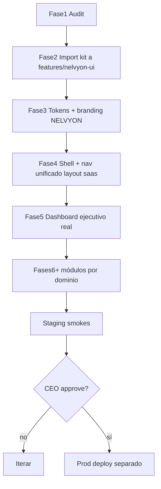

# DashForge AI → NELVYON SaaS — Plan de migración (Fase 1)

> **Estado:** AUDITORÍA COMPLETA · sin cambios de UI de producto · `claimReady: false` · sin canary · sin deploy prod  
> **Fecha:** 2026-07-30  
> **Origen legal:** Envato / Codervent — ZIP `dashforge-ai-ai-dashboard-builder-for-next-js-2026-06-18-19-36-13-utc.zip`  
> **Extract local (fuera de build):** `.reference/dashforge-ai/` (**gitignored**)

---

## 0. Hallazgo crítico (expectativa vs realidad)

**DashForge AI NO es una plantilla admin multi-módulo con CRM/Marketing/IA preconstruidos.**

Es un **AI Dashboard Builder** (Codervent) que:

| Ofrece | No ofrece |
|--------|-----------|
| Shell: sidebar / header / content / footer | Páginas CRM, campañas, inbox, workflows, etc. |
| Widgets: KPI, stat, line/bar/pie, table, activity | Tablas avanzadas tipo TanStack Table / AG Grid |
| ShadCN UI (new-york): button, card, input, sheet, tooltip… | Formularios RHF, data-grid enterprise |
| Presets SaaS/CRM/ecommerce con **datos inventados** | Multi-tenancy, RBAC, APIs reales |
| Theme light/dark + customizer | Auth propia (usa **Clerk** — descartar) |
| Generación IA + export ZIP + **Supabase** usage | Integración con Postgres/JWT Nelvyon |

**Consecuencia:** la migración **no** es “sustituir pantallas Nelvyon por pantallas DashForge”.  
Es **adoptar el kit visual + patrones de layout/widgets** de DashForge como base del design system SaaS de NELVYON, y **reconstruir cada módulo real** sobre ese kit, conservando 100 % APIs / auth / tenant.

Principio inquebrantable: **conflicto → gana NELVYON**.

---

## 1. Auditoría de la plantilla

| Dimensión | Valor en DashForge | Compatibilidad NELVYON |
|-----------|--------------------|-------------------------|
| Next.js | **16.1.1** | Nelvyon **15.5.x** — **no subir a 16** en esta migración |
| Router | App Router | Compatible |
| React | 19.1 | Compatible (Nelvyon 19.2) |
| Estilos | Tailwind **3.4** + tokens HSL shadcn + `@tailwindcss/postcss` 4 en deps | Nelvyon Tailwind **v4** — migrar **tokens/CSS vars**, no el `tailwind.config` entero |
| Charts | **recharts 3.2** | Nelvyon **recharts 2.15** — adaptar widgets a v2 o pin v2 |
| Auth demo | **Clerk** | **Prohibido** — conservar `nelvyon_token` + `requireSaasContext` |
| Data demo | Supabase + `fake-data.ts` + presets | **Prohibido** en runtime producto |
| State | Zustand (theme) | Opcional; Nelvyon ya tiene providers |
| Icons | lucide-react | Ya en Nelvyon |
| Licencia README | MIT (autor Codervent) | Documentar origen; strip branding |

### Inventario reutilizable (whitelist)

```
components/layout/{sidebar,header,content,footer,page-header}.tsx
components/ui/{button,card,input,textarea,sheet,tooltip,dropdown-menu,progress,separator,alert-dialog}.tsx
components/widgets/{kpi-card,stat-card,progress-stat-card,line-chart,bar-chart,pie-chart,table-widget,activity-widget}.tsx
components/{theme-toggle,search-bar}.tsx   # sin ThemeCustomizer Codervent branding
app/globals.css                             # solo tokens → remap a #0084ff / #020817
lib/utils.ts                                # cn() — ya existe equivalente
```

### Inventario a NO importar (blacklist)

```
@clerk/nextjs, lib/supabase/**, lib/ai/**, openai
lib/dashboard/fake-data.ts, randomize-preset.ts, code-generator.ts, zip-export.ts
prompt-form.tsx, layout-renderer.tsx (builder), widget-renderer.tsx (demo schema)
app/sign-in, sign-up, limit-reached
middleware.ts (Clerk)
presets/** con valores hardcodeados (sí: tipografía de widgets; no: números)
Cualquier string DashForge / Codervent / Envato / Geist marketing metadata
```

---

## 2. Auditoría NELVYON SaaS (resumen)

| Métrica | Valor |
|---------|-------|
| Rutas `page.tsx` `/saas/*` | **~97** |
| Nav canónica `SAAS_NAV_ITEMS` | **71** en **6** grupos |
| APIs `api/saas/**/route.ts` | **~237** |
| Shell actual | `SaasShellLayout` + `SaasSidebar` dark `#020817` / accent `#0084ff` |
| Auth | cookie `nelvyon_token` · middleware · `requireSaasContext` + RBAC |
| Charts hoy | `recharts` 2 (uso escaso) |
| Tablas | hand-rolled (sin TanStack Table) |
| Editores isla | TipTap (email/web-builder) · XYFlow (workflows) — **no reescribir** |

Detalle de rutas/grupos: ver `saasNav.ts` y exploración Fase 1.

---

## 3. Estrategia segura (reversible)



### Reglas de integración

1. Carpeta destino producto: `apps/web/src/features/nelvyon-ui/` (nombre **sin** DashForge).
2. Alias imports internos `@/features/nelvyon-ui/...` — cero `@/components` de la plantilla en rutas productivas.
3. Introducir **un** layout App Router `apps/web/src/app/saas/(app)/layout.tsx` con el nuevo shell; migrar páginas gradualmente (flag o dual-path temporal **solo** durante transición, luego borrar shell viejo).
4. Cada módulo: mismos `fetch('/api/saas/...')`, mismos `activeId`, mismos permisos.
5. Empty states reales; **cero** `fake-data` / números inventados.
6. Commits por fase (lista §8). Sin deploy prod sin autorización CEO.
7. `.reference/dashforge-ai/` nunca entra en Docker/Railway build (gitignore + exclude).

### Dual-path temporal (si hace falta)

- Query o cookie `nelvyon_ui=legacy|v2` **solo staging/dev**, default legacy hasta dashboard+CRM PASS.
- Eliminar legacy shell cuando ≥80 % rutas nav usen v2.

---

## 4. Mapa módulo → plantilla → APIs → riesgos

| Módulo NELVYON | Ruta actual | Vista/componente plantilla | APIs reales | Riesgos | Estado |
|----------------|-------------|----------------------------|-------------|---------|--------|
| Shell / nav | `SaasShellLayout` + `saasNav` | `layout/sidebar` + `header` + tokens | n/a (permisos via `useSaasPermissions`) | 71 items vs sidebar simple; i18n | **PLAN** |
| Dashboard ejecutivo | `/saas/dashboard` | widgets KPI/line/bar/pie/activity + table | `/api/saas/dashboard`, layout, geo, competitor-gap | Empty vs mock presets; onboarding 404 | **PLAN** |
| Setup / salud | `/saas/setup` | cards + progress-stat | setup/health APIs | Alta densidad UI | **PLAN** |
| CRM Contactos | `/saas/crm` | `table-widget` evolucionado | `/api/saas/crm/contacts*` | TableWidget básico (5 rows, string[][]) — extender | **PLAN** |
| Pipeline / deals | `/saas/pipeline` | KPI + table / kanban propio | `/api/saas/deals*` | Kanban no existe en DF | **PLAN** |
| Calendario | `/saas/calendar` | page-header + cards | calendar APIs | Calendario UI propia | **PLAN** |
| Inbox | `/saas/inbox` | layout content + list/detail | `/api/saas/inbox*` | UI compleja; isla | **PLAN** |
| Campañas email | `/saas/campanias` | table + forms UI | `/api/saas/campanias*` | TipTap isla | **PLAN** |
| Secuencias | `/saas/secuencias` | table + cards | `/api/saas/sequences*` | — | **PLAN** |
| Workflows | `/saas/workflows` | table + editor isla XYFlow | `/api/saas/workflows*` | Editor **no** DF | **PLAN** |
| Social / Ads | `/saas/social`, `/saas/publicidad` | KPI + table | ads/social APIs | Integraciones beta | **PLAN** |
| WhatsApp / SMS / Dialer | rutas comms | cards + table | twilio/wa/sms | Secrets externos | **PLAN** |
| IA Panel / agentes / chat | `/saas/ai`, agentes, chat | cards + activity | private-ai / orchestrator | Flags OFF; no canary | **PLAN** |
| Packs / playbooks | `/saas/packs`… | cards + table | packs APIs | — | **PLAN** |
| Reportes / atribución | `/saas/reportes` | charts | reports APIs | — | **PLAN** |
| Team / billing / security | cuenta | forms UI + table | team/billing/security | RBAC gates | **PLAN** |
| ERP / store / LMS | gestion | table + KPI | erp/store/lms | Bajo tráfico primero | **PLAN** |
| Web-builder | `/saas/web-builder` | TipTap isla | web-builder APIs | **No** sustituir editor | **PLAN** |
| Onboarding | `/saas/onboarding` | forms UI | `/api/saas/onboarding*` | Crítico post-register | **PLAN** |
| Legacy F62 redirects | `/saas/dashboard/*` | n/a | redirects | **No rediseñar** | **SKIP** |
| Marketing `/saas` público | `(marketing)/saas` | n/a | n/a | Fuera de shell SaaS | **SKIP** |

---

## 5. Arquitectura nav objetivo (solo módulos reales)

Reorganizar `saasNav` groups (sin inventar módulos). Aprox. mapeo:

| Grupo UI | Items existentes (ids) |
|----------|------------------------|
| GENERAL | dashboard, setup, inbox, calendar |
| VENTAS Y CRM | crm, pipeline, prospecting, lead-scoring, objetos, documentos, facturas, citas |
| MARKETING | campanias, secuencias, formularios, funnels, web-builder, ab-testing, qr, countdown, snippets |
| REDES Y ADS | social, publicidad, seo, reputacion |
| COMUNICACIÓN | whatsapp, sms, dialer, deliverability, helpdesk, chat |
| AUTOMATIZACIÓN | workflows, autopilot, brief-to-launch, pack-store, data-playbooks, compliance, benchmark |
| IA NELVYON | ai, agentes, copywriter, voice |
| ANALÍTICA | reportes, attribution, entregables |
| ADMIN | team, billing, settings, security, integraciones, webhooks, api-keys, white-label, auditoria, subcuentas, partner, marketplace, pwa, herramientas, comunidades + ERP/store/LMS/affiliates… |

Labels sin emoji clutter donde sea posible; i18n `saas.nav.*` actualizado.

---

## 6. Dashboard ejecutivo — contratos de datos

Fuentes reales (sin inventar):

- `/api/saas/dashboard` → tenant, jobs, spend, activity, moduleStats  
- Extender solo si faltan KPIs (ingresos deals, leads) vía APIs **ya existentes** (`deals`, `crm`) en paralelo `Promise.allSettled`  
- Empty: `SaasEmptyState` / nuevos empty del kit  
- Charts: widgets DF adaptados a series reales o hidden si `length===0`

---

## 7. Riesgos y mitigaciones

| Riesgo | Severidad | Mitigación |
|--------|-----------|------------|
| Expectativa “plantilla completa” vs builder | Alta | Este doc; comunicar; kit + rebuild |
| Next 16 en DF | Alta | Quedarse en Next 15 |
| recharts 3 vs 2 | Media | Adaptar widgets a v2 |
| Tailwind 3 config vs v4 Nelvyon | Media | Solo CSS variables en `globals.css` |
| Doble shell durante migración | Media | Layout `(app)` + flag; borrar legacy |
| Playwright selectores | Media | Actualizar e2e por módulo |
| TipTap / XYFlow rotos | Alta | Islas sin tocar |
| Branding residual Codervent | Media | Grep CI `DashForge|Codervent|Envato` en `apps/web` |
| Importar Clerk por error | Crítica | Blacklist + review commits |
| Debilitar CSRF/RBAC | Crítica | No tocar middleware auth; solo UI |

---

## 8. Orden de commits (mínimo)

1. **docs:** auditoría + plan (este archivo) + gitignore `.reference/`  
2. **ui-kit:** import whitelist → `features/nelvyon-ui` (sin Clerk/fake)  
3. **branding:** tokens NELVYON + strip DashForge  
4. **shell:** layout `(app)` + sidebar nav real  
5. **dashboard** ejecutivo  
6. **crm** (+ pipeline)  
7. **marketing** (campañas/secuencias/forms)  
8. **comunicación** (inbox/wa/sms)  
9. **ia** (panel/agentes; flags OFF)  
10. **analítica**  
11. **administración**  
12. **responsive** / mobile WebView  
13. **a11y + perf**  
14. **tests**  
15. **docs vivas**  
16. **staging** (cuando se autorice) — **no** prod  

---

## 9. Criterios de “COMPLETADO” (no declarar antes)

- [ ] Ninguna ruta nav activa con shell legacy  
- [ ] Grep limpio branding DashForge/Codervent/Envato en producto  
- [ ] Cero `fake-data` / números inventados en UI  
- [ ] tsc / lint / vitest / playwright SaaS PASS  
- [ ] Auth + RBAC + CSRF + tenant isolation verificados  
- [ ] Responsive desktop/tablet/móvil/WebView APK smoke  
- [ ] Staging estable; prod solo con OK CEO  
- [ ] `claimReady` sigue **false**; canary **KILL**

---

## 10. Rollback

- Revert commits UI por fase (`git revert`)  
- Flag `nelvyon_ui=legacy` si aún existe  
- No migraciones DB requeridas para UI kit  
- `.reference/` se puede borrar; ZIP original en Downloads  

---

## 11. Próximo paso EXACTO (Fase 2)

Tras OK humano a este plan:

1. Crear `apps/web/src/features/nelvyon-ui/{ui,layout,widgets}/`  
2. Copiar whitelist desde `.reference/dashforge-ai/main-files/`  
3. Remap imports + tokens NELVYON  
4. Story/dev page aislada `/saas/_ui-lab` (solo non-prod) para validar kit  
5. Commit “integración base visual”  

**No** tocar páginas de producto hasta que el kit compile en el monorepo.
