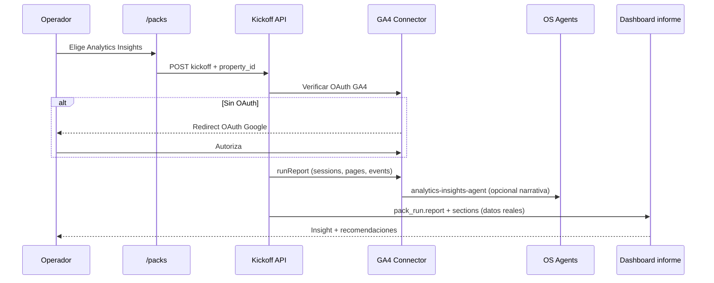

# Fase 2 — Pack «Analytics Insights» (GA4 real)

Diseño técnico y funcional para el primer pack de producto con **conector real** y un insight medible en dashboard. No implementado en Fase 1 (demo).

---

## 1. Objetivo de producto

Ofrecer un pack especializado **«Analytics Insights»** que, tras conectar **Google Analytics 4 (GA4)**, devuelva en el informe del dashboard **un insight accionable basado en datos reales** — no simulados — en menos de 5 minutos post-kickoff.

**Insight MVP (uno solo, bien hecho):**

> «En los últimos 28 días, el **X%** de tus sesiones vienen de **canal Y**; tu landing **Z** convierte un **W%** por debajo de la media del sitio. Prioridad: optimizar CTA en Z.»

Esto demuestra el salto demo → producto: el cliente ve **su** GA4, no benchmarks fake.

**Por qué GA4 y no Meta Ads primero**

| Criterio | GA4 | Meta Ads |
|----------|-----|----------|
| Ya hay OAuth/patrones en repo | Parcial (tracking, eventos) | Sí (`MetaAdsService`) |
| Alcance vertical | Todos los packs (Local, Ecommerce, B2B) | Sobre todo Ecommerce/Ads |
| Complejidad API | Data API + OAuth estándar Google | Business Manager, permisos ad account |
| Insight único sin campaña activa | Sí (tráfico orgánico, landing) | Requiere gasto para ROAS |

Meta Ads queda como **Fase 2b** reutilizando el mismo patrón de pack con conector.

---

## 2. Definición funcional del pack

| Campo | Valor |
|-------|--------|
| **ID catálogo** | `analytics-insights-pack` |
| **Nombre** | Analytics Insights |
| **Categoría** | `analytics` |
| **Pack padre sugerido** | Cualquier Growth Pack (Local / Ecommerce / SaaS B2B) |
| **Disponibilidad Fase 2** | `beta` (requiere GA4 conectado) |
| **Tiempo estimado** | 5 min (+ OAuth si no conectado) |

### Inputs (kickoff)

1. Propiedad GA4 (`property_id`) — selector si ya hay OAuth.
2. URL landing principal a analizar (opcional; default: página más visitada).
3. Ventana de análisis: 7 / 28 / 90 días (default 28).

### Outputs (entregables)

1. **Informe Analytics Insights** (JSON + vista dashboard).
2. **Tarjeta insight principal** en dashboard del pack padre.
3. **3 recomendaciones accionables** derivadas de reglas (no LLM obligatorio en MVP).
4. Checklist eventos GA4 faltantes (si aplica).

### Reglas de insight MVP (determinísticas)

1. **Canal dominante**: canal con mayor `sessions` en ventana.
2. **Landing gap**: página con `sessions > 100` y `conversion_rate` < `site_avg * 0.7`.
3. **Evento clave ausente**: si no hay `form_submit` / `purchase` en 28d → recomendación setup.

---

## 3. Flujo OS / SaaS



### Pasos OS (pack run)

| Step key | Label |
|----------|--------|
| `intake` | Brief recibido |
| `ga4_auth` | Conexión GA4 verificada |
| `ga4_fetch` | Extracción métricas (Data API) |
| `insight_compute` | Cálculo insight MVP |
| `report` | Informe en portal / dashboard |
| `complete` | Pack completado |

### Puente con pack padre

- `catalog_focus: "analytics"` (nuevo) o entrada de catálogo independiente con `launchPackId` apuntando al growth pack del vertical.
- Informe del padre muestra panel **«Datos reales GA4»** sustituyendo demo en `PackEliteSnapshots` cuando `data_source: "ga4"`.

---

## 4. Arquitectura técnica

### 4.1 Conector GA4 (nuevo módulo)

```
apps/web/src/lib/integrations/ga4/
  ga4OAuth.ts          # OAuth2 Google (reutilizar patrón meta-ads connect)
  ga4DataClient.ts     # Wrapper @google-analytics/data
  ga4Insights.ts       # computeMvpInsight(rawMetrics)
  types.ts
```

**Tabla credenciales** (o extensión existente):

```sql
-- ga4_connections (workspace_id, user_id, property_id, refresh_token_enc, created_at)
```

**Env**

- `GOOGLE_OAUTH_CLIENT_ID`
- `GOOGLE_OAUTH_CLIENT_SECRET`
- `GA4_OAUTH_REDIRECT_URI`

### 4.2 API routes

| Método | Ruta | Función |
|--------|------|---------|
| GET | `/api/integrations/ga4/connect` | Inicia OAuth |
| GET | `/api/integrations/ga4/callback` | Guarda tokens |
| GET | `/api/integrations/ga4/properties` | Lista propiedades del usuario |
| POST | `/api/os/packs/analytics-insights/kickoff` | Ejecuta pack |
| GET | `/api/platform/packs/analytics-insights/ceo-metrics` | KPIs live para dashboard |

### 4.3 Pack runner

```typescript
// apps/web/src/lib/packs/analyticsInsightsPack.ts
export async function runAnalyticsInsightsPack({
  workspaceId,
  userId,
  intake: { property_id, landing_path?, period_days? },
}) {
  const metrics = await fetchGa4MvpMetrics({ property_id, period_days });
  const insight = computeMvpInsight(metrics);
  const report = buildAnalyticsInsightsReport({ insight, metrics, intake });
  // persist pack_run + deliverable json
}
```

### 4.4 Consultas GA4 Data API (MVP)

Un solo `runReport` con dimensiones:

- `sessionDefaultChannelGroup` → sessions
- `landingPage` + `sessions`, `conversions` (o evento custom)
- `eventName` → conteo eventos clave

Límites: 1 property, 3 consultas, cache 15 min por workspace.

### 4.5 Dashboard

Extender `PackReport`:

```typescript
type PackReportDataProvenance = "demo" | "ga4" | "meta_ads";

report: {
  data_provenance: "ga4";
  live_insight: {
    headline: string;
    channel_breakdown: { channel: string; sessions: number; share_pct: number }[];
    landing_gap?: { path: string; rate: number; site_avg: number };
  };
  sections: PackReportSection[]; // bullets con números reales
}
```

`PackEliteSnapshots`: si `live_insight` presente, mostrar headline en lugar de demo.

---

## 5. Seguridad y límites

- Tokens GA4 cifrados at-rest; scope mínimo `analytics.readonly`.
- Rate limit: 10 kickoffs GA4 / workspace / hora.
- Sin exportar PII; solo agregados.
- Degradación: si API falla → informe parcial + badge «datos no disponibles», no mock silencioso.

---

## 6. Criterios de aceptación Fase 2

1. Usuario con GA4 conectado lanza pack y ve **≥1 métrica real** en dashboard en < 60 s.
2. Insight headline referencia canal o landing **de su propiedad**.
3. Smoke test ampliado: `staging-demo-preflight.mjs` + check opcional `--ga4` si credenciales QA.
4. Pack aparece en `/packs` como `beta` con badge «Requiere GA4».

---

## 7. Estimación y orden de implementación

| Orden | Tarea | Esfuerzo |
|-------|--------|----------|
| 1 | OAuth GA4 + tabla credenciales | 2–3 d |
| 2 | `fetchGa4MvpMetrics` + tests fixture | 2 d |
| 3 | `analyticsInsightsPack` + kickoff route | 2 d |
| 4 | UI selector propiedad + informe dashboard | 2 d |
| 5 | Puente pack padre + smoke `--ga4` | 1 d |

**Total orientativo:** 9–10 días dev.

---

## 8. Evolución Fase 2b (Meta Ads)

Mismo esqueleto:

- Pack `meta-ads-insights` → `MetaAdsService.getCampaigns` + insight «campaña con mejor ROAS 7d».
- `data_provenance: "meta_ads"`.
- Complementa Pack Crecimiento Ecommerce (ya diseñado en demo).

---

## 9. Referencias en repo actual

- Conector Meta existente: `backend/integrations/MetaAdsService.ts`
- Patrón pack + informe demo: `apps/web/src/lib/packs/packDemoReportContent.ts`
- CEO metrics reales (CRM): `localPackCeoMetrics.ts`, `saasB2bPackCeoMetrics.ts`
- OS catalog: `GET /api/os/core/catalog?view=summary`
- Preflight smoke: `scripts/staging-demo-preflight.mjs`
