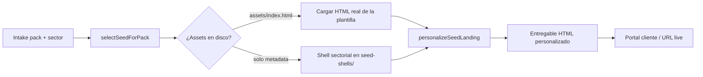

# Biblioteca local de plantillas y flujo de personalización

**Objetivo:** Las 500 plantillas base viven físicamente en `templates/seeds/` como biblioteca fija. Nelvyon OS elige la mejor para cada pack/sector/servicio y **solo personaliza contenidos** — nunca reinventa el diseño en React/Tailwind si no hace falta.

---

## 1. Estructura de la biblioteca local

```
templates/seeds/
├── index.json                    # Resumen: total, on_disk, pooled
├── verify-report.json            # Generado por verify-seed-library.mts
├── by-sector/
│   ├── index.json                # Índice sector × servicio × pack
│   └── {sector_group}.json       # Top 50 seeds por sector
├── aceternity/{slug}/
│   ├── metadata.json             # Catálogo + licencia + pack_ids
│   ├── source.zip                # ZIP original (gitignored, local)
│   └── assets/                   # HTML/CSS/JS extraído (gitignored)
└── envato/{slug}/
    ├── metadata.json
    ├── source.zip
    └── assets/
```

### Organización por sector y servicio

Cada `metadata.json` incluye:

| Campo | Uso |
|-------|-----|
| `sector_groups` | Ej. `food_hospitality`, `saas_tech`, `health_medical` |
| `services` | Ej. `Landing`, `SEO`, `Email`, `Funnel` |
| `kinds` | Ej. `landing`, `email_sequence`, `ad_creative` |
| `pack_ids` | Pack que puede usar esta plantilla |
| `quality_score` | Prioridad en selección automática |

Regenerar índice sectorial:

```powershell
pnpm --dir apps/web exec tsx ../../scripts/templates/build-sector-index.mts
```

---

## 2. Flujo Nelvyon OS — elegir y personalizar



### Paso a paso

1. **Kickoff del pack** — `enrichBriefWithPackLibrary()` registra referencias internas (`template_library_internal`).
2. **Selección** — `selectSeedForPack({ pack_id, sector, kind: "landing" })` usa `pickCuratedSeed()` sobre el catálogo de 500 entradas y verifica `templates/seeds/`.
3. **Carga de diseño** — Si existen `assets/` con HTML, se usa la plantilla real. Si no, el **shell sectorial** mantiene la estructura CRO del grupo (restaurante, SaaS, etc.).
4. **Personalización** — `personalizeSeedLanding()` reemplaza tokens `{{business_name}}`, `{{primary_color}}`, etc. **Sin reescribir layout ni CSS base.**
5. **Entrega** — La landing live se sirve en `/api/packs/local/live/{slug}` o `/api/packs/saas-b2b/live/{slug}`.

### Archivos clave

| Archivo | Responsabilidad |
|---------|-----------------|
| `apps/web/src/lib/template-library/seed-selector.ts` | Elige plantilla base por pack/sector |
| `apps/web/src/lib/template-library/seed-personalizer.ts` | Aplica tokens de cliente sobre HTML |
| `apps/web/src/lib/template-library/seed-shells/` | Shells HTML por sector (fallback + diseño fijo) |
| `apps/web/src/lib/packs/localPackAssets.ts` | Landing local → personalizer |
| `apps/web/src/lib/packs/saasB2bPackAssets.ts` | Landing SaaS → personalizer |

---

## 3. Qué viene de la plantilla vs qué cambia el código

### Se usa directamente de la plantilla (estructura + estilos)

- Layout de secciones (hero, features, formulario, footer)
- CSS completo (tipografía, grid, responsive, animaciones del kit)
- Imágenes e iconos del kit (salvo sustitución explícita por logo del cliente)
- JavaScript del kit (sliders, menús, validación de formularios)
- HTML semántico y jerarquía de headings

### Se rellena o cambia con código (personalización)

| Token / campo | Origen |
|---------------|--------|
| `{{business_name}}` | Intake del pack |
| `{{value_proposition}}` | Intake / IA copy |
| `{{primary_cta}}` | Intake |
| `{{city}}`, `{{contact_email}}` | Intake |
| `{{primary_color}}`, `{{accent_color}}` | Brand del cliente (CSS variables) |
| `{{logo_url}}`, `{{hero_image}}` | Assets del cliente |
| `{{icp_title}}`, `{{sales_motion}}` | Intake SaaS B2B |
| Meta title / description | Generados desde intake |

**Regla:** El código **no reescribe** clases Tailwind ni componentes React para landings de pack cuando hay seed HTML disponible. Solo sustituye tokens y variables CSS.

### Cuándo sí se usa React/Tailwind nativo

- UI interna de Nelvyon (panel, portal operador)
- Bloques nativos `nelvyon_owned` en `registry.ts` para piezas reutilizables
- Conversión gradual de seeds Aceternity → componentes React (opcional, no bloqueante)

---

## 4. Licencia — uso permitido y prohibido

| Permitido | Prohibido |
|-----------|-----------|
| Usar plantilla como **base interna** para proyectos de clientes finales | Revender o redistribuir el ZIP/HTML original de Envato/Aceternity |
| Personalizar logo, colores, textos, fotos para entrega al cliente | Publicar la plantilla sin modificar en marketplaces |
| Portar estructura a componentes Nelvyon propios (`converted_to`) | Incluir `source.zip` en repos públicos o CDN abierto |
| Servir HTML **personalizado** al cliente final (proyecto encargado) | Quitar atribución de licencia en metadata interna |

Licencias registradas en `apps/web/src/lib/template-library/license.ts`:

- **Envato Elements** (`lic-envato-elements-2026`) — seeds en `templates/seeds/envato/`
- **Aceternity UI Pro** (`lic-aceternity-ui-pro-2026`) — seeds en `templates/seeds/aceternity/`

Los binarios (`source.zip`, `assets/`) están en `.gitignore` — **biblioteca local privada**, no pública.

---

## 5. Descargar y mantener las 500 plantillas

### Provisionar catálogo (500 metadata slots)

```powershell
pnpm --dir apps/web exec tsx ../../scripts/templates/provision-seeds.mts
```

### Descargar ZIPs reales desde Envato (requiere sesión Edge)

```powershell
pnpm --dir apps/web exec tsx scripts/download-envato-seeds.ts
```

Variables opcionales: `NELVYON_ENVATO_MAX`, `NELVYON_ENVATO_DELAY_MS`, `NELVYON_ENVATO_SLUG`.

### Verificar estado físico (sin pooling)

```powershell
pnpm --dir apps/web exec tsx ../../scripts/templates/verify-seed-library.mts
```

Genera `templates/seeds/verify-report.json` con:

- `real_unique_zip` — descargas Envato/Aceternity únicas
- `real_extracted_assets` — HTML/CSS extraído
- `pooled_internal_copies` — copias internas temporales (**no sustituyen descarga real**)
- `metadata_only` — pendientes de descarga

> **Importante:** No uses `finalize-seed-library.ts --pool` en producción. Ese script rellena huecos con copias de un donor — útil solo para dev offline. Tu biblioteca fija debe tener 500 ZIPs únicos.

### Extraer assets HTML de un ZIP

Tras descargar, extrae manualmente o con script a `templates/seeds/{provider}/{slug}/assets/`. El personalizer busca `index.html`, `home.html`, `landing.html`.

---

## 6. Ejemplos en staging

| Demo | URL staging | Pack |
|------|-------------|------|
| Restaurante La Plaza | `/demo/pack-landing` → preset `local-restaurant-demo` | `local-business-growth` |
| FlowMetrics SaaS | `/demo/pack-landing` → preset `saas-flowmetrics-demo` | `saas-b2b-growth` |

URLs directas:

```
https://ideal-victory-staging.up.railway.app/demo/pack-landing
https://ideal-victory-staging.up.railway.app/api/demo/pack-landing/local-restaurant-demo
https://ideal-victory-staging.up.railway.app/api/demo/pack-landing/saas-flowmetrics-demo
https://ideal-victory-staging.up.railway.app/api/demo/pack-landing/local-restaurant-demo?format=json
```

El parámetro `?format=json` devuelve **provenance**: qué plantilla base se seleccionó, sector, tokens aplicados y estado de assets.

Landings de packs reales (post-kickoff):

```
/api/packs/local/live/{slug}
/api/packs/saas-b2b/live/{slug}
```

---

## 7. Checklist operativo

- [ ] 500 `metadata.json` provisionados (`provision-seeds.mts`)
- [ ] Descarga Envato completada (`download-envato-seeds.ts`)
- [ ] `verify-seed-library.mts` → `pooled_internal_copies: 0`
- [ ] Índice sectorial generado (`build-sector-index.mts`)
- [ ] Assets HTML extraídos para seeds P0 de cada sector
- [ ] Demos staging verificados en `/demo/pack-landing`
- [ ] Kickoff pack enriquece brief con `template_library_internal`

---

## 8. Relación con otros documentos

| Doc | Contenido |
|-----|-----------|
| `CURATED_SEED_LIBRARY.md` | Resumen catálogo 500 |
| `TEMPLATE_LIBRARY_MASTER_PLAN.md` | Visión 18 meses |
| `ENVATO_ACETERNITY_DOWNLOADS_TABLE.md` | Tabla 3.500+ combinaciones |
| `license.ts` | Registro legal seeds |
